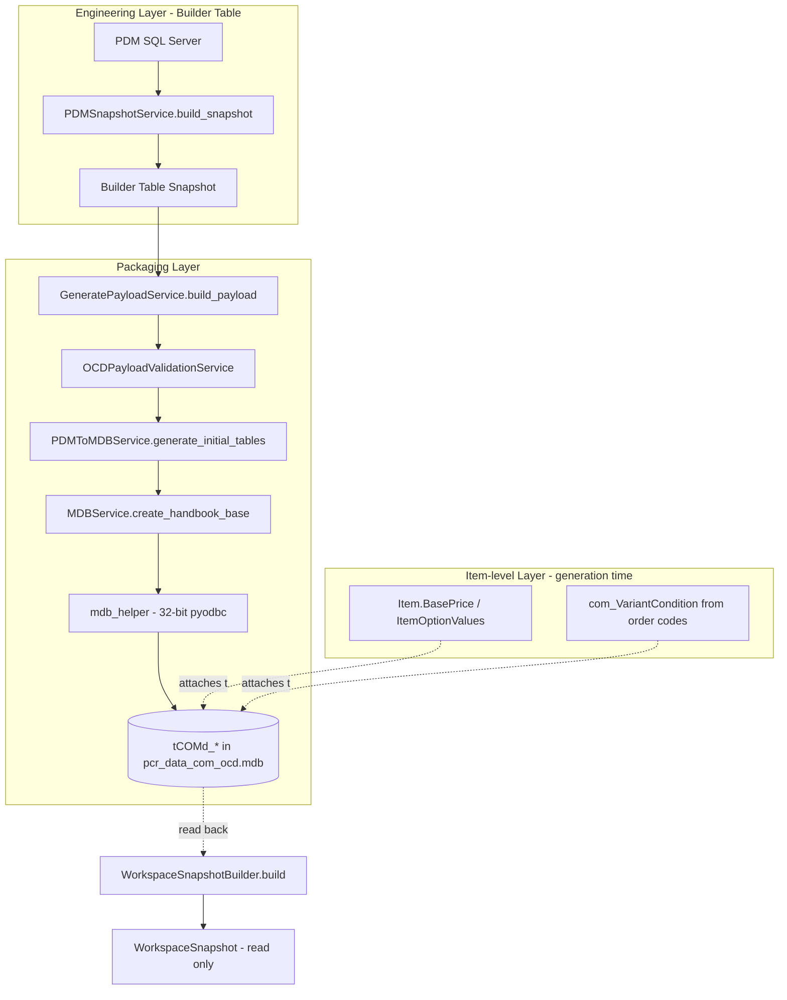

# Architecture

**Cross-refs:** [README](./README.md) · [02_Domain/Repository/Repository_Model.md](../02_Domain/Repository/Repository_Model.md) · [02_Domain/Repository/Snapshot.md](../02_Domain/Repository/Snapshot.md)

> **Status: PARTIALLY STALE — corrected 2026-09-27.** This document previously presented the pipeline below (`PDMSnapshotService`, `GeneratePayloadService`, `OCDPayloadValidationService`, `PDMToMDBService`, `MDBService.create_handbook_base`, `mdb_helper`, `WorkspaceSnapshotBuilder`, `WorkspaceSnapshot`) as the **current, complete execution flow**. A repo-wide search confirms **none of those class names exist anywhere in the codebase** (verified 2026-09-27). This is the same superseded/aspirational architecture already documented as stale in [Repository_Model.md §0](../02_Domain/Repository/Repository_Model.md) and the `Database_Relationships/` tree — it was evidently never built as described, or was replaced before this document was last updated.
>
> **What is verified real** (2026-09-27, by direct inspection): `services/pdm_service.py` (`PDMService`, the real PDM-reading entry point), a substantial `services/engineering/` package (class/relation/dependency/pricing-relation/value-table/reduction services), `models/snapshot.py` + `core/snapshot_manager.py` + `services/snapshot_service.py` (the real in-memory `Snapshot` — see [Snapshot.md](../02_Domain/Repository/Snapshot.md)), and the real OCD write/read path: `services/ocd_export_service.py` + `services/xocd_export_service.py` (write) and `services/mdb_reverse_engineering_service.py` (read) — see [Repository_Model.md](../02_Domain/Repository/Repository_Model.md) for the full evidence-graded detail on the write/read side.
>
> **What has not been re-verified:** the exact current end-to-end orchestration from PDM read through the `services/engineering/*` package to the final `Snapshot` used by the exporters. Rather than replace one unverified pipeline diagram with another, the diagram and flow below are kept **only as historical record of the previously-documented (and now confirmed non-existent) design** — do not treat anything below this notice as a description of current behavior. A follow-up investigation should build a new, evidence-graded end-to-end diagram (in the style of `Repository_Model.md`) before this file's core content can be trusted again.

## Overall Architecture Diagram (historical — see status note above)

*(None of the named classes above — `PDMSnapshotService`, `GeneratePayloadService`, `OCDPayloadValidationService`, `PDMToMDBService`, `mdb_helper`, `WorkspaceSnapshotBuilder`, `WorkspaceSnapshot` — exist in the current codebase.)*

## Complete Execution Flow (historical — not current)

1. **Product selection** — PDM SQL: `get_products_for_category` (catalogue/category scoped).
2. **Snapshot build** — `PDMSnapshotService.build_snapshot` collects the product-centric engineering
   model (see snapshot keys below). Parallel bulk fetch via `ThreadPoolExecutor`.
3. **Payload assembly** — `scripts/run_workspace_pipeline.py::build_product_payload` →
   `GeneratePayloadService.build_payload`:
   - `PDMToMDBService.build_com_group` / `build_package` → skeleton.
   - `OCDPayloadService` scopes/previews/generates `Articles` + `AttributeValues`.
   - `add_option_values` + `add_relationships` extend the payload.
4. **Validation** — `OCDPayloadValidationService` blocks invalid rows before any write.
5. **Base creation** — `PDMToMDBService.generate_initial_tables` → `MDBService.create_handbook_base`
   → `mdb_helper.create_handbook_base` writes `tCOMd_*` rows.
6. **Read-back** — `WorkspaceSnapshotBuilder.build` reads the OCD MDB into a read-only
   `WorkspaceSnapshot` used for conflict detection / validation.

## Real, verified current services (2026-09-27)

For anything beyond the historical record above, use these confirmed-real entry points as your starting point, and consult [Repository_Model.md](../02_Domain/Repository/Repository_Model.md) for the evidence-graded write/read detail already established:

| Concern | Real current file |
|---|---|
| PDM read | `services/pdm_service.py` (`PDMService`) |
| Engineering model (classes, relations, dependencies, pricing relations, value tables, reduction) | `services/engineering/*.py` |
| In-memory Snapshot | `models/snapshot.py`, `core/snapshot_manager.py`, `services/snapshot_service.py` — see [Snapshot.md](../02_Domain/Repository/Snapshot.md) |
| OCD write (direct MDB) | `services/ocd_export_service.py` (`OcdExportService`) |
| OCD/XOCD write (CSV) | `services/xocd_export_service.py` (`XocdExportService`) |
| OCD read-back | `services/mdb_reverse_engineering_service.py` (`MdbReverseEngineeringService`) |

## Builder Table Integration (snapshot keys)

**Historical/unverified naming** — see [Module_Architecture.md](./Module_Architecture.md) for the same key list; not repeated here twice. This section previously listed the same `product_attributes`/`product_options`/etc. keys independently — kept in a single place now to avoid two independently-maintained copies.
