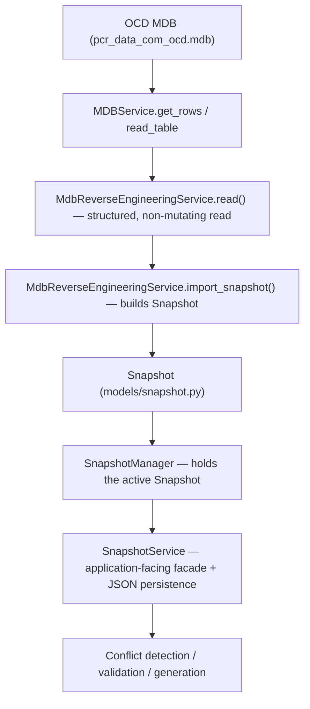

# Snapshot

**Status:** Current, canonical. Snapshot is the established canonical repository representation in MK Workbench — do not introduce a competing model (e.g. a "FinalArticle"-keyed model) merely because an older investigation document used different terminology.
**Related:** [Repository_Model.md](./Repository_Model.md) · [PDM_MDB_Bridge/MDB_Engineering_Workflow.md](../PDM/PDM_MDB_Bridge/MDB_Engineering_Workflow.md)

> **2026-09-27 correction:** this document previously described a read pipeline built on `WorkspaceSnapshotBuilder` (`services/workspace_snapshot_builder.py`), `WorkspaceService` (`services/workspace_service.py`), and `helpers/mdb_helper.py`. None of those files exist in the current codebase — they belonged to the same superseded architecture that [Repository_Model.md](./Repository_Model.md) §0 already documented as stale for the write path. This section has been rewritten against the actual current services (verified by direct file search of the repo, 2026-09-27). See [Repository_Model.md](./Repository_Model.md) for the full evidence-graded (FACT/INFERENCE/UNKNOWN) structural investigation this correction is based on.

## What it is

`Snapshot` (`models/snapshot.py`) is the in-memory model that holds the engineering/repository state of the currently active product — properties, values, options, relations, articles, and related engineering objects. The active instance is held by `SnapshotManager` (`core/snapshot_manager.py`), which downstream services and the UI read through `SnapshotService` (`services/snapshot_service.py`). It is the single source of truth for downstream conflict detection, validation, and generation.

## How it is built

Two concerns are kept separate:

- **Reading an existing OCD MDB into a `Snapshot`** — done by `MdbReverseEngineeringService` (`services/mdb_reverse_engineering_service.py`). This service is deliberately non-mutating: `.read(mdb_path)` reads a fixed, allow-listed set of `tCOMd_*` tables (`STRUCTURAL_TABLES` / `PRICE_TABLES` / `PACKAGE_TABLES`) via `MDBService`, and `.import_snapshot(data)` converts that structured read into a `Snapshot` instance.
- **Writing** a fresh OCD package (creating/updating `tCOMd_*` rows) — done by `OcdExportService` (`services/ocd_export_service.py`, direct-MDB path) and `XocdExportService` (`services/xocd_export_service.py`, CSV/XOCD path). See [Repository_Model.md §3](./Repository_Model.md) for the full write-sequence detail — it is not repeated here to avoid two independently maintained copies of the same sequence.
- **In-memory session state** — `SnapshotManager` holds the active `Snapshot`, tracks modification status, and notifies listeners on change. `SnapshotService` is the application-facing facade over it, and also owns JSON persistence of the active snapshot (via `SnapshotStore` / `snapshot_serialization.py`, under `cache/pdm_snapshots/`) — this JSON round-trip is unrelated to MDB I/O and exists purely so an in-progress engineering session can be saved/reloaded without touching PDM or OCD.

## What it reads

OCD (`pcr_data_com_ocd.mdb`) is the authoritative engineering model. `MdbReverseEngineeringService` reads a fixed table allow-list (`STRUCTURAL_TABLES`, plus `PRICE_TABLES` when `include_prices` is requested, plus `PACKAGE_TABLES`) — see [Repository_Model.md §1](./Repository_Model.md) for the complete, verified table inventory and which tables each current exporter actually writes vs. reads. That table is the canonical source for the read/write table list; it is intentionally not duplicated here.

## Dependencies

| Service | File | Responsibility | I/O |
|---|---|---|---|
| `MdbReverseEngineeringService` | `services/mdb_reverse_engineering_service.py` | OCD → structured read → `Snapshot` | Read only (via `MDBService`) |
| `OcdExportService` | `services/ocd_export_service.py` | Write/update `tCOMd_*` rows (direct MDB) | Read + Write |
| `XocdExportService` | `services/xocd_export_service.py` | Write OCD/XOCD as CSV | Write |
| `MDBService` | `services/mdb_service.py` | Low-level MDB I/O gateway | Read + Write |
| `SnapshotManager` | `core/snapshot_manager.py` | Hold the active in-memory `Snapshot`; notify listeners | None (in-memory) |
| `SnapshotService` | `services/snapshot_service.py` | Application-facing facade over `SnapshotManager`; JSON save/load | None / JSON file I/O |
| `SnapshotStore` / `snapshot_serialization` | `services/snapshot_store.py`, `services/snapshot_serialization.py` | Persist/restore `Snapshot` as JSON (no MDB access) | JSON file I/O |

## Why Snapshot, not a re-derived model

Snapshot is the single in-memory representation everything else builds on: engineering edits happen against the active `Snapshot`, and it is what gets read back into or exported out to OCD. Do not redesign this model unless implementation proves a concrete defect. If you find another document describing a different read/write pipeline for the repository model, treat [Repository_Model.md](./Repository_Model.md) as authoritative — it is evidence-graded against the actual current source, and the `Database_Relationships/` tree is documented there as describing a prior, superseded architecture.
