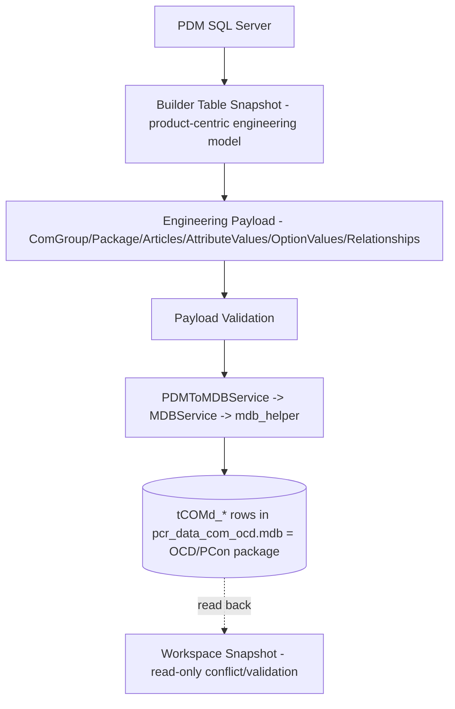

# pCon Reference

This folder holds pCon/OFML **reference material**, split strictly into two kinds (see [Documentation scope note](#documentation-scope-note) below):

- **[Specifications/](./Specifications/)** — external, vendor-authored EasternGraphics/pCon specifications (OFML, OCD, ODB, OAP, Metatype, GO, app notes), auto-converted from the original PDFs for AI/text consumption. These are normative external documents — cite them, never paraphrase them into MK Workbench conclusions.
- **[Investigation/](./Investigation/)** — MK Workbench's own forensic findings from investigating pCon.creator, PDM↔pCon mapping, and the overall canonical model. These are MK Workbench conclusions, evidence-backed but our own, not vendor text.

## Documentation scope note

Findings that became authoritative, current domain knowledge (not just investigation narrative) have been extracted into `docs/02_Domain/` as canonical documents, for example:

| Concept | Canonical home |
|---|---|
| Repository / MDB structure | [`02_Domain/Repository/Repository_Model.md`](../../02_Domain/Repository/Repository_Model.md) |
| Article / Product / Configuration model | [`02_Domain/Product/Article_Configuration_Model.md`](../../02_Domain/Product/Article_Configuration_Model.md) |
| Property/Option cardinality | [`02_Domain/Engineering/Property_Model.md`](../../02_Domain/Engineering/Property_Model.md) |
| Dependency/Exclusion model | [`02_Domain/Engineering/Dependency_Model.md`](../../02_Domain/Engineering/Dependency_Model.md) |
| Relation/RelObj model | [`02_Domain/Engineering/Relation_Model.md`](../../02_Domain/Engineering/Relation_Model.md) |
| Variant Code / Final Article Number (Nevi trace) | [`02_Domain/Article_Encoding/Variant_Code_and_Final_Article_Number.md`](../../02_Domain/Article_Encoding/Variant_Code_and_Final_Article_Number.md) |
| Article Encoding / CodeScheme | [`02_Domain/Article_Encoding/Article_Encoding.md`](../../02_Domain/Article_Encoding/Article_Encoding.md) |
| Permutation model + gap analysis | [`02_Domain/Permutation/`](../../02_Domain/Permutation/) |

**[Investigation/](./Investigation/)** retains the narrative/synthesis documents that don't map to a single domain concept: the reading-order index, the pCon.creator manual investigation, the PDM→pCon mapping synthesis, the proposed canonical model, the consolidated open-questions register, and the executive summary.

## Overall architecture (background)

The Metatype Wizard reads authoritative product engineering data from the **PDM SQL Server**
database into a product-centric **Builder Table snapshot**. A packaging layer converts that
snapshot into an **engineering payload** (`ComGroup`, `Package`, `Articles`, `AttributeValues`,
`OptionValues`, `Relationships`), validates it, and writes it as **OCD `tCOMd_*` rows** into an
Access MDB (`pcr_data_com_ocd.mdb`) via a 32-bit helper. That MDB is the PCon package; it can be
read back into a read-only **Workspace Snapshot** for conflict detection. Pricing and variant
conditions are **item-level generation-time concerns**, deliberately kept out of the Builder Table.

| Layer | Responsibility | Lives in Builder Table? |
|---|---|---|
| **Engineering layer** | Product-centric truth: articles, properties, options, dependencies, configurations, exclusions, order-code metadata | **Yes** (snapshot keys) |
| **Packaging layer** | `tCOMd_*` object creation, IDs, relationships, ComGroup/Package skeleton, MDB write | No (generator-only) |
| **Item-level layer** | Pricing and variant conditions (per released Item) | No (generation-time) |

Full architecture detail: [`01_Architecture/System_Architecture.md`](../../01_Architecture/System_Architecture.md) and [`01_Architecture/Module_Architecture.md`](../../01_Architecture/Module_Architecture.md). Packaging/OBX generation roadmap: [`02_Domain/OBX/Generator_Roadmap.md`](../../02_Domain/OBX/Generator_Roadmap.md).

## Source anchors (for verification)

- Python packaging: `services/generate_payload_service.py`, `services/ocd_payload_service.py`,
  `services/ocd_payload_validation_service.py`, `services/pdm_to_mdb_service.py`,
  `services/mdb_service.py`, `helpers/mdb_helper.py`, `scripts/run_workspace_pipeline.py`.
- Builder Table snapshot: `services/pdm_snapshot_service.py`, `services/pdm_service.py`.
- PDM/DPS reference: `PDMMaintenance/OCDExport.cs`, `PDMMaintenance/PConPriceUpdate.cs`,
  `PDMMaintenance/PriceMaintenance.cs`, `PDMMaintenance/CADMaintenance.cs`, `DPS/ocdPrice.cs`.
