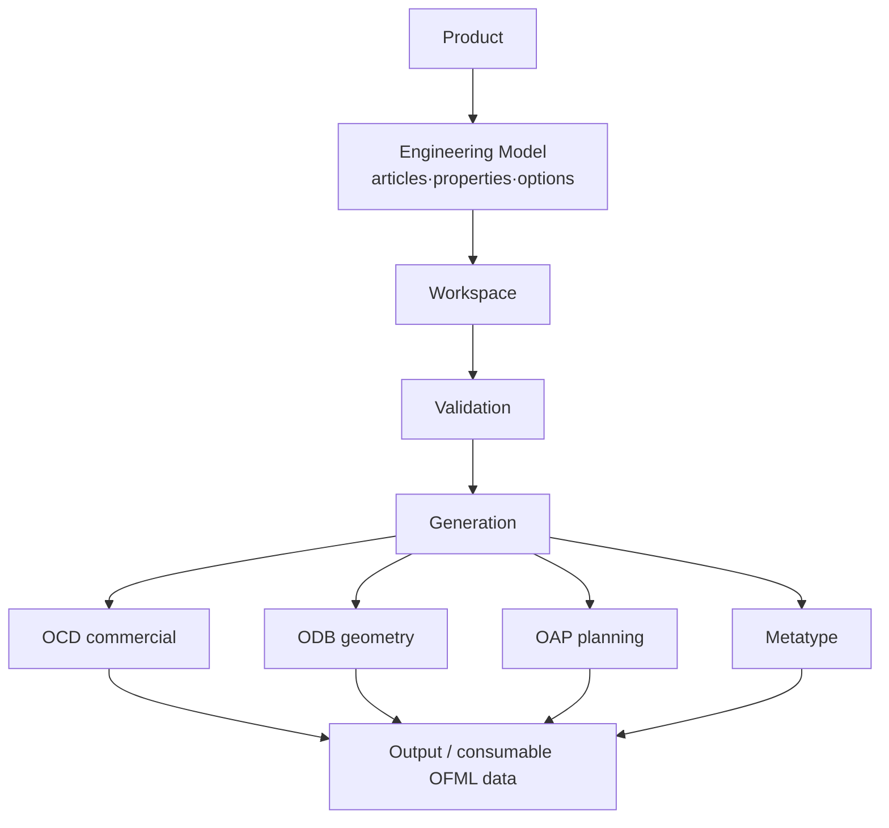

# 00 — Engineering Overview

**Source:** Consolidated from the OFML specification corpus (EasternGraphics / IBA).
**Status:** Primary engineering reference for the MK Product Workbench. Unclear items marked `UNKNOWN`.

---

## 1. What this handbook is

This handbook is the **primary technical engineering reference** for the MK Product Workbench and every
engineering component built within it — Explorer, Dashboard, Workspace, MDB integration, OCD, ODB, OAP,
Metatype, OFML, the Snapper generator, validation, and all future engineering modules.

It consolidates the authoritative **OFML** (Office Furniture Modelling Language) specifications published by
**EasternGraphics / IBA** (Industrieverband Büro und Arbeitswelt e. V.). These documents are **not** specific
to any one application; they define the industry engineering standards that the entire ecosystem follows.

> **Rule of thumb:** if a design decision in MK Product Workbench touches products, articles, properties,
> options, configuration, pricing, geometry, planning, materials, or generation — it must conform to the
> standards captured here.

---

## 2. The OFML ecosystem at a glance

OFML is a standardized, layered data-description format for the (office) furniture industry. It separates a
product's **commercial** description from its **graphical** description and links them through **mapping**
data, so that any conforming sales system (e.g. **pCon**) can present, configure, price, and order a product.

```mermaid
graph LR
    subgraph OFML core (Parts I–III)
      CORE[Object model · packages · layers · materials · geometry]
    end
    CORE --> OCD[OCD — Commercial Data<br/>articles·properties·options·relations·prices·texts]
    CORE --> ODB[ODB — OFML Database<br/>geometry / object description]
    CORE --> OAP[OAP — OFML Aided Planning<br/>planning behaviour]
    CORE --> MT[Metatype / GO<br/>generated & inter-product config]
    OCD --> SALES[Sales system / pCon<br/>present · configure · price · order]
    ODB --> SALES
    OAP --> SALES
    MT --> SALES
```

| Domain | What it describes | Handbook doc |
|--------|-------------------|--------------|
| **OFML** | The core standard: object model, packages, layers (OLAYERS), materials (OMATS), geometry, generic objects (GO), DSR | [06_OFML](06_OFML.md) |
| **OCD** | Commercial data — articles, properties, property values, options, relations/conditions, prices, texts, tax | [07_OCD](07_OCD.md) |
| **ODB** | OFML Database — declarative geometry / object description | [08_ODB](08_ODB.md) |
| **OAP** | OFML Aided Planning — planning behaviour, interactors, actions | [09_OAP](09_OAP.md) |
| **Metatype** | Tables enabling inter-product configuration & generation atop GO/OFML | [10_Metatype](10_Metatype.md) |

---

## 3. Core concepts you must know first

- **Product / article** — a commodity offered for sale; a **configurable product** exposes characteristics the
  buyer can specify. See [11_Product_Model](11_Product_Model.md), [03_Engineering_Concepts](03_Engineering_Concepts.md).
- **Article number** — uniquely identifies a product; a **basic article number** plus a **variant code** yields
  the **final article number** of a configured product.
- **Commercial series** (product line) — the classification unit governing distribution; identified by a code.
- **Commercial vs graphical data** — the fundamental separation OCD (commercial) vs ODB/geometry (graphical),
  linked by mapping data. See [18_Design_Principles](18_Design_Principles.md).
- **OFML library & package** — base / product / catalog libraries, identified by a **program ID**, distributed
  as versioned **packages**. See [06_OFML](06_OFML.md).
- **Property / property value / option / option value / relation** — the building blocks of configuration.
  See [16_Configuration](16_Configuration.md).

Full definitions: [19_Glossary](19_Glossary.md) (exhaustive A–Z) and [04_Core_Terminology](04_Core_Terminology.md)
(curated quick reference).

---

## 4. The end-to-end engineering flow



Each stage — purpose, inputs, outputs, dependencies, rules, expected results — is documented in
[05_Engineering_Workflows](05_Engineering_Workflows.md), with the rules in [12_Validation_Rules](12_Validation_Rules.md)
and [13_Naming_Standards](13_Naming_Standards.md), and generation specifics in [14_Generation_Process](14_Generation_Process.md).

---

## 5. How to use this handbook

- **Start** with [01_Document_Map](01_Document_Map.md) for the reading order and source mapping.
- **Learn the language** in [19_Glossary](19_Glossary.md) / [04_Core_Terminology](04_Core_Terminology.md).
- **Understand the shape** in [02_Architecture](02_Architecture.md) and [06_OFML](06_OFML.md).
- **Engineer data** with [07_OCD](07_OCD.md), [16_Configuration](16_Configuration.md),
  [13_Naming_Standards](13_Naming_Standards.md), [12_Validation_Rules](12_Validation_Rules.md).
- **Generate & ship** with [14_Generation_Process](14_Generation_Process.md), [15_File_Formats](15_File_Formats.md),
  [17_Best_Practices](17_Best_Practices.md).

---

## 6. Authority & scope

- **Authoritative:** the OFML/IBA specifications consolidated here are the source of truth. Where this handbook
  and a running implementation disagree, the specification wins.
- **Preserved intent:** definitions and rules reflect the source specs; consolidation never overrides them.
- **`UNKNOWN`:** anything not provable from the source documents is marked `UNKNOWN` rather than guessed.
- **Out of scope:** application-specific design docs under `Docs/superpowers/` and tooling folders are excluded
  (see [01_Document_Map](01_Document_Map.md) §1).
