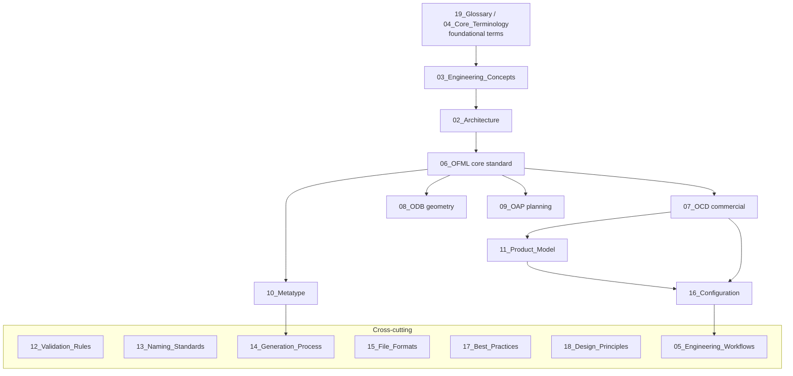

# 01 — Document Map

**Source:** Consolidation of the OFML specification corpus (EasternGraphics / IBA) held in
`MK_OFML_Testsuite/Docs/`, reorganized for the MK Product Workbench Engineering Handbook.
**Status:** Navigation/meta document. Unclear items marked `UNKNOWN`.

This document maps the original specification sources to the handbook, defines a recommended
reading order, and shows the knowledge hierarchy and cross-references.

---

## 1. Source corpus → handbook mapping

The handbook consolidates **24 OFML specification documents** (~35,000 lines) plus product-data
examples (`.obx`). It does **not** copy them; it extracts, organizes, and cross-references their
engineering knowledge.

| Source document (Docs/) | Domain | Consolidated into |
|-------------------------|--------|-------------------|
| `ofml_20r3_en.md` | OFML core standard (Parts I–III) | [06_OFML](06_OFML.md), [02_Architecture](02_Architecture.md), [18_Design_Principles](18_Design_Principles.md) |
| `ofml_glossary_1.1_en.md` | Foundational terminology & conceptual model | [19_Glossary](19_Glossary.md), [04_Core_Terminology](04_Core_Terminology.md), [03_Engineering_Concepts](03_Engineering_Concepts.md) |
| `ocd_4.3_en.md` | OCD — Commercial Data (Part IV) | [07_OCD](07_OCD.md), [16_Configuration](16_Configuration.md) |
| `AN-2014-04_OCD_Features-EN.md` | OCD features | [07_OCD](07_OCD.md), [05_Engineering_Workflows](05_Engineering_Workflows.md) |
| `AN-2017-01_PriceLists_DataCreation-EN.md` | OCD price lists | [07_OCD](07_OCD.md), [05_Engineering_Workflows](05_Engineering_Workflows.md), [17_Best_Practices](17_Best_Practices.md) |
| `fact_sheet_ocd_article_texts_en.md` | OCD article texts | [07_OCD](07_OCD.md) |
| `OCD_ArticleDescription_1.2_en.md` | OCD article descriptions | [07_OCD](07_OCD.md) |
| `OCD_TaxCategories_1.0_en.md` | OCD tax categories | [07_OCD](07_OCD.md) |
| `AN-2006-01_Control_Data_Tables-EN.md` | OCD control/global tables | [07_OCD](07_OCD.md), [16_Configuration](16_Configuration.md) |
| `article_interface_1.4_en.md` | Article model (Part III) | [11_Product_Model](11_Product_Model.md) |
| `property_interface_2.9_en.md` | Property model (Part III) | [11_Product_Model](11_Product_Model.md), [16_Configuration](16_Configuration.md) |
| `odb_2.4_en.md` | ODB — OFML Database (geometry) | [08_ODB](08_ODB.md) |
| `oap_1.6.1-en.md` | OAP — OFML Aided Planning | [09_OAP](09_OAP.md) |
| `methods4OAP.md` | OAP method catalogue | [09_OAP](09_OAP.md) |
| `AppNote_OAP_DataCreation_EN.md` | OAP data creation | [09_OAP](09_OAP.md), [05_Engineering_Workflows](05_Engineering_Workflows.md) |
| `OAP-Styleguide_en.md` | OAP naming/style | [13_Naming_Standards](13_Naming_Standards.md), [17_Best_Practices](17_Best_Practices.md) |
| `MT_1.18.0_en.md` | Metatype | [10_Metatype](10_Metatype.md), [14_Generation_Process](14_Generation_Process.md) |
| `MT-StyleGuide_1.2_en.md` | Metatype naming/style | [13_Naming_Standards](13_Naming_Standards.md), [10_Metatype](10_Metatype.md) |
| `GO_1.12.0.md` | Generic Objects | [06_OFML](06_OFML.md), [14_Generation_Process](14_Generation_Process.md) |
| `dsr-3.7_en.md` | DSR | [06_OFML](06_OFML.md) |
| `omats_2.2_en.md` | OMATS — materials (PBR) | [06_OFML](06_OFML.md), [15_File_Formats](15_File_Formats.md) |
| `OLAYERS_1.3.1_en.md` | OFML layers | [06_OFML](06_OFML.md), [15_File_Formats](15_File_Formats.md) |
| `OLAYERS-TAGS_1.2.md` | Layer tags | [15_File_Formats](15_File_Formats.md), [13_Naming_Standards](13_Naming_Standards.md) |
| `AN-2023-01_OFML_Support_in_pCon_Applications.md` | pCon consumption | [02_Architecture](02_Architecture.md), [05_Engineering_Workflows](05_Engineering_Workflows.md) |
| `*.obx` (snapper_CLOUD, Tool generated obx cloud, …) | OBX product-data baskets (XML) | [14_Generation_Process](14_Generation_Process.md), [15_File_Formats](15_File_Formats.md) |

> **Out of scope (not consolidated):** `Docs/superpowers/` (MK_OFML_Testsuite's own application design docs
> and agent tooling), `Docs/.claude/`, `Docs/.pytest_cache/`. These are application/tooling artifacts, not
> core OFML engineering standards.

---

## 2. Knowledge hierarchy

**Tiers:**
1. **Foundations** — [19_Glossary](19_Glossary.md), [04_Core_Terminology](04_Core_Terminology.md), [03_Engineering_Concepts](03_Engineering_Concepts.md)
2. **Architecture & philosophy** — [02_Architecture](02_Architecture.md), [18_Design_Principles](18_Design_Principles.md)
3. **Core standard** — [06_OFML](06_OFML.md)
4. **Data domains** — [07_OCD](07_OCD.md), [08_ODB](08_ODB.md), [09_OAP](09_OAP.md), [10_Metatype](10_Metatype.md)
5. **Models** — [11_Product_Model](11_Product_Model.md), [16_Configuration](16_Configuration.md)
6. **Cross-cutting practice** — [05_Engineering_Workflows](05_Engineering_Workflows.md), [12_Validation_Rules](12_Validation_Rules.md), [13_Naming_Standards](13_Naming_Standards.md), [14_Generation_Process](14_Generation_Process.md), [15_File_Formats](15_File_Formats.md), [17_Best_Practices](17_Best_Practices.md)

---

## 3. Recommended reading order

**Newcomer path (concept-first):**
[00_Engineering_Overview](00_Engineering_Overview.md) → [03_Engineering_Concepts](03_Engineering_Concepts.md) →
[04_Core_Terminology](04_Core_Terminology.md) → [02_Architecture](02_Architecture.md) → [06_OFML](06_OFML.md) →
[11_Product_Model](11_Product_Model.md) → [07_OCD](07_OCD.md) → [16_Configuration](16_Configuration.md) →
[05_Engineering_Workflows](05_Engineering_Workflows.md).

**Data-creation / engineering path:**
[07_OCD](07_OCD.md) → [16_Configuration](16_Configuration.md) → [13_Naming_Standards](13_Naming_Standards.md) →
[12_Validation_Rules](12_Validation_Rules.md) → [14_Generation_Process](14_Generation_Process.md) →
[15_File_Formats](15_File_Formats.md) → [17_Best_Practices](17_Best_Practices.md).

**Domain deep-dives:** [08_ODB](08_ODB.md), [09_OAP](09_OAP.md), [10_Metatype](10_Metatype.md) — read after [06_OFML](06_OFML.md).

**Reference (dip-in):** [19_Glossary](19_Glossary.md), [12_Validation_Rules](12_Validation_Rules.md), [15_File_Formats](15_File_Formats.md).

---

## 4. Which documents introduce vs depend

| Introduces core concepts | Depends on / applies them |
|--------------------------|---------------------------|
| [19_Glossary](19_Glossary.md), [03_Engineering_Concepts](03_Engineering_Concepts.md), [06_OFML](06_OFML.md) | [07_OCD](07_OCD.md), [08_ODB](08_ODB.md), [09_OAP](09_OAP.md), [10_Metatype](10_Metatype.md) |
| [11_Product_Model](11_Product_Model.md) | [16_Configuration](16_Configuration.md), [12_Validation_Rules](12_Validation_Rules.md) |
| [02_Architecture](02_Architecture.md), [18_Design_Principles](18_Design_Principles.md) | [05_Engineering_Workflows](05_Engineering_Workflows.md), [14_Generation_Process](14_Generation_Process.md), [17_Best_Practices](17_Best_Practices.md) |
