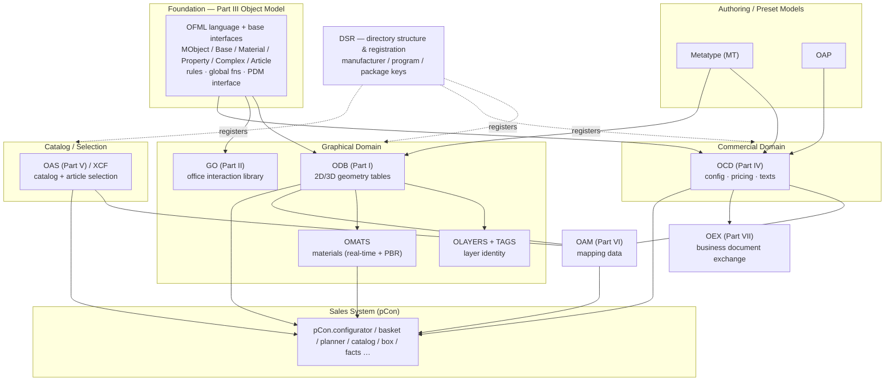
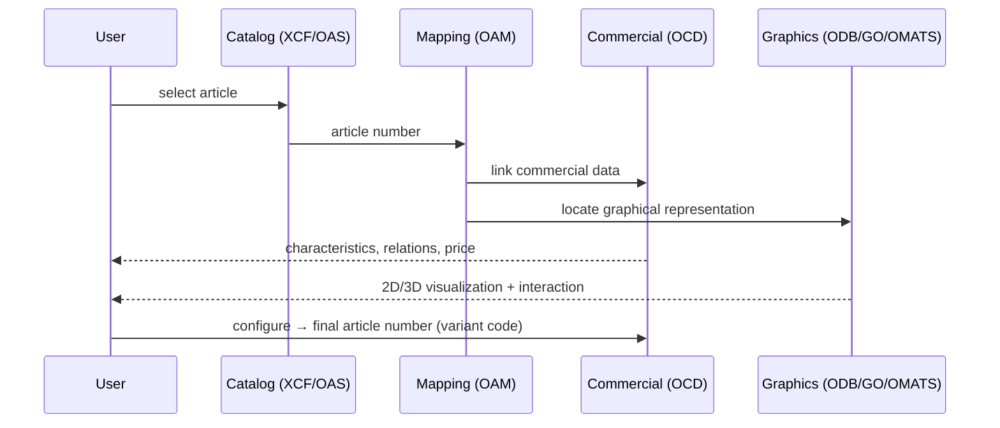

# 02 — Architecture: The OFML Ecosystem

**Source:** OFML specifications (EasternGraphics/IBA), consolidated for the MK Product Workbench Engineering Handbook.
**Status:** Consolidated from specification docs; unclear items marked `UNKNOWN`.

---

## 1. Purpose

This document describes the **overall engineering architecture** of the OFML ecosystem:
the layered OFML standard, the six/seven Parts and how they interrelate, the distinct
**data domains** (commercial vs graphical vs mapping vs catalog), the sales-system
consumption model (pCon), and where each subsystem — OCD, ODB, OAP, Metatype, GO, OMATS,
OLAYERS, DSR — fits. For the OFML standard itself see [06_OFML](06_OFML.md).

---

## 2. The Layered Architecture

OFML is layered so that a *manufacturer- and vendor-independent* description can be
authored once and consumed by many applications.

1. **Foundation / language layer (Part III object model).** A complete object-oriented
   programming language, base interfaces (`MObject`, `Base`, `Material`, `Property`,
   `Complex`, `Article`), predefined rule reasons, global functions and base types.
   Everything else builds on this. It also defines the **generic product-data interface**
   used to reach external commercial data.
2. **Geometry layer (Part I — ODB).** Table-based description of hierarchical **2D/3D**
   geometry consumed by the object model. → [08_ODB](08_ODB.md)
3. **Domain class-library layer (Part II — GO).** Reusable office-furniture behaviour
   (interactions, scaling, accessory placement) layered on the language.
4. **Commercial-data layer (Part IV — OCD).** Tables describing selling data:
   configuration, pricing, offer/order forms. → [07_OCD](07_OCD.md)
5. **Selection / catalog layer (Part V — OAS; in practice XCF).** Structured article
   presentation and selection.
6. **Mapping layer (Part VI — OAM).** Binds commercial ↔ graphical ↔ catalog data.
7. **Exchange layer (Part VII — OEX).** Electronic exchange of business documents
   (orders, invoices).

Cross-cutting supporting standards:

- **OMATS** — material models (real-time + PBR) for surface representation.
- **OLAYERS (+ TAGS)** — layer naming that carries manufacturer/series/mode/tag
  identity through geometry data.
- **DSR** — directory structure & registration (manufacturer, program, package keys).
- **Metatype (MT)** and **OAP** — higher-level data-creation/preset models consumed by
  applications. → [10_Metatype](10_Metatype.md), [09_OAP](09_OAP.md)

---

## 3. The Parts and How They Interrelate

The Parts are **loosely coupled**, linked mainly by cross-reference — **article
numbers** and **type identifiers** — rather than by tight binding. This is what lets
commercial data, geometry and catalog data be authored and evolved semi-independently
yet resolve to one product.

| Part | Subsystem | Produces / Governs | Depends on |
|------|-----------|--------------------|------------|
| I | **ODB** | 2D/3D geometry tables | Part III object model |
| II | **GO** | Reusable interaction/behaviour classes | Part III |
| III | **Object Model** | Language, base interfaces, rules, PDM interface | — (foundation) |
| IV | **OCD** | Commercial data (config, price, texts) | Article numbers ↔ III |
| V | **OAS** / XCF | Catalog / article selection | Article numbers |
| VI | **OAM** | Mapping data (commercial↔graphical↔catalog) | I, IV, V |
| VII | **OEX** | Business-document exchange | IV |

**Identity is the glue:** a *(manufacturer ID, commercial-series ID, article number)*
triple must resolve to exactly one **OFML product library**. See
[11_Product_Model](11_Product_Model.md).

---

## 4. Data Domains

OFML's central architectural decision is the **separation of commercial from graphical
data**, joined by explicit mapping.

| Domain | Contents | Standard / Format | Handbook |
|--------|----------|-------------------|----------|
| **Commercial** | Non-graphical selling data: presentation text, configuration (characteristics + relations), pricing (base + surcharges) | OCD (Part IV); or external product DB via Part III PDM interface | [07_OCD](07_OCD.md) |
| **Graphical** | 2D/3D visual representation, geometry, materials | ODB (I), GO (II), OMATS | [08_ODB](08_ODB.md), [06_OFML](06_OFML.md) |
| **Mapping** | Links between commercial, graphical and catalog data | OAM (Part VI) | [06_OFML](06_OFML.md) |
| **Catalog** | Presentation/selection; insert article into plan/list | XCF (practice) / OAS (Part V) | [09_OAP](09_OAP.md) |

Higher-level authoring models — **Metatype (MT)** and **OAP** — sit above these domains
to make data creation more systematic and are consumed directly by applications.

---

## 5. Architecture Diagram

---

## 6. Sales-System Consumption Model (pCon)

OFML data is authored by/for manufacturers and consumed by **EasternGraphics pCon**
applications (see AN-2023-01, [06_OFML](06_OFML.md) §12):

1. **Catalog selection** — a user selects an article from catalog data (XCF/OAS).
2. **Mapping resolution** — OAM/mapping data locates the matching **graphical
   representation** and links it to the article's **commercial data**.
3. **Configuration** — OCD (and MT/OAP presets) drive configurable characteristics and
   the relations/conditions between them.
4. **Visualization & interaction** — ODB geometry + GO interactions + OMATS materials
   render the product in 2D/3D and allow parametric manipulation.
5. **Pricing & order** — OCD determines base price + surcharges; OEX exchanges the
   resulting business documents.

Application/format support varies by release and app (online vs desktop). Processing is
handled by libraries such as XOI, OI, GO, EAI and FAPI.

---

## 7. Where Each Subsystem Fits (Quick Map)

| Subsystem | Layer / Domain | Handbook doc |
|-----------|----------------|--------------|
| Object Model (Part III) | Foundation / language | [06_OFML](06_OFML.md), [11_Product_Model](11_Product_Model.md) |
| ODB | Graphical (geometry) | [08_ODB](08_ODB.md) |
| GO | Graphical (behaviour) | [06_OFML](06_OFML.md) |
| OMATS | Graphical (materials) | [15_File_Formats](15_File_Formats.md) |
| OLAYERS / TAGS | Graphical (identity/layers) | [06_OFML](06_OFML.md), [15_File_Formats](15_File_Formats.md) |
| OCD | Commercial | [07_OCD](07_OCD.md) |
| OAM | Mapping | [06_OFML](06_OFML.md) |
| OAS / XCF | Catalog / selection | [09_OAP](09_OAP.md) |
| OEX | Exchange | `UNKNOWN` (no dedicated handbook doc yet) |
| Metatype (MT) | Authoring / preset | [10_Metatype](10_Metatype.md) |
| OAP | Authoring / preset | [09_OAP](09_OAP.md) |
| DSR | Registration / directory | [06_OFML](06_OFML.md) §11 |

---

## 8. Related Handbook Documents

- [06_OFML](06_OFML.md) — the OFML standard in depth.
- [07_OCD](07_OCD.md) · [08_ODB](08_ODB.md) · [09_OAP](09_OAP.md) ·
  [10_Metatype](10_Metatype.md) · [11_Product_Model](11_Product_Model.md)
- [15_File_Formats](15_File_Formats.md) — file/directory formats.
- [18_Design_Principles](18_Design_Principles.md) — the philosophy behind this
  architecture.
- [19_Glossary](19_Glossary.md) — terminology.
