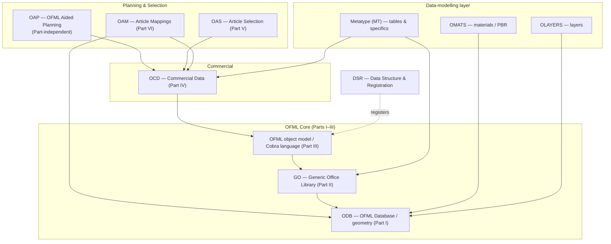
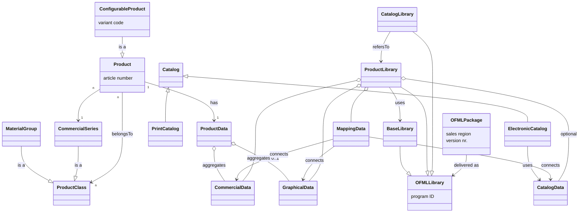

# 03 — Engineering Concepts

**Source:** OFML glossary + specifications (EasternGraphics/IBA), consolidated for the MK Product Workbench Engineering Handbook.
**Status:** Consolidated from specification docs; unclear items marked `UNKNOWN`.

This chapter presents the core system concepts and how they fit together. It is the
conceptual "map" that ties together the domain chapters. Definitions here follow the
authoritative *OFML glossary* (v1.1, EasternGraphics/IBA) and its conceptual model
(glossary Appendix B). For the exhaustive term list see [19 — Glossary](19_Glossary.md);
for the curated quick reference see [04 — Core Terminology](04_Core_Terminology.md).

---

## 1. The sales system frame

Everything in OFML exists to serve a **sales system** (synonym: marketing system) — a
software system that supports a dealer with sales procedures. All concepts below relate
specifically to *OFML-based* sales systems (the pCon application family: pCon.planner,
pCon.basket, EAIWS-based configurators, etc.). See
[02 — Architecture](02_Architecture.md).

A sales system must be able to **present**, **configure**, and **order** a product, and
to **visualize** it graphically. These four capabilities map directly onto the OFML data
domains described in section 3.

## 2. Product, article and configurable product

- **Product** (synonym: **article**) — a commodity (or service) produced and/or offered
  for sale by a manufacturer or supplier. Products differ by constructive, material and
  other characteristics.
- **Configurable product** — a product for which some characteristics can be specified
  by the buyer/user of the sales system. Since most articles are configurable, "article"
  and "article variant" are often used interchangeably.
- **Article number** — an alphanumeric code that unambiguously identifies a product
  within the leading production/planning system (PPS). The **basic article number**
  identifies the *configurable* product; the **final (extended) article number**
  identifies the product *as configured* and embeds the **variant code**, which encodes
  the values of the configurable characteristics.
- **Article variant** (synonym: article configuration) — the specific values of a
  configurable article's properties. The **PropVarCode** (property variant code) encodes
  the current OFML property values as `<Property>=<Value>;...` (see
  [09 — OAP](09_OAP.md)).

Detailed article/property mechanics live in [11 — Product Model](11_Product_Model.md)
and [16 — Configuration](16_Configuration.md).

## 3. The four data domains

In a sales system only two of these are strictly *product-visible*, but all four are
engineered:

| Domain | What it describes | OFML Part / format | Handbook chapter |
|--------|-------------------|--------------------|------------------|
| **Commercial data** | Non-graphical, sales-relevant data: presentation (texts), configuration (properties + relations), pricing (base price + surcharges) | Part IV — **OCD** | [07 — OCD](07_OCD.md) |
| **Graphical data** | Everything used to visualize a product in 2D/3D | Parts I–III (ODB, GO, OFML core) | [08 — ODB](08_ODB.md), [06 — OFML](06_OFML.md) |
| **Mapping data** | Connections between commercial, graphical and catalog data | Part VI — **OAM** | [02 — Architecture](02_Architecture.md) |
| **Catalog data** | Presentation/selection instrument for browsing products | **XCF** (Part V OAS not used in practice) | [02 — Architecture](02_Architecture.md) |

> **Product data** (broad sense) = *all* data needed to present, configure, order,
> produce and supply a product. In a sales system only **commercial** + **graphical**
> data are relevant. In the narrow sense "product data" is sometimes a synonym for
> commercial data (compare *product database*).

## 4. Classification and series

- **Product classification** — organizing products into classes by differentiation
  criteria (function, design, price group, statistics…). A product may belong to several
  classes; classification systems can be multi-level (super/subclasses). Standard systems
  (eCl@ss, UN/SPSC) coexist with manufacturer-specific ones.
- **Product group** (synonyms: commodity group, class of goods) — a class per a
  manufacturer-specific classification, often used for rebates.
- **Commercial series** (synonyms: **collection**, **product line**) — a group of
  products governing distribution. Determining ≥1 commercial series per manufacturer is
  **obligatory** for an OFML sales system. A series is identified by an ID within the
  manufacturer and an article's series assignment **must not change** during its life
  cycle.

## 5. Libraries, packages and the product database

- **OFML library** (synonym: OFML program) — identified by a unique **program ID**.
  Three forms:
  - **Base library** — OFML classes/data per the standard, with no reference to a
    concrete commercial series; the development basis for product libraries.
  - **Product library** (synonym: OFML series) — aggregation of the commercial,
    graphical, mapping and (optionally) catalog data of one or more commercial series of
    a manufacturer.
  - **Catalog library** — contains only catalog data referencing articles in other
    product libraries.
- **OFML package** — the actual distribution/installation unit of a library for a defined
  **sales region**, tagged with a unique **version number**. (Not the same as an OFML
  Part III namespace "package".) Directory layout and registration are governed by **DSR**
  (see [18 — Design Principles](18_Design_Principles.md)).
- **Product database** — a database holding the commercial data of one or more commercial
  series. Logically an OFML product library always contains a dedicated product database;
  physically one database may back several libraries.

## 6. The domain / technology stack

OFML is layered. Each layer builds on the ones beneath it:

The MK Product Workbench operates primarily in the **Metatype/GO** modelling layer,
feeding **OCD** commercial data and consuming the **OFML core** contracts (article &
property interfaces). See [10 — Metatype](10_Metatype.md),
[14 — Generation Process](14_Generation_Process.md).

## 7. Conceptual model (glossary Appendix B)

The following diagram reproduces the OFML glossary's conceptual model — the terms and
their most important relationships. Triangles in the original UML-like notation denote
inheritance (superordinate concept); diamonds denote aggregation; other associations are
typed with `<<...>>`.

**Key aggregation/association relationships:**

- A **Product** *belongsTo* many **Product Classes** (n:n); a **Configurable Product**
  *is a* Product; **Material Group** and **Commercial Series** *are* Product Classes.
- **Product Data** aggregates one **Commercial Data** and 0..1 **Graphical Data**.
- **Mapping Data** *connects* commercial, graphical and catalog data.
- An **OFML Library** (program ID) is delivered *as* an **OFML Package** (sales region +
  version). A **Product Library** *uses* a **Base Library**; a **Catalog Library**
  *refersTo* Product Libraries.

## 8. How it fits together (narrative)

1. A manufacturer's **products** are organized into **commercial series** and other
   **product classes** (classification).
2. Each series' commercial data is authored per **OCD** and stored in a **product
   database**; graphics are authored on the **OFML core / ODB / GO** stack, often
   generated from **Metatype** tables.
3. **Mapping data (OAM)** links a catalog selection to the right graphical representation
   and its commercial data.
4. The whole is aggregated into an **OFML product library** (program ID) and shipped as a
   versioned **OFML package** for a sales region.
5. In the sales system, the **article & property interfaces** (OFML Part III) expose the
   configurable product to the client; **OAP** drives interactive planning behaviour.

---

### Cross-references

- Architecture & data-domain routing → [02 — Architecture](02_Architecture.md)
- OFML core object model / Cobra → [06 — OFML](06_OFML.md)
- Commercial data model → [07 — OCD](07_OCD.md)
- Geometry / database → [08 — ODB](08_ODB.md)
- Interactive planning → [09 — OAP](09_OAP.md)
- Metatype modelling → [10 — Metatype](10_Metatype.md)
- Article & property model → [11 — Product Model](11_Product_Model.md)
- Generation pipeline → [14 — Generation Process](14_Generation_Process.md)
- Configuration & relations → [16 — Configuration](16_Configuration.md)
- DSR, OLAYERS, OMATS principles → [18 — Design Principles](18_Design_Principles.md)
- Curated terms → [04 — Core Terminology](04_Core_Terminology.md)
- Full A–Z → [19 — Glossary](19_Glossary.md)
