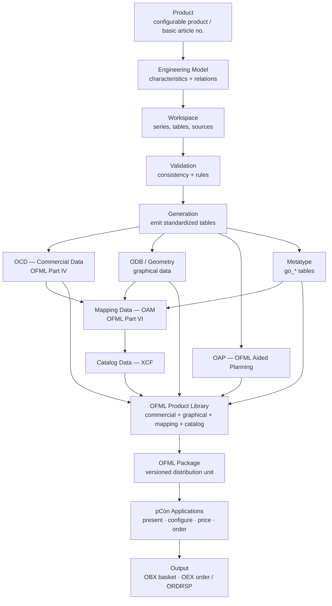
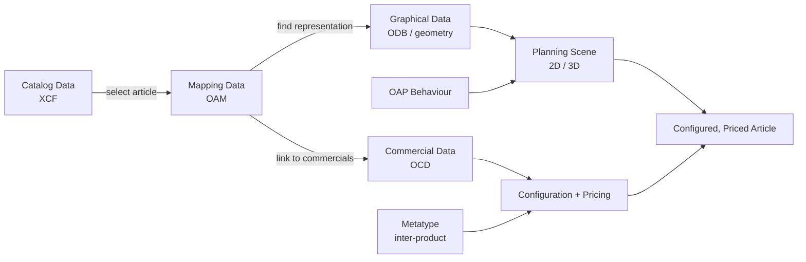

# 05 — Engineering Workflows
**Source:** OFML application notes + specifications (EasternGraphics/IBA), consolidated for the MK Product Workbench Engineering Handbook.
**Status:** Consolidated from specification docs; unclear items marked `UNKNOWN`.

This chapter documents each authoritative OFML data-creation workflow and how they combine into the end-to-end
product-to-order pipeline consumed by pCon applications.

Related chapters: [06 — OFML](06_OFML.md) · [07 — OCD](07_OCD.md) · [08 — ODB](08_ODB.md) ·
[09 — OAP](09_OAP.md) · [10 — Metatype](10_Metatype.md) · [12 — Validation Rules](12_Validation_Rules.md) ·
[14 — Generation Process](14_Generation_Process.md) · [15 — File Formats](15_File_Formats.md)

---

## 1. End-to-End Ecosystem Flow

A manufacturer's **product** is expressed as an **engineering model**, assembled inside a **workspace**, validated,
and then generated into the standardized OFML data formats that pCon applications consume. Commercial data (OCD),
graphical data (ODB/geometry), planning behaviour (OAP), inter-product configuration (Metatype), and the
**mapping data** that ties them together are aggregated into an **OFML product library** and distributed as an
**OFML package**.

> Grounding: the glossary defines *product data* as **commercial + graphical** data, joined by **mapping data**,
> and aggregated with catalog data into an **OFML product library** distributed as an **OFML package**
> (`ofml_glossary_1.1_en.md`). Commercial data is standardized in **OFML Part IV (OCD)**; mapping in **Part VI (OAM)**;
> catalogs in **XCF**.

---

## 2. Workflows

### 2.1 OCD Commercial Data Creation
| Field | Detail |
| --- | --- |
| **Purpose** | Describe a product from a commercial/sales point of view: configurable characteristics, relations (conditions), and pricing (base price + extra charges). |
| **Inputs** | Product/series definition; property (characteristic) model with value lists; relation logic; price components. |
| **Outputs** | OCD tables (article, property/relation, price tables) at a supported OCD format version (2.1 → 4.3 broadly supported; 5.0 not yet — `AN-2014-04`). |
| **Dependencies** | OCD specification (IBA, OFML Part IV); control data table `epdfproductdb.csv` for processing options; native OCD implementation (module EAI / `xOiNativeOCDProductDB`). |
| **Rules** | OCD expressions use OCD characteristics (`Legs = 'ALU'`); string literals in single quotes. Feature availability is release-gated (see `AN-2014-04` matrix). Options such as `@RelEvalOptimization`, `@UnlockBackwardRestriction`, `@OptPropsWithBaseValues`, `@SetDefaultMode` tune relation/preselection behaviour. `SET_VISIBILITY()` and `SET_CHECK_RELEVANCE()` mark visibility/order-check relevance. |
| **Expected Results** | A configurable article resolves valid variants and a correct price; invalid combinations are flagged inconsistent. |

Cross-ref: [07 — OCD](07_OCD.md), [12 — Validation Rules](12_Validation_Rules.md).

### 2.2 OCD Article Texts / Description Creation
| Field | Detail |
| --- | --- |
| **Purpose** | Provide the presentation layer of commercial data: short and long article descriptions (text). |
| **Inputs** | Article/variant identifiers; description text per language; optional text formatting codes; property/value hint texts. |
| **Outputs** | OCD text tables (short/long descriptions); alternative text tables (`UNKNOWN` — listed but not supported in `AN-2014-04`). |
| **Dependencies** | OCD specification; language handling; property text where value-level hints apply. |
| **Rules** | Recommended to annotate obsolete properties/values in text, e.g. `(obsolete)`, `(till ...)` (`AN-2017-01 §2.6`). Text formatting codes exist per OCD 4.0 but are not supported in the surveyed releases (`AN-2014-04`). |
| **Expected Results** | Human-readable article/variant descriptions rendered in catalog and basket; obsolete variants clearly hinted. |

Cross-ref: [07 — OCD](07_OCD.md).

### 2.3 Price List Data Creation
| Field | Detail |
| --- | --- |
| **Purpose** | Support **multiple price lists** in a single OFML dataset, selected at runtime by the price date, to preserve validity of quotes. |
| **Inputs** | Price components in the OCD price table with **validity periods**; new PL + retained old PL(s); article-specific and/or global (`*`) price components. |
| **Outputs** | Price table entries per price list; corrected end dates for superseded PLs. |
| **Dependencies** | OCD price-calculation rules; OCD 4.2+ for property-value validity periods (supported in apps from Nov 2018). |
| **Rules** | The entry whose validity period matches the price date is used (latest start date wins on ties); no match ⇒ article inconsistent (`"invalid price date"`). Do **not** alter retained old-PL entries except correcting an unknown end date. A global price component is applied only when no article-specific entry with the same variant condition exists. Article-specific → global conversion is **not** supported under multiple PLs up to OCD 4.3 (`AN-2017-01 §2.8`). |
| **Expected Results** | Old orders reprice on the old PL; new articles/variants price on the new PL; invalid-price-date state prompts the user to switch PL. |

Cross-ref: [07 — OCD](07_OCD.md), [14 — Generation Process](14_Generation_Process.md).

### 2.4 OAP Data Creation
| Field | Detail |
| --- | --- |
| **Purpose** | Define **OFML Aided Planning** behaviour: interactors, actions, conditions, and planning groups that drive interactive placement/configuration in 2D/3D. |
| **Inputs** | OFML properties of the active object; interactor/action/condition tables; symbol-display tables; planning-group classes; control data tables (with `EBase` descriptors `oap_<major>_<minor>.inp_descr`). |
| **Outputs** | OAP tables (`Version`, `Interactor`, `Action`, `SymbolDisplay`, `NumTripel`, `oap_methodcall.csv`, control data) — optionally in a **separate OAP series** (`oap_program`). |
| **Dependencies** | OAP specification; XOI base classes (`xOiCustomModule`, `xOiOAPManager`); standard OFML methods (`getFather()`, `getRoot()`); metatype `go_types` for numeric metaproperties. |
| **Rules** | OAP expressions differ from OCD: operators `\|\|`, `&&`, `==`, `!=`; symbols like `@ALU`; string literals in double quotes. Numeric metaproperties (`chi`/`chf`) return strings — convert with `int()`/`float()`. Integer division truncates (`DEPTH / 2000.0`). Special symbols via `symbol("---")` or `@"---"` (not `Symbol()`). Symbol sizes: large = group, medium = top-level/element actions, small = child articles. Create OAP data in a separate series when it spans multiple OFML series, uses planning groups, or changes on a different cadence. |
| **Expected Results** | Correct interactor visibility/position; actions create/clone/replace/delete articles and change dimensions consistently; planning groups behave as coherent units. |

Cross-ref: [09 — OAP](09_OAP.md), [12 — Validation Rules](12_Validation_Rules.md).

### 2.5 Metatype Creation / Generation
| Field | Detail |
| --- | --- |
| **Purpose** | Model **inter-product** configuration — properties that may change the basic article number (e.g. switch program/collection) plus concatenation/attachment rules — beyond traditional intra-product graphic modelling. |
| **Inputs** | `go_*` CSV tables, primarily `go_types` (metatype properties), `go_articles` (article numbers), `go_texts`, and control keys. |
| **Outputs** | A complete set of `go_*` tables (all tables must be present; unused tables empty), UTF-8/ASCII, `;`-separated, filenames `go_<table>.csv`. |
| **Dependencies** | MT specification (v1.18 surveyed); OFML Part III expression syntax (`NumExpr`/`BoolExpr` using `go_types` property keys as variables); OCD variant code mapping. |
| **Rules** | A metatype references a general metatype (e.g. `desk`) and represents a set of article numbers; each `go_types` entry defines one property. Config mode key: `consistent` / `inconsistent` / `serial`. `skipVC2MT` suppresses metatype→variant-code mapping; base-article-number changes handled per key when two series share a metatype using different codings. |
| **Expected Results** | Objects reconfigure across products/collections; article numbers and variant codes stay consistent with the OCD data. |

Cross-ref: [10 — Metatype](10_Metatype.md), [14 — Generation Process](14_Generation_Process.md), [15 — File Formats](15_File_Formats.md).

### 2.6 ODB / Geometry Data Creation
| Field | Detail |
| --- | --- |
| **Purpose** | Produce the **graphical data** used to visualize a product in 2D/3D views of the sales system. |
| **Inputs** | Geometry/model sources; digital image files (simplest case). |
| **Outputs** | Graphical data in OFML-standard methods/formats (OFML Parts I–III). Concrete ODB table/file layout: `UNKNOWN` — not covered by the surveyed docs. |
| **Dependencies** | OFML standard Parts I–III for representation; mapping data (OAM) to link geometry to commercial articles. |
| **Rules** | For 2D/3D representation, the methods and formats specified by the OFML standard must be used (`ofml_glossary_1.1_en.md`). Detailed ODB authoring rules: `UNKNOWN` in these sources. |
| **Expected Results** | Each catalog article resolves to a suitable graphical representation linked (via mapping) to its commercial data. |

Cross-ref: [08 — ODB](08_ODB.md). Detailed geometry authoring rules are `UNKNOWN` from the surveyed specs.

### 2.7 OFML Data Consumption by pCon (Sell / Configure / Order)
| Field | Detail |
| --- | --- |
| **Purpose** | Consume the published OFML dataset end-to-end: present the product, configure it, price it, and order it. |
| **Inputs** | OFML product library / package (commercial + graphical + mapping + catalog data). |
| **Outputs** | Configured article (basic + final article number with variant code), priced position, basket (OBX), order documents (OEX; order confirmation `ORDRSP`). |
| **Dependencies** | pCon applications (planner, basket, configurator/EAIWS, xcad, etc.) and processing libraries (XOI, OI, GO, EAI, FAPI); supported format-version matrix (`AN-2023-01`). |
| **Rules** | Consumption is gated by the supported-version matrix per release (`AN-2023-01`, `AN-2014-04`). The sales system determines the OFML product library from (manufacturer ID, series ID, article number); article numbers must be unambiguous across series and referenced in catalog data. Check-relevant properties (`SET_CHECK_RELEVANCE`) must be verified against the order confirmation. |
| **Expected Results** | User browses catalog → inserts article → configures valid variant → sees correct price → saves basket → emits order; inconsistent states (e.g. invalid price date) surface to the user. |

Cross-ref: [16 — Configuration](16_Configuration.md), [09 — OAP](09_OAP.md).

---

## 3. Data Flow at Runtime

At runtime the four data classes converge to render and sell an article:

- **Catalog data (XCF)** presents products and inserts a selected article into the plan.
- **Mapping data (OAM)** links the selected article to both its **graphical** representation and its **commercial** data.
- **Commercial data (OCD)** drives configuration (characteristics + relations) and pricing (base + extra charges, per active price list).
- **Graphical data (ODB)** provides the 2D/3D representation; **OAP** governs interactive planning; **Metatype** enables inter-product/collection changes.

The aggregation of commercial, graphical, mapping and catalog data for one or more commercial series forms the
**OFML product library**, distributed as a versioned **OFML package**.

Cross-ref: [06 — OFML](06_OFML.md), [15 — File Formats](15_File_Formats.md).

---

## 4. `UNKNOWN` / Open Items
- **ODB/geometry authoring** (table/file layout, detailed rules): not covered by the surveyed docs — see [08 — ODB](08_ODB.md).
- **OCD alternative text tables**: listed but marked unsupported in `AN-2014-04`; authoring guidance `UNKNOWN`.
- Detailed **generation mechanics** (how sources emit the standardized tables) are outside these application notes — see [14 — Generation Process](14_Generation_Process.md).
