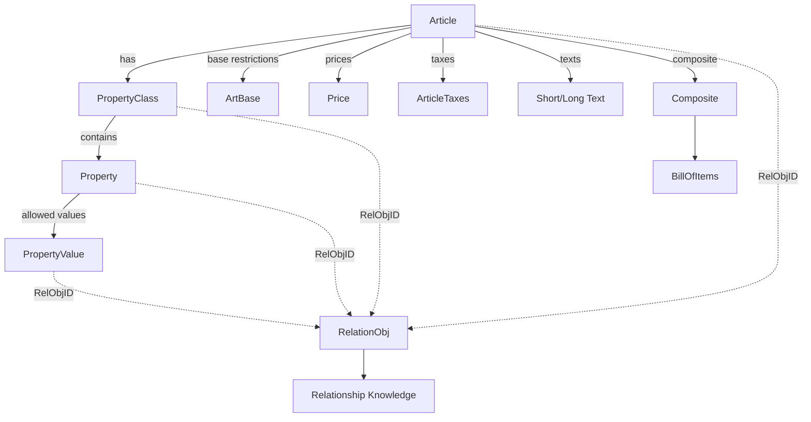

# 07 — OCD (OFML Commercial Data)

**Source:** OCD 4.3 + OCD application notes (EasternGraphics/IBA), consolidated for the MK Product Workbench Engineering Handbook.
**Status:** Consolidated from specification docs; unclear items marked `UNKNOWN`.

---

## 1. What OCD Is

**OCD** = **O**FML **C**ommercial **D**ata — **OFML Part IV**, the complete *commercial*
data model for the furniture trade. Where [06_OFML](06_OFML.md) describes the geometric
and object model, OCD describes the **business logic**: articles, configurable
properties, configuration rules (relations), prices, texts, taxes and identification.

- **Governance / editor:** EasternGraphics GmbH (Thomas Gerth, Editor) on behalf of the
  **Industrieverband Büro und Arbeitswelt e.V. (IBA)**.
- **Reference version:** **OCD 4.3**, Status *Release*, 2020-06-25 (Copyright 2003–2020 IBA).
- **Underlying model:** based on the fundamental OFML product data model (OFML standard
  v2.0.2, appendix A). See [11_Product_Model](11_Product_Model.md).

### 1.1 Purpose

OCD principally serves to create product data needed and exchanged within business
processes of the furniture trade. It covers three primary tasks:

1. **Configuration of complex articles** (see [16_Configuration](16_Configuration.md)).
2. **Price determination.**
3. **Creation of offer and order forms** (article texts / commercial forms).

> OCD is **not** a format for *catalog* data creation. Catalog data is provided
> otherwise; the link between catalog and product data is made by the software system
> **based on the article numbers**. (Catalog formats: OAS = OFML Part V, XCF =
> eXtensible Catalog Format.)

### 1.2 Physical Format — CSV Tables

CSV (comma-separated-values) tables are the physical exchange format. See also
[15_File_Formats](15_File_Formats.md). Rules:

- Each table lives in exactly one file. **File name = `ocd_` + table name (lower case) + `.csv`.**
- Each line (terminated by `\n`) is one data record. Blank lines are ignored.
  Character set is **ISO-8859-1 (Latin-1)**.
- Fields are separated by a **semicolon** (`;`).
- Lines starting with `#` are **comments** and excluded from processing.
- A field containing a semicolon must be enclosed in double quotation marks (`"`);
  two successive quotes inside a quoted field encode one literal quote.

**Data types** used in table field definitions:

| Type | Meaning | Notes |
|------|---------|-------|
| `Char` | Character string | All printable chars except the field separator `;` |
| `Num` | Number | May include decimal point and leading minus sign |
| `Bool` | Boolean | `1` = yes, `0` = no |
| `Date` | Date | `YYYYMMDD` (ISO 8601 without hyphens) |

- Each field spec has: **Number, Name, Key (part of primary key?), Type, Max length,
  Obligatory?**. The *obligatory* mark is only relevant for `Char`; other types must
  always be filled.
- **Units** follow the openTRANS / UN/ECE Recommendation 20 *Common Code* (e.g. `C62`
  piece, `MTR` meter, `MTK` square meter). See [13_Naming_Standards](13_Naming_Standards.md).

---

## 2. The OCD Data Model (Conceptual)

Core entities:

- **Article** — the base article (model number); root of all commercial data.
- **Property class** → **property** → **property value** — the configurable structure.
- **Article base** — article-specific fixed/allowed value restrictions.
- **Relational object** → **relationship knowledge** — configuration/price/packaging/tax logic.
- **Price / rounding** — pricing data and rounding rules.
- **Texts / descriptions** — short, long, variant, hint, message texts.
- **Taxation schemes / tax categories** — abstract tax assignment.
- **Composite / bill of items** — sets and sub-items.
- **Identification / classification / series / version / code scheme** — metadata & keys.

Splitting article data across many tables increases clarity (optional info is hidden),
eases extensibility and enables incremental data exchange.

---

## 3. The OCD Tables

Each subsection lists the physical file (`ocd_<name>.csv`), whether the table is
**obligatory**, and its key columns. **Bold = primary-key field.** Symbol legend:
*(o)* = optional (non-obligatory) `Char` field.

### 3.1 Overview of all tables

| Table (file `ocd_*`) | Oblig. | Purpose |
|----------------------|:------:|---------|
| `Article` | **yes** | Master table for all articles |
| `ArticleIdentification` | no | Extra identification numbers per article/variant |
| `Classification` / `ClassificationData` | no | Classify articles (eCl@ss, UNSPSC, manufacturer) |
| `Packaging` | no | Packaging dimensions/weights/volumes |
| `Composite` | no | General attributes of composite articles |
| `BillOfItems` | no | Sub-items of composite articles |
| `PropertyClass` | **yes** | Property classes assigned to articles |
| `Property` | **yes** | Properties of each property class |
| `PropertyIdentification` | no | Extra identification numbers per property |
| `Article2PropGroup` / `PropertyGroup` | no | Property groups for the property editor |
| `ArtBase` | no | Article-specific fixed/allowed property values |
| `PropertyValue` | **yes** | All possible values per property |
| `PropValueIdentification` | no | Extra identification numbers per property value |
| `RelationObj` | **yes** | Binds relations to relational objects |
| `Relation` | **yes** | The relationship knowledge (logic code blocks) |
| `Price` | **yes** | Base prices, extra charges, discounts |
| `Rounding` | no | Rounding rules |
| `Series` | no | Commercial series registration |
| Text tables (`ArtShortText`, `ArtLongText`, …) | mixed | Language-specific texts |
| `<name>_tbl` | no | Value combination tables (relationship knowledge) |
| `Identification` | no | Actual additional identification numbers |
| `Version` | **yes** | Format/database version metadata |
| `CodeScheme` | no | Codification schemes for final article numbers |
| `ArticleTaxes` / `TaxScheme` | no | Taxation-scheme assignment |

> The configuration tables (`PropertyClass`, `Property`, `PropertyValue`) and
> `RelationObj`/`Relation` **may be omitted** if the database stores only article texts
> and prices (no configuration data).

### 3.2 `Article` (obligatory)

Master table — the article number keys all other tables.

| # | Field | Key | Type | Explanation |
|---|-------|:---:|------|-------------|
| 1 | **ArticleID** | X | Char | Base article number (manufacturer model number) |
| 2 | ArticleType | | Char | `P` / `C` / `CS` (see below) |
| 3 | ManufacturerID | | Char | Manufacturer ID — assigned/managed centrally by EasternGraphics |
| 4 | SeriesID | | Char | Series ID (upper-case, digits, `_` only) |
| 5 | ShortTextID | | Char | Key into `ArtShortText` |
| 6 | LongTextID | | Char *(o)* | Key into `ArtLongText` |
| 7 | RelObjID | | Num | Relational object (0 = none) |
| 8 | FastSupply | | Num | Fast-supply threshold count (0 = none) |
| 9 | Discountable | | Bool | Are discounts allowed on the purchase price? |
| 10 | OrderUnit | | Char *(o)* | Order unit (UN/ECE, default `C62` piece) |
| 11 | SchemeID | | Char *(o)* | Codification scheme for final article number |

**Article types:**

| Type | Meaning |
|------|---------|
| `P` | Plain article — not configurable, no sub-items |
| `C` | Configurable article — user-settable properties, no sub-items |
| `CS` | Composite article — may include sub-items, may itself be configurable |

### 3.3 `ArticleIdentification` (no)

`**ArticleID**, **VariantCode**, SchemeID, IdentKey` — links an article (optionally a
specific variant via `VariantCode` + coding `SchemeID`) to entries in `Identification`
(§3.20). If several entries exist for a base article, each needs a variant code.

### 3.4 `Classification` / `ClassificationData` (no)

- `Classification`: `**ArticleID**, **System**, ClassID`.
  Systems: `ECLASS-x.y` (eCl@ss with version), `UNSPSC`, or
  `<Manufacturer>_*` (manufacturer-specific → product groups/hierarchies).
- `ClassificationData`: `**System**, **ClassID**, TextID` → language texts via
  `ClassificationText`.

### 3.5 `Packaging` (no)

`**ArticleID**, **Variantcondition**, Width, Height, Depth, MeasureUnit, Volume,
VolumeUnit, TaraWeight, NetWeight, WeightUnit, ItemsPerUnit, PackUnits`.

- Amounts for entries **with** a variant condition are always stated as a **difference**
  to the basic (no-variant) amount and may be negative → so a base entry (empty field 2)
  must always exist.
- Wildcard `*` in `ArticleID` (only when field 2 non-empty) gives article-independent
  uniform values, used only if no specific entry exists.
- Measure units: dimensions `CMT/FOT/INH/MMT/MTR`; volume `INQ/LTR/MTQ`; weight `KGM/LBR/MGM`.
- Gross weight = TaraWeight + (NetWeight × ItemsPerUnit).
- Determination procedure: see §6.

### 3.6 `Composite` (no)

`**CompositeID**, IsFixedSet, Configurable, ItemsConfigurable, PriceMode, BasketMode, TextMode`.

- `IsFixedSet` — if `yes`, existence conditions of sub-items are **not** evaluated.
- `Configurable` — is the composite itself configurable?
- `ItemsConfigurable` — may sub-items be configured at all?
- **PriceMode:** `C` (price bound to composite), `S` (sum of sub-item prices),
  `C+S` (composite price + sum of sub-items).
- **BasketMode:** `H` (hierarchical sub-positions), `T` (sub-items listed in the
  composite description text).
- **TextMode** (only for basket mode `T`): how sub-items are described —
  `BAN`, `FAN`, `ST`, `LT`, and combinations `BAN+ST`, `BAN+LT`, `FAN+ST`, `FAN+LT`,
  `ST+BAN`, `ST+FAN`, `LT+BAN`, `LT+FAN`.

### 3.7 `BillOfItems` (no)

`**CompositeID**, **Position**, ItemID, RelObjID, Configurable, Quantity, QuantUnit, TextID`.

- Existence condition per sub-item via `RelObjID` — must be a *precondition* of scope
  `BOI`; only evaluated if the composite's `IsFixedSet` = `no`.
- `Quantity` > 1 summarises identical articles at a BOM position; such items must not be
  configured (field 5 ignored). `QuantUnit` default `C62`.

### 3.8 `PropertyClass` (obligatory)

`**ArticleID**, **Position**, Name, TextID, RelObjID`.

- Assigns property classes describing an article's properties.
- `Position` orders classes in listings/editors.
- `Name` — alphanumeric + underscore; first char not numeric.
- Preconditions and actions may be bound via `RelObjID` (0 = none). A class precondition
  takes priority over the preconditions of its properties.

### 3.9 `Property` (obligatory)

`**PropertyClass**, **PropertyName**, Position, TextID, RelObjID, Type, Digits,
DecDigits, Obligatory, AddValues, Restrictable, MultiOption, Scope, TxtControl, HintTextID`.

**Value data types (field `Type`):**

| Type | Meaning |
|------|---------|
| `C` | Char — string (max length = `Digits`); no space, no backslash |
| `T` | Text — free multi-line text (`\n` line breaks); implicitly configurable |
| `N` | Num — number, format `%<Digits>.<DecDigits>f` (or `%d`) |
| `L` | Length — like `N` but OFML format `@L`; values stored in **meters** |

**Scope (field `Scope`):**

| Scope | Meaning |
|-------|---------|
| `C` (or blank) | Configurable, visible; usable for graphics |
| `R` | Only in relationship knowledge; **not persisted** (re-initialised each run) |
| `RV` | Not configurable, but **visible** (read-only); graphic-relevant |
| `RG` | Not configurable, not visible, but **graphic-relevant** |

Other fields: `Obligatory` (input mandatory — only for type `C`); `AddValues` (free
value input allowed for simple properties); `Restrictable` (value set restricted by
*constraints*, starting from the full set); `MultiOption` (multi-valued property);
`TxtControl` (property-text control code, §5); `HintTextID` → `PropHintText`.

**Attribute dependency rules (explicit in spec):**

- `Obligatory` and `AddValues` are only relevant for configurable properties (scope `C`).
- Configurable **numeric** properties are always mandatory.
- Configurable **restrictable** properties are always mandatory.
- Free string/text input properties are mandatory (empty string is a real value).
- Type `T` is implicitly scope `C`; `Restrictable`/`MultiOption` not relevant; only text
  controls `0` and `5` allowed.
- Restrictable configurable properties cannot take additional (free) input values.
- Interval values only for configurable, non-restrictable numeric properties.
- Type `L` only useful for visible scopes (`C`, `RV`).
- Type `T` cannot be multi-valued.
- For multi-valued properties, `AddValues`/`Restrictable`/intervals not relevant.

**Initialisation:** type `T` → empty string; restrictable → undefined; non-restrictable
configurable → the `IsDefault` value (else first value / undefined). Full rules in
[16_Configuration](16_Configuration.md).

### 3.10 `PropertyIdentification` (no)

`**PropertyClass**, **PropertyName**, IdentKey` → keys into `Identification` (§3.20).

### 3.11 Property groups — `Article2PropGroup` / `PropertyGroup` (no)

- `Article2PropGroup`: `**ArticleID**, **Position**, PropGroupID, TextID` — assigns groups
  to an article; `TextID` → `PropGroupText` for a language-specific group name.
- `PropertyGroup`: `**PropGroupID**, **Position**, PropertyClass, PropertyName` — defines
  the properties (and order) inside a group. Ungrouped visible properties fall into an
  artificial group "Other".

### 3.12 `ArtBase` (no)

`**ArticleID**, **PropertyClass**, **PropertyName**, **PropertyValue**` — article-specific
fixed/allowed values. Restricts the value set to the listed discrete values (only values
also present in `PropertyValue`), and **prevails over** any proposal value in
`PropertyValue`.

### 3.13 `PropertyValue` (obligatory)

`**PropertyClass**, **PropertyName**, **Position**, TextID, RelObjID, IsDefault,
SuppressTxt, OpFrom, ValueFrom, OpTo, ValueTo, Raster, DateFrom, DateTo`.

- Lists all possible values per property. Values in `ValueFrom`/`ValueTo` are numeric
  strings or symbolic identifiers; language texts via `PropValueText`.
- `IsDefault` marks the initial value (only one allowed). For optional properties without
  a default, the virtual value `VOID` ("not selected") is used (reserved for type `C`).
- `SuppressTxt` — suppress the value in the article description when selected.
- **Interval values** via operators in `OpFrom`/`OpTo`: `EQ` (fixed), `GT/GE/LT/LE`
  (open/closed ranges). `Raster` = increment. Multiple intervals possible, gated by
  preconditions. `DateFrom`/`DateTo` = validity period (for multi-price-list data).

### 3.14 `PropValueIdentification` (no)

`**PropertyClass**, **PropertyName**, **PropertyValue**, IdentKey` → `Identification`
(§3.20). Only for non-interval values that exist in `PropertyValue`.

### 3.15 `RelationObj` (obligatory) — binding relations

`**RelObjID**, **Position**, RelName, Type, Domain`.

**Relation types (field `Type`):**

| Code | Type | Purpose |
|:----:|------|---------|
| 1 | Precondition | Validity/visibility of a data entity |
| 2 | Selection condition | Whether a property must be evaluated |
| 3 | Action | Determine/assign values or issue messages |
| 4 | Constraint | Consistency assurance / value-set restriction |
| 5 | Reaction | Like action but only on specific events |
| 6 | Post-Reaction | Like reaction, executed after all others |

**Domains (field `Domain`):** `C` (configuration), `P` (price determination),
`BOI` (bill of items), `PCKG` (packaging), `TAX` (taxation). Relations in `P`, `PCKG`,
`TAX` **can only be actions** and may assign only to internal/auxiliary properties.

**Usage matrix (entity × domain):**

| Rel. type | Article | P.class | Property | P.value | BOI part | C | P | PCKG | TAX | BOI |
|-----------|:---:|:---:|:---:|:---:|:---:|:---:|:---:|:---:|:---:|:---:|
| Precondition | | X | X | X | X | X | | | | X |
| Selection cond. | | | X | | | X | | | | |
| Action | X | X | X | X | | X | X | X | X | |
| Reaction | X | | X | | | X | | | | |
| Post-Reaction | X | | X | | | X | | | | |
| Constraint | X | | | | | X | | | | |

`Position` sets evaluation order (ascending) among relations of the same type + domain.

### 3.16 `Relation` (obligatory) — relationship knowledge

`**RelationName**, **BlockNr**, CodeBlock`. The logic is stored as numbered code blocks
concatenated by `BlockNr` before evaluation. Coding language is declared in `Version`
(§3.21). Languages: `OCD_1`, `OCD_2`, `OCD_3`, `OCD_4`, `SAP_LOVC` (see §7).

### 3.17 `Price` (obligatory)

`**ArticleID**, **Variantcondition**, **Type**, **Level**, Rule, TextID, PriceValue,
FixValue, **Currency**, **DateFrom**, DateTo, **ScaleQuantity**, RoundingID`.

- All prices are **net** (without taxes).
- **Type:** `S` sales price, `P` purchase price.
- **Level:** `B` base price, `X` extra charge, `D` discount.
- Variant condition (upper case) gates conditioned price items; assigned via price
  relations (§4). Wildcard `*` allows article-independent charges/discounts (field 2
  must be non-empty).
- **Rule** (calculation rule): required for percentage discounts — `1` = relative to base
  price, `2` = relative to accumulated price.
- `FixValue` — `1` fixed amount in `Currency` (ISO 4217), `0` percentage.
- Extra charges (`X`) may be negative. `ScaleQuantity` = min. quantity for scale prices
  (default `1`; calculated per order position). `RoundingID` → `Rounding` (§3.18).

### 3.18 `Rounding` (no)

`**ID**, **Number**, Minimum, Maximum, Type, Precision, AddBefore, AddAfter`. Multiple
sequential entries per `ID`. Range `[Minimum, Maximum)` (Maximum excluded). Methods:
`DOWN`, `UP`, `COM` (commercial, X.5 up), `ECOM` (unbiased commercial, X.5 to even).
`Precision` = divisor for the rounded amount. `AddBefore`/`AddAfter` may be negative.

### 3.19 `Series`, description tables, value-combination tables

- **`Series`** (no): `**SeriesID**, TextID, CatalogFormat, CatalogDir`. Catalog format
  `OAS` (OFML Part V) or `XCF`.
- **Text tables** (§4.2 below): all share the structure
  `**TextID**, **Language**, **LineNr**, LineFormat, Textline`.
- **Value combination tables** `<id>_tbl.csv`: `**LineNr**, **PropertyName**, **Value**` —
  all upper case. Used in relationship knowledge to check/derive/restrict value
  combinations. A restrictable property's cell may hold a value **set**.

### 3.20 `Identification` (no)

`**EntityID**, **Type**, IdentNr`. Types: `CustomID` (dealer/major-client article no.),
`EAN.UCC-8/-13/-14`, `GLN`, `Intrastat`, `CustomsTarif`.

### 3.21 `Version` (obligatory)

`FormatVersion, RelCoding, DataVersion, DateFrom, DateTo, Region, VarCondVar,
PlaceHolderOn, Tables, Comment`. **One entry only.**

- `FormatVersion` = `Major.Minor`; `RelCoding` = relation language (§3.16);
  `DataVersion` = `Major.Minor.Build` (strictly monotonically ascending).
- `Region` = sales region identifier (also models major-client-specific price/config data).
- `VarCondVar` = custom variable used instead of `$VARCOND` / `$self.variant_condition`.
- `PlaceHolderOn` = replace placeholders in `IN` comparisons?
- `Tables` = comma-separated list of contained tables (names without `ocd_`/`.csv`;
  value-combination tables excluded).

### 3.22 `CodeScheme` (no)

`**SchemeID**, Scheme, VarCodeSep, ValueSep, Visibility, InVisibleChar, UnselectChar,
Trim, MO_Sep, MO_Bracket`. Parameterises final-article-number generation (§8). Final
article number = base article number + variant code (position determined by scheme).
`Visibility` `0` = only currently valid/visible properties, `1` = all configurable.
`InVisibleChar` default `-`, `UnselectChar` default `X`, `MO_Sep`/`MO_Bracket` control
multi-valued output.

### 3.23 Taxation — `ArticleTaxes` / `TaxScheme` (no)

Articles are **not** assigned concrete tax rates; each is assigned a **taxation scheme**
that, per country/region and tax type, names an abstract **tax category** (rates managed
in the OFML application). See §9.

- `ArticleTaxes`: `**ArticleID**, TaxID, **DateFrom**, DateTo` — assigns a scheme; date
  fields carry legal changes (non-overlapping periods if multiple entries).
- `TaxScheme`: `**TaxID**, **Country**, **Region**, **Number**, TaxType, TaxCategory` —
  country- (ISO 3166-1) and region- (ISO 3166-2 suffix) specific. `Number` orders
  multiple tax types. Function `SET_TAX_CATEGORY` (in `TAX` relations) can override the
  category per variant.

---

## 4. Article Texts & Descriptions

### 4.1 The three text types (fact sheet + ArticleDescription 1.2)

Based on the IBA recommendation "Uniform customer-oriented article descriptions". An
article description is composed (no blank lines between sections) of:

1. **Manufacturer + series name** (from registration data; can be switched off).
2. **Short or long text** (incl. fixed dimensions).
3. **Variant text** (configurable properties).
4. **Custom-made product text** (optional; entered by the retailer).

| Text type | Source table | Rules |
|-----------|--------------|-------|
| **Short text** | `ArtShortText` (obligatory) | Brief description of the base article; **one line, max 50 chars**; used in article trees/overviews |
| **Long text** | `ArtLongText` | Detailed description of non-configurable properties incl. **fixed dimensions**; must be understandable independently of the short text; each line = a paragraph (continuous text) |
| **Variant text** | `PropertyText` + `PropValueText` | Describes configurable properties; **no bare codes/abbreviations** — describe textually; standard form (text control `0`) = `name: value` |

- **Dimensions** order: **width × depth × height**, e.g. `800 x 430 x 720 mm (WxDxH)`;
  recommended unit mm (Germany), cm otherwise, inches (USA). A configurable dimension is
  omitted from the long text and described in the variant text instead.
- Long-text and variant-text lines are treated as **paragraphs**: applications wrap them
  as needed; each new line forces a line break.

### 4.2 Text tables (shared structure)

All text tables share `**TextID**, **Language**, **LineNr**, LineFormat, Textline`.
Language per ISO 639-1 (`de`, `en`, `fr`, …). Multi-line allowed **only** for
`ArtLongText`, `PropHintText`, `UserMessage`, `PropValueText`.

Tables: `ArtShortText` *(obligatory)*, `ArtLongText`, `PropClassText`,
`PropertyText` *(obligatory)*, `PropHintText`, `PropGroupText`, `PropValueText`,
`PriceText`, `BillOfItemsText`, `UserMessage`, `SeriesText`, `ClassificationText`.

**LineFormat codes:** `\` (line feed, default), `~` (append as continuous text),
`^` (conditioned continuous text — wrap only if line width exceeded).

### 4.3 Property text control (`TxtControl`, §5 of spec)

Controls how a property is described in commercial forms (type `T` allows only `0`/`5`):

| Code | Effect |
|:----:|--------|
| `0` | `name: value` (first value line) + remaining value lines — **standard** |
| `1` | Value text only (property name suppressed) |
| `2` | Name only + value lines 2..n |
| `3` | Value lines 2..n only (name + first value line suppressed) |
| `4` | No description in the form (auxiliary properties) |
| `5` | For multi-valued / type `T`: name line + all value texts (separated by `MO_Sep`) |

---

## 5. Pricing & Price-List Data Creation

### 5.1 Price determination (spec §3)

Total price per price type (sales/purchase) is accumulated over price items at levels in
order: **1. base (`B`) → 2. extra charge (`X`) → 3. discount (`D`)**. Amounts are rounded
to 2 decimals by commercial rounding unless a `RoundingID` overrides. Taxes are applied
last using the taxation schemes (§9).

**Relevant entries** (per level): article entries without variant condition, plus entries
whose variant conditions are assigned by **price relations** (scope `P`, type action).
Variant conditions are assigned to `$VARCOND` (OCD) / `$self.variant_condition` (SAP) and
converted to upper case. Relations are collected from: article → property classes →
assigned properties → assigned values.

**Valid (most appropriate) entry:** base-level entries without a fixed amount are ignored;
entries outside the validity period are ignored; the requested currency is preferred;
scale entries above the ordered quantity are excluded; among the rest the **latest
`DateFrom`** wins.

**Price factors:** `$SET_PRICING_FACTOR(<variant condition>, <factor>)` multiplies the
price item bound to a variant condition (factor may be negative; can be conditioned with
`IF`). SAP language sets add `$self, variant_condition` as leading parameters.

### 5.2 Multiple price lists (AN-2017-01)

Multiple price lists coexist in one dataset via multiple `Price` entries with different
**validity periods**; at runtime the entry matching the user's **price date** is used
(latest `DateFrom` if several match). No suitable list ⇒ article is inconsistent
("invalid price date"). Data-creation rules:

- When taking over an older PL into a new dataset, **do not change** its relevant price
  entries — except to correct an unknown/far-future end date (set to the day before the
  new PL's first validity day).
- **Article no longer valid** in new PL → keep it, create **no** new-PL entries, correct
  old-PL end date. Beware **global (`*`) price components** still valid in the new PL —
  they may wrongly price the article; make them article-specific or remove globally.
- **New article** → entries only in the new PL, not the old.
- **Variant newly price-relevant** → set variant condition + new-PL entry only.
- **Variant no longer price-relevant** → **leave price logic unchanged**; simply omit the
  new-PL table entry (removing the variant condition would silently drop a still-valid
  old-PL charge → faulty offer).
- An older PL may **not** be removed while basic dealer agreements still permit ordering
  against it.

---

## 6. Determination of Packaging Data (spec §6)

1. Read the **basic** entry (empty variant condition) from `Packaging`.
2. Determine valid variant conditions via **packaging relations** (scope `PCKG`, type
   action; variant conditions assigned to `$VARCOND`).
3. For each valid variant condition, add the non-empty field amounts (differences) to the
   accumulated data. `$SET_PCKG_FACTOR(<variant condition>, <data item>, <factor>)`
   multiplies a fetched field (e.g. `'NETWEIGHT'`); may be conditioned with `IF`.

Relations collected from: article → property classes → assigned properties → values.

---

## 7. Configuration Semantics & Relationship-Knowledge Languages

See [16_Configuration](16_Configuration.md) for the full configuration model. Key points
from OCD:

- **Preconditions** gate visibility/validity of classes, properties, values, BOI parts.
  If undefined, a precondition is treated as *not violated*.
- **Selection conditions** force evaluation of optional/free-input properties (violated
  if *not definitely true*, i.e. also violated when undefined).
- **Actions** assign values / issue messages (per config step). **Reactions** run on
  change events (before other relations); **post-reactions** run after all others (must
  not further change dependent properties). **Constraints** assure consistency /
  restrict value sets (bound to articles).

**Languages** (declared in `Version.RelCoding`):

| Language | Adds |
|----------|------|
| `OCD_1` | Base: conditions, assignments, arithmetic; `$BAN`; operators `LT/LE/EQ/NE/GE/GT`, `AND/OR/NOT`; special conditions `SPECIFIED`, `IN`; three-valued (undefined) logic |
| `OCD_2` | String concat `+`, `STRING()`, `TRUE/FALSE`, **constraints**, table calls |
| `OCD_3` | Multivalued properties, multilevel configuration |
| `OCD_4` | Further extensions (incl. `SET_TAX_CATEGORY`) |
| `SAP_LOVC` | SAP LO-VC language set (uses `$self.variant_condition`) |

**Undefined-logic rules:** an expression referencing a missing/unassigned property is
*undefined*; `OR` is true if any operand is true; `AND` is false if any operand is false;
`SPECIFIED` guards against undefined. String comparison is **lexicographic** on Latin-1
(so `'900' > '1000'` while `900 < 1000`).

---

## 8. Final Article Number Generation (spec §4)

Final article number = base article number + variant code, per the `SchemeID` from
`Article`. No/unknown scheme ⇒ final = base number.

- **Predefined schemes** (`Scheme` field of `CodeScheme`):
  - `KeyValueList` — `Class.Property=Value;…` (VOID for unselected optional; trim always `1`).
  - `ValueList` — property values only; controlled by `CodeScheme` fields 4–10.
- **User-defined schemes** — sequence of `<Class>:<Property>`, table calls, `@` (next base
  number char) and literal chars (except `,` and `@`).
- **Multivalued properties** — values separated by `MO_Sep` (default `,`), optionally
  bracketed by `MO_Bracket` (even char count → split half front/half back, e.g. `[ABS,ZV]`).

> User-defined final numbers are of limited use for **reconstructing** a configuration
> (esp. with table calls or the Trim flag on consecutive properties).

---

## 9. Tax Types & Tax Categories (OCD_TaxCategories 1.0)

Standardised tax types/categories (replaces the OCD appendix from format 4.0 onward).

### 9.1 Value Added Tax — type `VAT`

Categories: `standard_rate`, `reduced_rate`, `super_reduced_rate` (severely reduced),
`parking_rate`, `services`, `zero_rate`, `exemption`.

### 9.2 Eco-tax France — type `ECO_FR`

A visible **fee** (not a tax) financing disposal/recycling of B2B office/object furniture
(authority: **Valdelia**). It **is** subject to VAT and is **not discountable**. Fee =
net weight × annual price factor for the article's fee category. Category identifier =
`<product type>` or `<product type>_<material category>`.

- **General furniture types:** `seat`, `storage`, `workplace`, `other` — combinable with
  material categories `metal`, `metal95`, `plastics`, `wood`, `other` (e.g. `seat_metal`).
- **Decoration** (`decoration`): materials incl. `pvc`, `textile` (e.g. `decoration_textile`).
- **Floorings** (`floor`): `floor_pvc`, `floor_other`.
- **Specific product types (no material category):** `mattress`, `bed_base`,
  `metal_tambour_cabinet` (≥75% metal roller-shutter cabinet), `school_furniture`,
  `acoustic_booth`, `cut2size_panel`.
- Special category `none` = not subject to the fee.

Material category is decided by **weight percentage** (majority material; else `other`).

---

## 10. OCD Engineering Rules

Rules explicitly stated across the specs (naming, ordering, defaults, validation,
dependencies). See also [12_Validation_Rules](12_Validation_Rules.md) and
[13_Naming_Standards](13_Naming_Standards.md).

### 10.1 Naming

- File name = `ocd_<tablename>.csv` (table name lower case).
- `SeriesID`, property class/property/value **variant conditions** in relationship
  knowledge are **upper case**; forbidden chars in IDs: `\ / ? : * " > < | , ; =` and space.
- Property class / property names: alphanumeric + `_`; **first char not numeric**.
- Variant conditions (`Price`) written completely in **upper case**.
- Value-combination table names lower case with `_tbl.csv` suffix; names/values upper case.
- Manufacturer IDs assigned centrally by EasternGraphics; series IDs upper case + digits + `_`.

### 10.2 Ordering & positions

- `Position` fields order classes, properties, values, groups, sub-items in editors/forms.
- Relation evaluation order = ascending `Position` within same type + domain; equal
  positions = undefined order.
- Price levels evaluated `B → X → D`.

### 10.3 Defaults & initialisation

- Only **one** `IsDefault` value per property (multiple ⇒ undefined behaviour).
- Optional property without default ⇒ virtual `VOID`; mandatory without default ⇒ first value.
- `ArtBase` values **prevail over** `PropertyValue` proposal values.
- Default value should not carry a precondition invalid in the initial configuration.

### 10.4 Validation / consistency

- Configuration incomplete while any obligatory property is unassigned or any restrictable
  property is unevaluated ⇒ article **cannot be ordered**.
- A specific value may appear only once within a property; a property may occur only once
  within an article's classes.
- Packaging: a base (no-variant-condition) entry must always exist.
- Multi-price-list: no matching price date ⇒ article inconsistent ("invalid price date").
- Inconsistent articles cannot be ordered.

### 10.5 Dependency / relation rules

- Relations in domains `P`, `PCKG`, `TAX` may **only** be actions and may assign only to
  internal/auxiliary properties (no impact on the current configuration).
- Post-reactions must not change dependent properties (no later evaluation follows).
- Scope `R` properties are non-persistent (re-initialised each configuration run).
- Class precondition takes priority over property preconditions of that class.

---

## 11. Application / Tooling Notes

- **Supported features (AN-2014-04):** current pCon apps support OCD **2.1, 4.0–4.3**;
  OCD 3.0 (scale prices, composite articles) and 5.0 largely **unsupported**; multivalued
  properties supported only for scope `R` in format 4.3; the packaging table is used only
  in pCon.basket for Eco-tax-France weight. Native OCD implementation = module **EAI**,
  class `xOiNativeOCDProductDB` (key `productdb`).
- **Control data tables (AN-2006-01):** XOI control tables (`proginfo`, `plelement`,
  `anyarticle`, `epdfproductdb`, …) tune runtime behaviour without subclassing. Structure:
  `field1 = type`, `field2 = args`, `field3 = value`; may live in single CSV or
  `ofml.ebase` (which takes precedence). Relevant OCD options include
  `@OptPropsWithBaseValues`, `@SetDefaultMode`, `@AllowConsecValsInTrimmedCode`,
  `@UnlockBackwardRestriction`, `@UnfixPreselectedChoiceList`, `@EPDFPropValPrefix`
  (default prefix `S` for values starting with a digit — OFML symbols may not start with a
  digit). These control tables are **XOI/OFML control data**, distinct from the `ocd_*`
  commercial tables. `UNKNOWN`: full option catalogue not consolidated here (see AN-2006-01).

---

## 12. Cross-References

- [06_OFML](06_OFML.md) — the overall OFML standard and its parts.
- [08_ODB](08_ODB.md) — OFML database (geometry) interface.
- [09_OAP](09_OAP.md) — OFML article/property data creation.
- [10_Metatype](10_Metatype.md) — metatype layer that generates OCD structures.
- [11_Product_Model](11_Product_Model.md) — article/property interfaces underpinning OCD.
- [12_Validation_Rules](12_Validation_Rules.md) — consolidated validation rules.
- [13_Naming_Standards](13_Naming_Standards.md) — naming/ID conventions.
- [15_File_Formats](15_File_Formats.md) — CSV/table file formats.
- [16_Configuration](16_Configuration.md) — configuration semantics & relationship knowledge.
- [19_Glossary](19_Glossary.md) — terms (article, variant condition, property class, etc.).

---

### Open `UNKNOWN` items

- Full field-level detail of language definitions `OCD_3`, `OCD_4`, `SAP_LOVC` and the
  complete arithmetic-function list (spec appendices C–F) — summarised, not exhaustively
  reproduced.
- Complete `epdfproductdb` / control-table option catalogue (AN-2006-01) — only OCD-relevant
  options captured.
