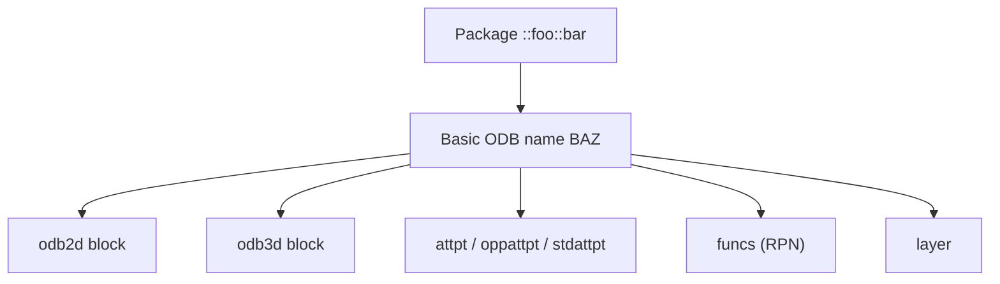
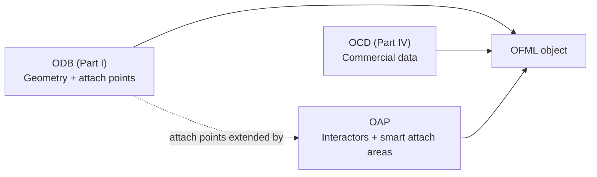

# 08 — ODB (OFML Database)

**Source:** ODB 2.4 (EasternGraphics/IBA), consolidated for the MK Product Workbench Engineering Handbook.
**Status:** Consolidated from specification docs; unclear items marked `UNKNOWN`.

---

## 1. What ODB Is

**ODB** = **O**FML **D**ata**b**ase — the **geometry-and-object description database** of OFML,
formally designated **OFML Part I**. Using ODB you describe the **geometric** and — to a
certain extent — the **logical** characteristics of planned objects in a *descriptive*,
table-based form that can be easily written into a program and checked for consistency.

- **Governance / editor:** developed by **EasternGraphics GmbH** (Jochen Pohl, Ekkehard
  Beier, Sebastian Schmidt) on behalf of the **Industrieverband Büro und Arbeitswelt e.V.
  (IBA)**.
- **Reference version:** **ODB 2.4**, Status *Release*, January 6, 2022 (Copyright 2003–2022 IBA).
- **Nature:** ODB data are arranged in **tables** so that the description is declarative and
  verifiable, rather than programmed.

### 1.1 Where ODB Sits in OFML

OFML separates concerns into layered parts. ODB (Part I) supplies the **graphical /
geometric layer** that gives an article its visual body and its attachment behaviour:

| Part | Domain | Handbook |
| --- | --- | --- |
| **Part I — ODB** | Geometry & object description (this doc) | 08_ODB |
| Part III — core / PDM interfaces | Product model, Article/Property | [06_OFML](06_OFML.md), [11_Product_Model](11_Product_Model.md) |
| Part IV — OCD | Commercial data (price, texts, config rules) | [07_OCD](07_OCD.md) |
| — OAP | Aided planning (interactors, actions, attach areas) | [09_OAP](09_OAP.md) |

ODB is the *descriptive* alternative/complement to programming geometry directly in the
OFML language. An ODB definition (an **ODB block**) can be instantiated from OFML code or
referenced from another ODB block (see §7.7–7.8).

---

## 2. The ODB Data Model

An ODB description is a set of **CSV tables**. Each table row is a data record; a series of
consecutive rows sharing one basic ODB name forms an **ODB block**.

### 2.1 Survey of Tables

| Table (`odb_<name>.csv`) | Purpose | Obligatory |
| --- | --- | --- |
| `odb2d` | 2D geometry (graphical primitives, symbols) | **yes** |
| `odb3d` | 3D geometry (solids, imports, CSG) | **yes** |
| `attpt` | Attachment point definitions | **yes** |
| `oppattpt` | Opposite (matching) attachment points | **yes** |
| `stdattpt` | Standard attachment point control | **yes** |
| `funcs` | User-defined functions (RPN) | no |
| `layer` | 3D layer definitions | no |

> **Format rules (§7.4):** one table per file; filename = prefix `odb_` + table name (lower
> case) + `.csv`. Character set **ISO-8859-1 (Latin-1)**. Fields separated by `;`. Blank
> lines and lines starting with `#` are ignored. A field containing `"` or `;` is quoted and
> inner `"` doubled. Lines end with `LF` or `CR`+`LF`. (Compare OCD/OAP CSV rules in
> [15_File_Formats](15_File_Formats.md).)

### 2.2 The ODB Name

Every geometry belongs to a **fully qualified ODB name** of the form
`::foo::bar::BAZ`, where `::foo::bar` is the **package name** and `BAZ` is the **basic ODB
name**. Within a table, the first row of a block carries the basic name in `odb_name`; all
following rows in the same block leave `odb_name` blank.



---

## 3. 2D Geometry (`odb2d`)

The 2D geometry of an OFML object is described by one or more consecutive `odb2d` entries;
each entry creates a **graphical primitive** with its own offset, rotation, scaling and
optional attributes.

| # | Field | Description |
| --- | --- | --- |
| 1 | `odb_name` | ODB name (only in first row of block) |
| 2 | `level` | hierarchy level (grouping) |
| 3 | `visible` | visibility control (blank/≠0 = shown; 0 = hidden with children) |
| 4 | `x_offs` | X offset |
| 5 | `y_offs` | Y offset |
| 6 | `rot` | rotation around Z axis (degrees, counter-clockwise) |
| 7 | `x_scale` | X scale |
| 8 | `y_scale` | Y scale |
| 9 | `ctor` | creating the 2D object (RPN function call) |
| 10 | `attrib` | graphical attributes |

### 3.1 Hierarchy, transform order, grouping

- Default `level` of the first entry is **0**. Grouped elements are listed as consecutive
  rows one level *above* the row that carries the group transform. The **last entry before a
  group whose level is lower** determines the group's transformation.
- A row with a **blank `ctor`** is not drawn; it exists only to carry a group transform.
- **Transform order:** an object is **scaled**, then **rotated**, then **offset**.

### 3.2 Rules for transforms

- **Scaling** sizes "unit primitives" (corner/end coordinates are 0.0 or 1.0). A negative
  scale **mirrors** (−1.0 mirrors across the opposite axis). Scale **0.0 is not permitted**;
  use 1.0 for "no scaling".
- **Rotation** is around the origin of the local coordinate system, in degrees,
  mathematically positive (counter-clockwise).
- **Visibility** can hold an RPN expression (e.g. `$HANDLE "L" ==`); typically stored as a
  named function in `funcs` because the column width is limited.

### 3.3 2D `ctor` primitives

| Primitive | `ctor` functions / notes |
| --- | --- |
| Lines | `hline` (0,0→1,0), `vline` (0,0→0,1), `dline` (0,0→1,1); scale to size |
| Square / rectangle | `quadrat` (unit square, lower-left at origin) scaled by w×h |
| Circles, arcs, ellipses | dedicated `ctor` functions (see spec §2.7.3) |
| Points | point primitive (§2.7.4) |
| Text | text primitive (§2.7.5) |
| Stretch | §2.7.6 |
| External geometry | `ctor` references an external 2D file — handled as a whole object (§2.7.7) |

Horizontal/vertical lines **must** use `hline`/`vline` (a 0.0 scale is illegal).

### 3.4 2D attributes (`attrib`)

Color, line width, line style, point size, font height, font aspect, and **layer**
assignment (§2.8). Attribute functions are RPN calls.

---

## 4. 3D Geometry (`odb3d`)

The 3D geometry is described by one or more `odb3d` entries creating primitives with
position, rotation, materials, selectability, etc.

| # | Field | Description |
| --- | --- | --- |
| 1 | `odb_name` | ODB name |
| 2 | `obj_name` | object name (hierarchy handle) |
| 3 | `exist` | creation control (blank/≠0 creates; 0 skips, and skips all successors) |
| 4–6 | `x_offs` `y_offs` `z_offs` | offsets |
| 7–9 | `x_rot` `y_rot` `z_rot` | rotations |
| 10 | `ctor` | 3D object creation |
| 11 | `mat` | material assignment |
| 12 | `attrib` | graphical attributes |
| 13 | `link` | reserved for future use |

### 4.1 Object naming rules

- A name is unique within an ODB block.
- Names carry **no** hierarchy by themselves; hierarchy is expressed by linking basic names
  with a period, e.g. `o2.o1`. If a name implies a predecessor, that predecessor must be
  defined.
- **Convention:** basic name = prefix `o` + integer, starting at 1 per parent (`o1`, `o2`,
  `o2.o1`, …).

### 4.2 Placement rules

- Each primitive has a unique **attachment point** at the local origin (cube: lower-left-back
  corner; sphere: centre). Offsetting moves it relative to the predecessor; **all successors
  move with it**. Offset is independent of rotation.
- **Rotation** applies x, then y (about the new Y after x), then z; angles in degrees,
  counter-clockwise; successors rotate with the parent.

### 4.3 3D `ctor` primitives & references

| Category | `ctor` |
| --- | --- |
| Primitives | `ellipsoid`, `sphere`, `block`, `frame`, `cyl` (cylinder), `top`, `hole`, parametric plane (`surf`), `rot` (rotating solid), `sweep` (extrusion), `imp` (import) |
| Import formats | `imp` supports **3DS** (binary triangle lists) and further formats (§3.6.2) |
| OFML reference | `clsref` — instantiate an OFML class: `p0 … "classname" clsref`; params map to `classname::initialize(...)` |
| ODB reference | `odbref` — instantiate an ODB block: `p0 … "odbname" odbref`; params exposed as `P0…Pn-1` inside the referenced block |

Unqualified `classname`/`odbname`/material names are automatically prefixed with the ODB's
package name.

### 4.4 Material assignment (`mat`)

- Primitive → one material name → `setMaterial()`.
- `clsref` → any number of names (vectors allowed) → combined into a vector →
  `setMaterials()`.
- `odbref` → names accessible in the referenced block as `M0…Mn-1`.

### 4.5 Constructive Solid Geometry (CSG)

CSG builds complex solids from primitives via Boolean operators, expressed in `ctor` through
function `csg`; the operands are the **children** in the object hierarchy.

| Operator | `ctor` | Meaning |
| --- | --- | --- |
| Union | `union csg` | logical OR of operand geometries |
| Difference | `diff csg` | operand1 minus the union of operands 2..n |
| Intersection | `inter csg` | logical AND of operand geometries |
| Stretch | `len a b c d stretch` | insert/contract a segment along cut plane `ax+by+cz=d` |

CSG rules: only elementary geometries (`ellipsoid`, `imp`, `sphere`, `surf`, `block`,
`frame`, `rot`, `sweep`, `cyl`) or CSG nodes are allowed; all geometries must be **closed
3D shapes**; `obj_name` only defines hierarchy (no OFML objects created except the top CSG
node); `mat` and `attrib` are **ignored** and should be blank.

### 4.6 3D attributes (§3.9) and Link

Selectability (`0 sel` explicitly forbids; primitives are non-selectable by default),
collision response, editing response, degrees of freedom for translation and rotation,
properties, and **layer**. Field `link` (§3.10) is **reserved for future use** (`UNKNOWN`
purpose — currently unused).

---

## 5. Attachment Points

Planning objects are placed relative to one another through **attachment points**. Each
attachment point has a unique symbolic name; a new object is placed so that its attachment
point coincides with the existing object's matching attachment point, optionally rotated
about the Y axis through that point. Three tables define them.

### 5.1 `attpt` — definition

| # | Field | Description |
| --- | --- | --- |
| 1 | `odb_name` | basic ODB name the definition applies to |
| 2 | `name` | symbolic name (letters/digits/`_`; first char not a digit; case-sensitive) |
| 3 | `select` | RPN expression; blank/≠0 enables, 0 disables |
| 4 | `text_idx` | index into a text table (currently unused → put `0`) |
| 5–7 | `x_pos` `y_pos` `z_pos` | local position (RPN expressions) |
| 8 | `direction` | attach direction: `R` right, `L` left, `B` back, `F` front, `T` top (others allowed) |
| 9 | `rotation` | rotation of inserted object about Y (RPN, degrees, CCW) |
| 10 | `mode` | insert as child `C` or neighbour `S` |

**Naming rule:** prefix attachment-point names with a (manufacturer/series) prefix so names
from different packages do not collide; keep names unique within a block. See
[13_Naming_Standards](13_Naming_Standards.md).

### 5.2 `oppattpt` — opposite / matching points

Determines which attachment points from different objects match, from the point of view of
the object being inserted.

| # | Field | Description |
| --- | --- | --- |
| 1 | `odb_name` | basic name of the object to be inserted |
| 2 | `select` | RPN; blank/≠0 enables, 0 disables |
| 3 | `opposite` | name of the opposite attachment point (key) |
| 4 | `direction` | direction of the opposite point (key) |
| 5 | `att_points` | blank-delimited list of own matching attachment points |

An opposite point is considered only if it has no direction, or the table direction is
blank, or the directions match.

### 5.3 `stdattpt` — standard attachment points

There are **18 standard attachment points** at the eight corners, the centres of the top and
bottom edges, and the middle of the deck/floor of the object's bounding volume. Names encode
position by three letters: 1st = X (`L`/`C`/`R`), 2nd = Y (`B`/`T`), 3rd = Z (`F`/`C`/`B`) —
e.g. `LBF`, `CTC`, `RTB`.

| # | Field | Description |
| --- | --- | --- |
| 1 | `odb_name` | basic ODB name |
| 2 | `has_stdattpts` | unsigned int; `0` = none used |
| 3 | `prep_stdattpts` | `0` = considered **after** user-defined points (normal case), else before |
| 4 | `stdattpts` | blank list of a subset; blank = all |

**Default:** if there is no `stdattpt` row for an ODB name, all standard points are used
after any user-defined points.

---

## 6. Functions (`funcs`) — RPN

Table columns frequently hold arithmetic/logical expressions in **Reverse Polish Notation
(RPN)**: arguments precede the function (e.g. `2.0 sqrt`).

- **Built-in constants:** `M_PI`, `M_E`, `M_SQRT2`, `M_LN2`, `M_PI_2`, … (spec table 12).
- **Built-in math:** `sin`, `cos`, `tan`, `asin`, `atan2`, `pow`, `sqrt`, `exp`, `log`,
  `floor`, `ceil`, `fmod`, `neg`, `fabs`, … (table 13).
- **Stack ops:** `dup`, `dup2`, `dupx`, `pop`, `swap`, `swapx` (table 14).
- **2D formatting:** `utos` (unit→string), `atos` (angle→string) (table 15).

**User-defined functions** (`funcs` table: fields `name`, `body`):

- Function names use letters `A–Z`/`a–z`, digits, `_`; first char a letter or `_` (leading
  `_` reserved for internal use → avoid).
- A function with arguments must begin its body with `n argc` (n = argument count); arguments
  are then read as `$0`, `$1`, … (numbering from 0). Return values are simply left on the
  stack.

```text
name  body
DIST  4 argc $2 $0 - dup * $3 $1 - dup * + sqrt
```

---

## 7. Layers (`layer`)

Layers assign shared properties (visibility, colour, …) to many objects regardless of
hierarchy, via the `layer` attribute function in `odb2d`/`odb3d`.

| # | Field | Description |
| --- | --- | --- |
| 1 | `layer_name` | alphanumerics, `_`, `-`, `$`; should conform to **OLAYERS** |
| 2 | `attributes` | layer properties defined by predefined RPN functions |

- **2D layers** are defined exclusively by the application; **3D layers** are defined here
  (optional; undefined → application defaults, which can override table defaults).
- Layer naming should follow the OLAYERS specification — see [13_Naming_Standards](13_Naming_Standards.md)
  and [15_File_Formats](15_File_Formats.md).

---

## 8. How ODB Relates to OCD and OAP

- **ODB ↔ OFML core / Product Model:** ODB supplies the geometric body and attachment
  behaviour for OFML objects whose commercial/logical identity lives in the Part III product
  model. See [06_OFML](06_OFML.md) and [11_Product_Model](11_Product_Model.md).
- **ODB ↔ OCD (commercial):** OCD ([07_OCD](07_OCD.md)) is *purely commercial* (articles,
  properties, prices, texts, config rules). It carries **no geometry**. ODB provides the
  visual/attachment layer for the same articles; the two are complementary, not overlapping.
- **ODB ↔ OAP:** OAP ([09_OAP](09_OAP.md)) is a **planning** layer that adds interactors,
  actions and *smart attach areas*. OAP's smart attach areas **extend** the conventional ODB
  attach-point concept (points → lines/areas, plus actions on connect/disconnect); over time
  OAP is intended to supersede OLAYER-based snapping.



---

## 9. Related Handbook Sections

- [06_OFML](06_OFML.md) — OFML standard & parts overview
- [07_OCD](07_OCD.md) — commercial data model
- [09_OAP](09_OAP.md) — OFML Aided Planning
- [15_File_Formats](15_File_Formats.md) — CSV table formats across OFML
- [19_Glossary](19_Glossary.md) — terminology
