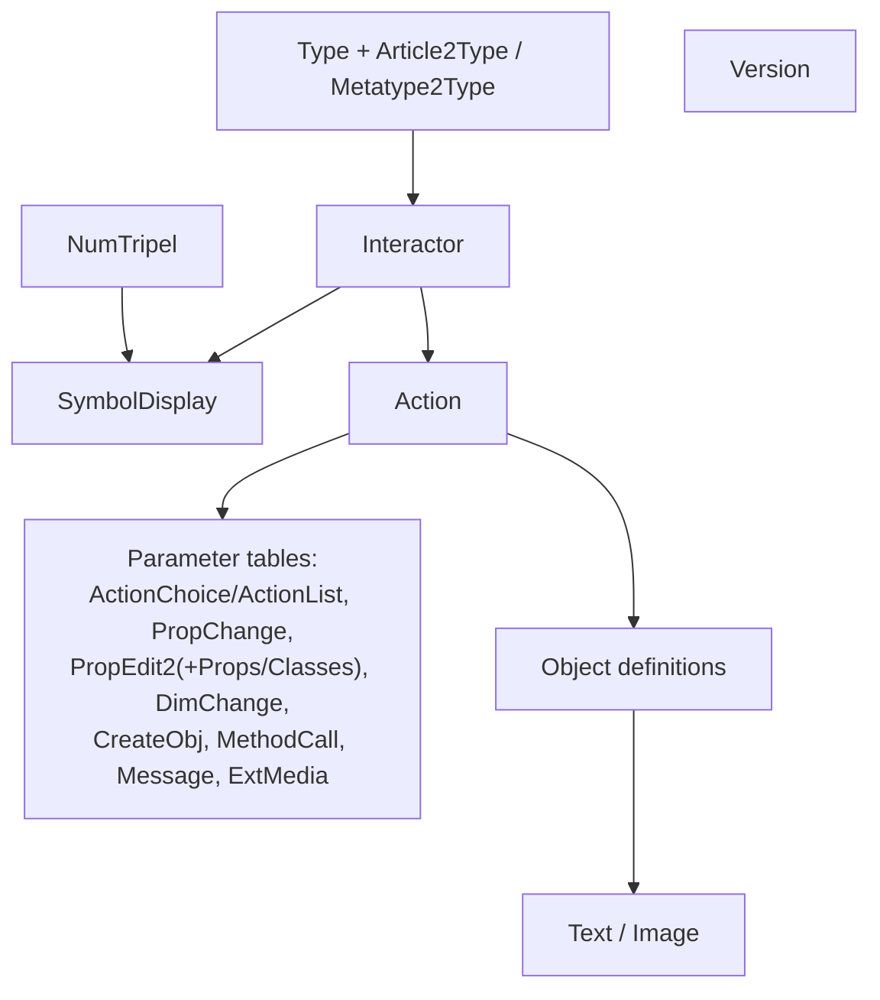

# 09 — OAP (OFML Aided Planning)

**Source:** OAP 1.6.1 + methods4OAP 1.13 + AppNote OAP Data Creation (2025-05-21) + OAP-Styleguide 1.4 (EasternGraphics/IBA), consolidated for the MK Product Workbench Engineering Handbook.
**Status:** Consolidated from specification docs; unclear items marked `UNKNOWN`.

---

## 1. What OAP Is

**OAP** = **O**FML **A**ided **P**lanning — a specification of *concepts, techniques and data
tables* that enable largely uniform **data creation and implementation of planning
techniques (inter-product rules)** in both online and offline applications.

- **Governance / editor:** **EasternGraphics GmbH** (Thomas Gerth, Editor).
- **Reference version:** **OAP 1.6** (1st revised version), August 19, 2025 (this handbook
  consolidates the **1.6.1** English spec plus companion docs).
- **Position in the stack:** OAP is an **additional layer on top of conventional OFML data**.
  It can reference the properties of article instances, so OAP data creation can be layered on
  top of **Metatype**-based data ([10_Metatype](10_Metatype.md)) or specially programmed OFML
  data.
- **Direction:** techniques previously used for offline planning (e.g. **OLAYER-based
  snapping**) are to be replaced by OAP.

> **Note:** features not yet supported by current EasternGraphics applications are marked
> *gray* in the spec; several §4 subsections (General information, Attach areas, Matching
> attach areas) are currently **`Not yet supported`**.

---

## 2. Basics & Terminology

### 2.1 Core techniques

| Technique | Summary |
| --- | --- |
| **Interactors** | 2D/3D graphical symbols drawn over an object, linked to one or more **actions** triggered when the user selects the symbol. Object-specific; size independent of camera distance; visibility can be constrained by angle and occlusion. |
| **Actions** | Functionality performed on an event (e.g. activating an interactor). With attach areas they implement inter-product rules. |
| **Smart attach areas** | Extend conventional OFML attach points: not only points but **lines and areas** (optionally rastered), and the area can be linked with actions on connect/disconnect. Intended to replace OLAYER `D2SNAP` / `ATTACH & ORIGIN` snapping (currently `Not yet supported`). |

### 2.2 Key terms

- **Article vs. article variant** — an article (product) is a sellable commodity; a
  *configurable* article's chosen values form an **article variant** (configuration). See
  [04_Core_Terminology](04_Core_Terminology.md) / [19_Glossary](19_Glossary.md).
- **Article representation (planning element / object)** vs. **OFML instance** — the object
  shown in the planner vs. the (often temporary, invisible) OFML instance created to configure
  or query the article. Online (EAIWS): a **planning element** (client) and a **basket
  instance** (server).
- **Active vs. passive planning element** — the element being inserted/deleted/moved is
  *active*; others are *passive*. Relevant for which attach areas may be used.
- **Proximity (connection)** — exists when a pair of attach areas of two elements match
  logically and geometrically.
- **PropVarCode (Property variant code)** — encodes current OFML property values as
  `<Property>=<Value>;…`; dependencies on variants are expressed via OFML properties.
  Retrieved from the OFML instance via `getPropVarCode(pState)` (use status `0`).
- **OAP type** — the set of all articles/variants that share OAP behaviour; defined in table
  `Type` and mapped from articles or metatypes.

---

## 3. General Rules & Field Types

**CSV format:** one table per file; filename = prefix `oap_` + table name (lower case) +
`.csv`; character set **UTF-8** (optional BOM); `;` field separator; `#` comment lines and
blank lines ignored; `"`-quoting as in OFML CSV. (Contrast ODB's Latin-1 — see
[15_File_Formats](15_File_Formats.md).)

**Storage:** tables live per region in the series
`<data>/($manufacturer)/($program)/($region)/($version)/oap` and are compiled into an EBase
database **`oap.ebase`**. Cross-serial logic is placed in a dedicated series (e.g. `global`)
referenced by registration key `oap_program`.

**Field types** (selected): `Text`, `Char`, **`PVC`** (property variant code), `Lang`
(ISO 639-1 + ISO 3166-1), `Symbol`, `ID`, **`OID`** (simple or dotted hierarchical object
id), `ID List`, `OID List`, `OFML` (package/interface/type name), `Int`, `Num`, `Bool`,
**`NumExpr`**, **`BoolExpr`**. Expression errors → `NumExpr` yields `0.0`; `BoolExpr` yields
*undefined*.

**OAP expressions** (appendix A) largely match OFML Part III expressions and add: OFML
property keys usable as variables, and `methodCall(<Action-ID>)` to call OFML methods. See
[16_Configuration](16_Configuration.md).

---

## 4. The OAP Tables (Model)

| Table | Role |
| --- | --- |
| `Type` | defines OAP types |
| `Article2Type`, `Metatype2Type` | map articles / metatypes → OAP type |
| `NumTripel` | reusable (x,y,z) triples (NumExpr) referenced by other tables |
| `Interactor` | interactor definition (condition, actions, symbol type/size) |
| `SymbolDisplay` | position, orientation & visibility range of a symbol |
| `Action` | action definition (condition, type, parameter, target objects) |
| `ActionChoice` / `ActionList` | option lists for `ActionChoice` actions |
| `PropChange` | assign a value/status to a property |
| `PropEdit2` (+ `PropEditProps`, `PropEditClasses`) | property editor dialog |
| `DimChange` | interactive dimension change |
| `CreateObj` | create an object |
| `MethodCall` | call an OFML method |
| `Message` | issue a message (Attention interactor) |
| `ExtMedia` / `Object` / `Text` / `Image` | media, object sets, localized texts & images |
| `Version` | stored OAP format version (required) |

### 4.1 Interactors

`Interactor` fields: `Interactor` (ID), `Condition` (BoolExpr validity), `NeedsPlanMode`
(*deprecated*), `Actions` (ID List → `Action`), `SymbolType` (Symbol), `SymbolSize` (Symbol).

- Actions run **in listed order** when activated; an invalid action is skipped; processing
  aborts on failure or after a `SelectObj` action.
- An interactor shows only if it has **at least one valid action**.
- **Symbol types** (abstract pictograms, not image files) include: `Add`, `Delete`,
  `Duplicate`, `Edit`, `Material`, `Electrification`, `Lighting`, `OnOff`, `Flip`,
  `Attention`, `Video`, position (`PosHorizontal/Vertical`, `Pos2Left/Right`, `PosUp/Down`),
  rotation (`RotatePY`/`RotateNY`/`…90`), dimension (`ChangeDimHorizontal/Vertical`,
  `ChangeDim2Left/Right`, `ChangeDimUp/Down`, `StartDimChange`), visibility
  (`VisibilityOn/Off`), `FinishMode`, `NoAction`. Types marked `(App)`/`App` start an
  application mode. **Sizes:** `small`, `medium`, `large`.

`SymbolDisplay` fields: `Interactor`, `HiddenMode` (BoolExpr occlusion), `OffsetType`
(`Tripel` → `NumTripel` id, or `Expr` → sequence of 3 floats), `Offset`, `Direction`
(NumTripel id → visibility cone axis), `ViewAngle` (0–360°), `OrientationX` (NumTripel id →
makes it a **3D symbol**). Multiple rows per interactor allow separate front/rear views with
non-overlapping visibility ranges.

### 4.2 Actions

`Action` fields: `Action` (ID), `Condition` (BoolExpr), `Type` (Symbol), `Parameter`
(→ parameter table), `Objects` (OID List target objects).

| Action type | Parameter table | Notes |
| --- | --- | --- |
| `ActionChoice` | `ActionChoice`→`ActionList` | user picks an option; valid only if ≥1 valid option |
| `CreateObj` | `CreateObj` | creates an object |
| `DeleteObj` | — | removes objects in field 5 |
| `DimChange` | `DimChange` | interactive dimension change; single action in list |
| `Message` | `Message` | only for `Attention` interactors; single action in list |
| `MethodCall` | `MethodCall` | calls an OFML method (instance → on field-5 objects) |
| `NoAction` | — | dummy; dev-only, not for delivered data |
| `PropChange` | `PropChange` | assign property value/status |
| `PropEdit2` | `PropEdit2` | property dialog; must be **last** action; single target object |
| `SelectObj` | — | selects field-5 object; **aborts** the action list (place last) |
| `ShowMedia` | `ExtMedia` | shows external media; single action in list |

Only one *interactive* action per list (`ActionChoice`, `DimChange`, `Message`, `PropEdit2`,
`ShowMedia`). Field 5 (`Objects`) resolves via table `Object`; hierarchical OIDs produce a
product set; execution order follows OID order.

### 4.3 Object definitions, texts, images, version

`Object` maps an OID to a set of objects (incl. object category **`Self`** — the active
object — and category **`MethodCall`**). `Text`/`Image` provide localized resources
(`Lang`-based fallback: region code → language code → empty). `Version` **must** record the
OAP format version so processing selects the correct EBase table descriptions.

---

## 5. OFML Method Catalogue (from methods4OAP)

OFML methods are used in OAP for three purposes: (1) **realizing product logic** as an action
bound to an interactor; (2) **obtaining information** inside expressions via
`methodCall()` (interactor/action conditions, symbol positions, MethodCall arguments);
(3) **specifying target objects** via object category `MethodCall`. Interfaces `Base`,
`Complex`, `Property`, `Article` are all implemented in base class `OiPlElement`, so their
methods apply to every article instance. Each method has a `MethodCall`-table example.

| Category | Representative methods |
| --- | --- |
| **Interface `Base` (incl. `MObject`)** | `getClass()`, `isCat(cat)`, `hasMember(name)`, `getFather()`, `getRoot()`, `getTrAxis()` (spatial model) |
| **Interface `Complex`** | composite-article structure access (children/parts) — §3 |
| **Interface `Property`** | property value access/state (used with `PropChange`/`PropEdit2`) — §4. See [property interface] in [11_Product_Model](11_Product_Model.md) |
| **Interface `Article`** | article-level information (numbers, texts, prices) — §5 |
| **Class `GoMetaType`** | metatype access, e.g. `getMTID()` — links OAP to [10_Metatype](10_Metatype.md) |
| **Planning group classes (general)** | element categories, common/group properties, other common functions — §7 |
| **`xOiJointPlGroup`** | accessing the topological order list; joint-group methods — §8 |
| **`xOiLayoutGroup`** | layout elements, fork elements, branches, additional elements — §9 |
| **`xOiTabularPlGroup`** | tabular groups: general settings/info, field & layout structure, manipulating layout — §10 |
| **`xOiCustomPlGroup`** | custom groups: layout elements, additional elements, free attach points, neighbours — §11 |
| **`xOiCustomModule`** | custom module base class — §12 |

> Note (methods4OAP §2.2): OFML object references cannot be stored in OAP, so `getFather()`/
> `getRoot()` are used only for comparison (e.g. suppress an interactor at top planning level:
> `methodCall("AC_call_GET_FATHER") != methodCall("AC_call_GET_ROOT")`).

The doc reflects OFML base packages **OI 1.45.0, XOI 1.63.0, GO 1.18.5** (Spring 2025).

---

## 6. Data-Creation Workflow (from AppNote OAP Data Creation)

Because there is (currently) no authoring tool, OAP tables are written **manually**;
disciplined naming and structure are essential. Key guidance:

1. **Format versioning** — record the format version in table `Version`; each major/minor
   version ships a matching `oap_<major>_<minor>.inp_descr` EBase description.
2. **Separate series for OAP data** — advisable when OAP references several OFML series, when
   planning groups are used, when OAP changes on a different cadence than OFML, or when OFML
   and OAP are maintained by different people. Reference it via registration key
   `oap_program`. A **pseudo article** in OCD is the simplest way to bind interactors to a
   planning group.
3. **Conditions/expressions** — OAP expression syntax differs from OCD; prefer standard
   methods; check the configuration context; mind numerical metaproperties, special symbols,
   and integer expressions (§2).
4. **Interactors** — choose symbol sizes deliberately; decide interactor scope (planning
   group vs. group element); support dynamic and 3D interactor symbols; verify the correct
   configuration context (§3).
5. **Actions** — create articles via `xOiCreateArticle()` / `xOiCloneArticle()`; set the
   change direction for `DimChange`; nest method calls; handle `DeleteObj`, RG properties and
   `NoAction` correctly (§4).
6. **Planning groups** — object category `MethodCall`; change element dimensions (incl.
   na-metaproperties); group-specific control-data entries; `replaceElement()`; common/group
   properties; persistency; overriding XOI base methods; property-state management; reacting
   to element property changes; collision detection (§5).
7. **`xOiCustomModule`** — module initialization, properties, managing parts (§6).
8. **Debugging** — `xOiOAPManager` and `CreateObj` debugging; `setDBMode()` (§7).

See [05_Engineering_Workflows](05_Engineering_Workflows.md) and
[14_Generation_Process](14_Generation_Process.md).

---

## 7. Naming & Style Guidance (from OAP-Styleguide)

IDs may be chosen freely (alphanumeric, not starting with a digit; **camelCase** preferred),
but each key **should be prefixed** with a standard combination indicating its table:

| Table / purpose | Prefix | Example |
| --- | --- | --- |
| ActionChoice | `ACH_` | `ACH_addableChildren` |
| ActionList | `ACL_` | `ACL_addableChildren` |
| Action (generic) | `AC_` | `AC_...` |
| CreateObj-Action | `AC_CO_` | `AC_CO_Table` |
| DimChange-Action | `AC_DC_` | `AC_DC_Width` |
| Delete-Action | `AC_DL_` | `AC_DL_Table` |
| PropChange-Action | `AC_PC_` | `AC_PC_colorGreen` |
| PropEdit-Action | `AC_PE_` | `AC_PE_Colors` |
| ShowMedia-Action | `AC_SM_` | `AC_SM_Video` |
| SelectObj-Action | `AC_SO_` | `AC_SO_Father` |
| MethodCall-Action | `AC_call_` | `AC_call_setPropValue_Color_green` |
| ActionChoice-Action | `AC_choice_` | `AC_choice_colors` |
| CreateObject | `CO_` | `CO_Table12345` |
| DimChange | `DC_` | `DC_Width` |
| ExtMedia | `XM_` | `XM_Video` |
| Interactor | `IA_` | `IA_addTableR` |
| Image | `IMG_` | `IMG_AttachTableTop` |
| MethodCalls | `MC_` | `MC_doSomething` |
| Message | `MSG_` | `MSG_info` |
| NumTriple | `NT_` | `NT_leftArmRest` |
| OAP type | `OAP_` | `OAP_Table` |
| Object | `OB_` | `OB_self` |
| PropChange | `PC_` | `PC_addArmRest` |
| PropEdit2 | `PE_` | `PE_mainPropsForTP` |
| PropEditProp | `PE_PR_` | `PE_PR_Color` |
| PropEditClass | `PE_CL_` | `PE_CL_Dimension` |
| Text | `TXT_` | `TXT_AttachTableTop` |
| Text for title | `TXT_Title_` | `TXT_Title_Properties` |

> Convention: a `MethodCall`-Action ID mirrors its `MethodCall` ID with `MC` replaced by
> `AC_call`. See [13_Naming_Standards](13_Naming_Standards.md).

---

## 8. How OAP Relates to OFML, OCD and ODB

- **OAP ↔ OFML core:** OAP sits on top of conventional OFML data and reads article
  **properties**; article logic and configuration remain in OFML/Metatype. See
  [06_OFML](06_OFML.md).
- **OAP ↔ OCD:** binding interactors to a planning group typically needs a **pseudo article**
  in OCD ([07_OCD](07_OCD.md)); OCD provides the commercial identity, OAP the planning
  behaviour. Note OAP and OCD expression syntaxes differ.
- **OAP ↔ ODB:** OAP **smart attach areas extend ODB attach points** ([08_ODB](08_ODB.md))
  from points to lines/areas with connect/disconnect actions, progressively replacing
  OLAYER-based snapping.

---

## 9. Related Handbook Sections

- [06_OFML](06_OFML.md) — OFML standard & parts
- [07_OCD](07_OCD.md) — commercial data
- [08_ODB](08_ODB.md) — geometry & attach points
- [05_Engineering_Workflows](05_Engineering_Workflows.md) — engineering workflows
- [13_Naming_Standards](13_Naming_Standards.md) — naming standards
- [14_Generation_Process](14_Generation_Process.md) — generation process
- [19_Glossary](19_Glossary.md) — terminology
