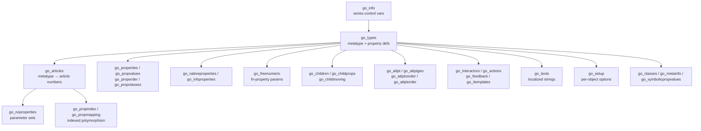

# 10 — Metatype (MT)

**Source:** MT – OFML Metatypes – Tables and Specifics 1.18.0 (2024-11-04) + Style Guide for Metatypes 1.2 (EasternGraphics/IBA), consolidated for the MK Product Workbench Engineering Handbook.
**Status:** Consolidated from specification docs; unclear items marked `UNKNOWN`.

---

## 1. What a Metatype Is

**Metatype (MT)** — full name **"OFML Metatypes – Tables and Specifics"** — is an
EasternGraphics/IBA concept that **enhances the traditional way of modelling graphic data**
(GO / [06_OFML](06_OFML.md), [11_Product_Model](11_Product_Model.md)) with two capabilities
the classic model lacks:

1. **Configuration on the inter-product level.** For a given object you can change not only
   *intra-product* properties (where the **basic article number stays unchanged**) but also
   properties that **change the basic article number** — e.g. selecting another program or
   collection. This is *article polymorphism*: one planning object can morph across article
   numbers as its properties change.
2. **Concatenation and attachment rules.** Attachment parts (children) can be described by
   properties held in tables in an **article-dependent** way, driving how objects snap and
   assemble together.

- **Reference version:** MT **1.18.0**, implementation `::ofml::go::1.18.0`. Governed by
  EasternGraphics; changes vs. 1.17.3 are marked by underline in the source.
- **Position in the stack:** A metatype sits **above** raw OFML/GO geometry and **below** the
  commercial layer. It maps configurable planning behaviour onto **OCD/OFML articles**
  ([07_OCD](07_OCD.md)) and reuses **GO** interaction types ([06_OFML](06_OFML.md),
  [14_Generation_Process](14_Generation_Process.md)). The *kind of commercial data* is
  declared per object by the reserved property `GMode` (`OCD` default; `EPDF` deprecated;
  `EPL` no longer supported).

> A **metatype** and an **instance of a metatype** are used synonymously in the spec. A
> metatype represents a **set of article numbers** (defined in `go_articles`) that share a
> common configurable behaviour and property model.

---

## 2. The Metatype Model — CSV Tables

A metatype series is expressed as a family of **CSV tables** exchanged between OFML-conform
applications. **All tables must be present; unused tables should be empty.**

### 2.1 Physical exchange format

| Rule | Requirement |
| --- | --- |
| File name | prefix `go_` + table name (lowercase) + `.csv` (e.g. `go_types.csv`) |
| Character set | UTF-8 or ASCII (no BOM; `go_texts` UTF-8 requires the `utf8` key in `go_info`) |
| Record | one line = one record; blank lines and `#`-comment lines ignored |
| Field separator | semicolon `;` (`U+003B`) |
| Quoting | `"` doubled and the field wrapped in `"` when the value starts with `"` or contains `;` |

### 2.2 Column value types

| Type | Meaning |
| --- | --- |
| `ID` | Identifier: `A–Z a–z 0–9 _`, must not start with a digit, **case-sensitive** everywhere |
| `ID_List` | Comma-separated list of `ID` |
| `Text` | Any valid UTF-8 (no NBSP `U+00A0`, no soft hyphen `U+00AD`, no control chars) |
| `Char` | ASCII string |
| `Int` | Non-negative integer |
| `Num` | Numeric (digits + one `.`, optional leading `-`) |
| `NumExpr` | Expression evaluating to a `Num` |
| `BoolExpr` | Expression evaluating to Boolean (numeric ≠ 0 → true; 0 → false; else undefined) |

Expression syntax (`NumExpr` / `BoolExpr`) follows **OFML Standard Part III**; additionally the
**property keys (names) declared in `go_types`** of the active planning element are usable as
variables. Unless stated otherwise, `ID` is the default column type.

### 2.3 Table catalogue

Key tables (non-exhaustive; see the spec for every column):

| Table | Purpose |
| --- | --- |
| `go_info` | Series-wide control variables (see §5). Optional. |
| `go_types` | **Defines the metatypes and their properties** — one row per property. Core table. |
| `go_articles` | Maps a metatype to concrete `manufacturer / program / article_nr` and its parameter sets. |
| `go_properties` / `go_propvalues` | Property value tables and (mode `8192`) validity constraints on values. |
| `go_proporder` | Explicit value ordering when mode `128` disables standard sorting. |
| `go_propclasses` | Groups properties into named property classes (UI grouping). |
| `go_freenumeric` | Parametrises `fn` (free-numeric) properties (min/max/raster/expr/child). |
| `go_nativeproperties` / `go_inhproperties` | Wrap / inherit native child properties onto metatype level. |
| `go_noproperties`, `go_propindex`, `go_propmapping` | Parameter sets (standard + child) referenced from `go_articles`. |
| `go_children` / `go_childprops` / `go_childmoving` | Child (sub-object) creation, their property values, and interactive movement. |
| `go_attpt` / `go_attptgeo` / `go_attptsorder` | Attachment points, their geometry and ordering (concatenation/snapping). |
| `go_interactors` / `go_actions` / `go_feedback` / `go_itemplates` | Interactive symbols, rule actions, feedback and item templates. |
| `go_texts` | Localized text resources (`key / language / text`). |
| `go_setup` | Per-object feature options (replaces the `GSetup`/`GXSetup` properties). |
| `go_symbolicpropvalues` | Maps symbolic property values to numbers. |

---

## 3. Types — `go_types`

`go_types` **defines the metatypes (or metatype instances) of a manufacturer**. Each row
defines **exactly one property** of the metatype; a metatype needs at least one row. The same
general metatype (e.g. `GO_TABLE`) can be instanced differently per manufacturer (e.g.
width-variable at fixed depth vs. variable in width/height/depth).

| Column | Meaning |
| --- | --- |
| `id` | References the metatype instance; unique per manufacturer. |
| `name` | Property name (English; starts with `G` + capital; each word capitalised; no umlauts/spaces). All properties of the referenced GO type must be described; more may be added. |
| `format` | Property format (see §4). |
| `default` | Default value assigned after creation (polymorphic; matches the format). |
| `mode` | Composite bit-mode controlling behaviour (see §4.3). |
| `filter` | Comma-separated list of properties considered when configuring this property. |

**Reserved / predefined properties:** `GType` (required — selects the metatype class),
`GMode` (kind of commercial data), `GSetup`/`GXSetup` (feature flags — now superseded by
`go_setup`), `GAlign` (geometric alignment of the main child, 3 letters `N/I/C/A`, default
`III`; or `ATTPT`), `GWidth`/`GHeight`/`GDepth` (dimension proxies / dummy display),
`GMetaLabel` (order-list node label), `GVarPrefix`, and context variables `XHeight`,
`XChildID`, `XIsInsObj`.

---

## 4. Properties

### 4.1 Formats

| Format | Meaning |
| --- | --- |
| `ch` | Selection from a set of **symbolic** values |
| `chf` | Selection from a set of **float** values |
| `chi` | Selection from a set of **integer** values |
| `f` | Free **float** number |
| `i` | Free **integer** number |
| `fn` | **Free-numeric** property (no discrete range; parametrised via `go_freenumeric`; no standard filter mechanism) |
| `na` | **Native wrapper** — exposes a child's native property at metatype level; name = native name + prefix `G` (e.g. native `Frame` → `GFrame`); only valid while the child exists; a default is used until then; no filters/visibility; must not appear inside other filters; native value must never be `NULL` |
| `th` | **Thru property** — transfers a property value from a predecessor object to its successor in a concatenation; not part of article polymorphism; transferred type given in the `filter` column; not visible/usable elsewhere |
| `cp` | **Child-position** property — the position of an (in)direct child, in metres, in the metatype's local coordinate system; `mode` is a two-digit code (1=x/2=y/3=z, then 0=pos/1=max/2=min/3=center); `filter` gives the reference object path |
| `lb` | Read-only **label** property (available only inside the evaluation context) |

### 4.2 Default values

- Polymorphic, matching the format; `@VOID` marks **non-selection** for `ch`; empty = no
  prescribed default. Example: `1000`, `H1`.
- For sub-item control the default is `[Start, Minimum, Maximum]` (e.g. `[1, 0, 5]` = up to 5
  sub-positions, initially 1).
- `MT_UNDEF` marks an **undefined / not-selected** property (used mainly in **Serial**
  configuration mode; only for `ch` polymorphic properties).

### 4.3 Mode flags (composite; add values)

> Modes **4** and **8** must not be combined.

| Value | Effect |
| --- | --- |
| `1` | Property is editable |
| `2` | Considered for **global** property modification |
| `4` | Controls the **variant code** |
| `8` | Controls a **sub-item** (CH → distinct sub-positions; INT → N identical invisible sub-positions from `[start,min,max]`) |
| `16` | Invisible |
| `32` | Initially **inherited** from parent/predecessor metatype (do not use for creation-assigned properties) |
| `64` | Suppress filter-adaptation dialog (only if `ShowPolyPropFilterMsg` set in `go_setup`) |
| `128` | Disable standard value sorting → order taken from `go_proporder` (or `go_childprops` for child props) |
| `256` | Re-create main child 2D/3D geometry after change |
| `512` | Force remove + re-create own children after change |
| `1024` | Re-position main child 2D/3D geometry after change |
| `2048` | Re-position own children after change (affected child props listed in `filter`; `na`/`fn` only) |
| `4096` | Apply OFML **collision detection**; reject change on collision |
| `8192` | Value validity constrained via `go_propvalues` |

### 4.4 Filters

`filter` lists property names (comma-separated) considered when configuring the property (e.g.
`GWidth,GHeight,GDepth,GHeightAdjust`). In **Serial** configuration mode the filter is
ignored and generated automatically from the explicitly set polymorphic properties.

---

## 5. `go_info` control variables (series-wide)

Cardinality markers: `[0,1]` optional-once, `[1,1]` exactly-once, `[0,*]`/`[1,*]` repeatable.

| Key | Effect |
| --- | --- |
| `configuration` `[0,1]` | Global config behaviour: `consistent` (default — adapts other properties to stay consistent), `inconsistent` (tolerates inconsistent states), `serial` (fixes set properties, generates remaining degrees of freedom dynamically) |
| `pindex` `[0,1]` *(obsolete)* | Number of property columns when `go_propindex`/`go_propmapping` are used (integer > 1) |
| `skip_FAN` `[0,1]` | Suppress verification/message of the **Final Article Number** after article creation |
| `skipVC2MT` `[0,1]` | Suppress metatype-property → variant-code mapping (performance on large tables) |
| `updateGMode` `[0,1]` | Update `GMode` when the base article number changes (needed when series in one metatype use different data kinds, e.g. OCD vs EPL) |
| `utf8` `[0,1]` | Declare `go_texts` as UTF-8 (no BOM; normal form NFC) |

---

## 6. Articles & Polymorphism — `go_articles`

`go_articles` maps metatypes (`go_types.id`) to concrete article numbers so that **at run time
the article number can change without deleting/recreating the object**.

| Column | Meaning |
| --- | --- |
| `id` | Metatype from `go_types`. The reserved id `_native_` excludes specific native articles from automatic metatype detection. |
| `manufacturer` | Manufacturer id |
| `program` | Series id |
| `article_nr` | Basic article number (`Char`) |
| `prm_set` | Standard-property parameter set (in `go_noproperties`, or via `go_propindex`/`go_propmapping`) |
| `chprm_set` | Child-oriented parameter set(s) (in `go_childprops`), `ID_List` |

The set of properties flagged mode `4` forms the **variant code**; the resulting article
number is verified as the **Final Article Number (FAN)** unless `skip_FAN` is set.

---

## 7. Naming & Style Rules (Style Guide 1.2 — capture all)

`SE_` = series identifier. Bracketed `[SE_]` means the series prefix is inserted.

| Table / element | Rule |
| --- | --- |
| **Metatype name** (`go_types`) | `MT_` + `[SE_]` + Name; upper/lower CamelCase, each word starts uppercase. `GType` entry = metatype name **without** the leading `MT_`. Example: `MT_[SE_]StandardDesk`. |
| **Property names** (`go_types`) | Start with `G` + `[SE_]` + underscore; composite words joined with no separator; each word starts uppercase; remainder arbitrary. |
| **Article ids** (`go_articles` `prm_set`) | Built as: (1) Metatype ID + `_`, (2) Article Number, (3) optional `_` + extension. Multiple property sets for one article get a distinguishing number (`_1`, `_2`). |
| **Child-property keys** | `CHP_` + `SE_` + alphanumerics, each word starts uppercase (e.g. `CHP_[SE_]Legs`). |
| **Dimensions** (`go_properties`) | Given in the **measurement unit used in the paper price list**; internal name arbitrary but follows the `go_types` rules. |
| **Children created by property** (`go_childprops`) | Start with `SE_` then upper/lower CamelCase (e.g. `CHP_[SE_]Table;G[SE_]OrgBridge;[SE_]Yes;[SE_]OrgBridge`). |
| **Attachment points** (`go_attpt`) | `Ap` + `SE_` + (child point → extra `CH_`) + Name (CamelCase). Example: `Ap[SE_]TableL`, `Ap[SE_]CH_AddOn`. |
| **Property classes** (`go_propclasses`) | `PC_` + `SE_` + upper/lower CamelCase (e.g. `PC_[SE_]Measures`). |
| **Messages** (`go_actions`) | `msg` + `SE_` + upper/lower CamelCase (e.g. `msg[SE_]notPossible`). |

See [13_Naming_Standards](13_Naming_Standards.md) for cross-domain naming and program IDs.

---

## 8. Validation, Defaults & Ordering Rules (as stated in the spec)

- **Completeness:** all tables must exist (empty if unused); every property of the referenced
  GO type must be described in `go_types`.
- **Defaults:** applied after object creation; `@VOID` = non-selection (`ch`); `MT_UNDEF` =
  undefined (Serial mode, `ch` only); sub-item defaults use `[start,min,max]` where
  `min ≥ 0`, `max > min`, `min ≤ start ≤ max`.
- **Ordering:** value order is standard-sorted unless mode `128` is set, then taken from
  `go_proporder` (standard props) or `go_childprops` order (child props); attachment-point
  order from `go_attptsorder`.
- **Value validity:** mode `8192` limits allowed values via `go_propvalues`.
- **Consistency:** governed by `go_info` `configuration` (`consistent` / `inconsistent` /
  `serial`).
- **Collision:** mode `4096` (per property) and `GSetup`/`go_setup` collision flags reject
  changes that collide.
- **FAN gate:** the Final Article Number is verified after creation unless `skip_FAN`.

See [12_Validation_Rules](12_Validation_Rules.md) for consolidated validation gates.

---

## 9. Relation to OFML / OCD / GO / Articles

- **GO** ([06_OFML](06_OFML.md)) supplies the base parametric interaction/geometry classes
  (`GO_TABLE`, the GO rotation/translation types, `GoScaling`, `GoAccParameters`) that a
  metatype's `GType` selects and configures.
- **OCD** ([07_OCD](07_OCD.md)) supplies the commercial data for the article numbers the
  metatype resolves to (`GMode = OCD`).
- **Articles / variant code** ([11_Product_Model](11_Product_Model.md)): metatype properties
  (mode `4`) drive the variant code and the Final Article Number.
- **Generation:** the CSV tables above are the *output* of metatype data creation — see
  [14_Generation_Process](14_Generation_Process.md).
- Terms are defined in [19_Glossary](19_Glossary.md).

---

## 10. Cross-References

- [06_OFML](06_OFML.md) — OFML/GO base model
- [07_OCD](07_OCD.md) — commercial data the articles resolve to
- [11_Product_Model](11_Product_Model.md) — article/variant/polymorphism model
- [13_Naming_Standards](13_Naming_Standards.md) — naming & program IDs
- [14_Generation_Process](14_Generation_Process.md) — generating metatype/GO/OBX data
- [19_Glossary](19_Glossary.md) — terminology
