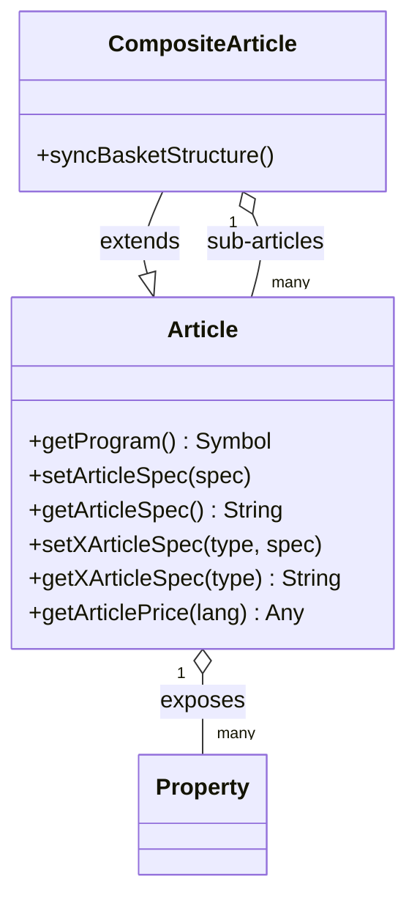
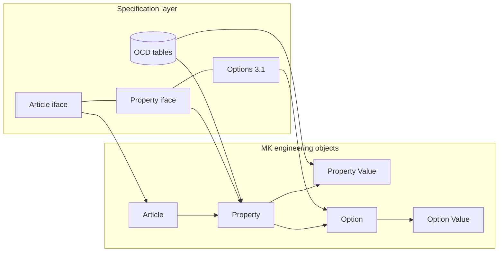

# 11 — Product Model

**Source:** OFML Interfaces *Article* & *CompositeArticle* v1.4, OFML Interface *Property* v2.9, OFML Glossary v1.1, OCD v4.3 (EasternGraphics/IBA), consolidated for the MK Product Workbench Engineering Handbook.
**Status:** Consolidated from specification docs; unclear items marked `UNKNOWN`.

Related: [06_OFML](06_OFML.md) · [07_OCD](07_OCD.md) · [10_Metatype](10_Metatype.md) · [12_Validation_Rules](12_Validation_Rules.md) · [16_Configuration](16_Configuration.md) · [19_Glossary](19_Glossary.md)

---

## 1. Purpose and scope

This chapter consolidates the OFML **product model**: the layered definition of what a *product* is, how it is
represented as an *article instance* at runtime, how its *properties*, *property values* and *options* are described,
and how these specification concepts map to the engineering objects used across the MK ecosystem
(`Article`, `Property`, `Property Value`, `Option`, `Option Value`).

The model is defined across three specifications:

| Layer | Source spec | What it defines |
| --- | --- | --- |
| Terminology | OFML Glossary v1.1 | product / article, configurable product, article number, commercial series |
| Runtime object model | Article & CompositeArticle interface v1.4 | article instances, identity, initialization, structure |
| Property model | Property interface v2.9 | property definitions, types, values, classes, groups, options |
| Commercial data | OCD v4.3 | property/value/relation tables that feed the above at runtime |

---

## 2. Product vs. article vs. configurable product

Definitions are taken verbatim in intent from the OFML Glossary.

- **Product** — a commodity (or service) produced and/or offered for sale by a manufacturer or supplier.
  Products differ from each other by their constructive, material and other characteristics. **Synonym: article.**
- **Configurable product** — a product for which *some of the characteristics can be specified by the buyer*
  resp. the user of the sales system. Configuration is therefore *optional* — a product with no user-selectable
  characteristics is still a valid (non-configurable) product.
- **Article instance** — a runtime object that *represents* a commercial article (Article interface). Different
  article instances can represent the *same* configuration; conceptually they must then return the same product data.

> Terminology note: the glossary treats *product* and *article* as synonyms. In OCD and the interfaces, **article**
> is the concrete addressable unit (identified by an article number); **product** is the broader commercial concept.

### 2.1 Article number: basic vs. final + variant code

An **article number** is an alphanumeric code that unambiguously identifies a manufacturer's product within the
leading production and planning system (PPS). It is occasionally unique only within a single commercial series.

For a **configurable** product the identity splits into two forms:

| Form | Spec type (Article iface) | Meaning |
| --- | --- | --- |
| **Basic article number** | `@Base` | Identifies the article *without* reference to a specific design/configuration. |
| **Manufacturer variant code** | `@VarCode` | Encodes the specific design/configuration (manufacturer-specific). |
| **OFML variant code** | `@OFMLVarCode` | Manufacturer-*independent* variant code; recommended for restoring saved configurations. |
| **Final article number** | `@Final` | Identifies the article *and* its configuration. Normally = basic article number + variant code (exact composition depends on the product database). |

The **variant code** encodes the values of the configurable characteristics. The manufacturer-independent OFML
variant code follows the predefined OCD coding scheme **KeyValueList** (see [16_Configuration](16_Configuration.md#7-variant-code-generation)).

### 2.2 Commercial series and classification

- **Commercial series** — a group of products specified according to a manufacturer-specific classification system
  that governs distribution. Determination of at least one commercial series per manufacturer is **obligatory** for
  an OFML-based sales system. Identified by a unique ID within the manufacturer; the assignment of an article to a
  series **must not change** during its life cycle. **Synonyms: collection, product line.**
- **Product classification** — organization of products into groups by differentiation criteria (function, design,
  price group, statistics …). A product may belong to more than one class; assignment may change over the life cycle.
- **Product group** — a group of products per a manufacturer-specific classification system, often used for rebates.

---

## 3. The Article Model (Article / CompositeArticle interface)

The interface **`Article`** defines all functions a type must implement so its instances represent a commercial
article. **`CompositeArticle`** extends `Article` for articles that consist of a fixed or variable number of
sub-articles (design pattern: *Composite*); a sub-article may itself be a composite.

### 3.1 Program binding and identity

| Function | Returns | Role |
| --- | --- | --- |
| `getProgram()` | `Symbol` | ID of the OFML program (series) the instance belongs to. Determines the relevant `OiProductDB` holding the commercial data, and the `OiProgInfo` used for program-related tasks. |
| `setArticleSpec(pSpec)` | `Void` | Assigns the (basic) article number; instance gains the initial (basic) configuration defined in the product database. |
| `getArticleSpec()` | `String` \| `Void` | Returns the (base) article number; `Void` ⇒ no basket entry is created for the instance. |
| `getArticleParams()` | `Any` | Extra parameters (beyond the instance type) used to derive the article number (via OAM mapping tables, Part VI). |
| `setXArticleSpec(pType, pSpec)` | `Void` | Assigns a typed specification: `@Base`, `@VarCode`, `@OFMLVarCode`, `@Final`. |
| `getXArticleSpec(pType)` | `String` \| `Void` | Returns the specification of the requested type. The `@OFMLVarCode` standard implementation **must not** be overwritten. |

**Commercial initialization** is done by immediately successive calls to `setArticleSpec()` (or
`setXArticleSpec(@Base)`) followed by `setXArticleSpec(@VarCode, …)`:

- An **empty** variant code ⇒ the instance keeps the initial (basic) configuration.
- A **partial** variant code ⇒ only the properties that differ from the basic configuration are coded.
- A **non-matching** variant code / final number ⇒ the instance keeps the configuration built so far (or only the
  recognized properties are re-evaluated).
- On assignment of a variant code / final number the instance also holds the corresponding **geometric representation**.

### 3.2 Same-configuration identity (caching key)

Two article instances represent the **same configuration** iff these match:

1. the OFML **program ID** — `getProgram()`
2. the **(basic) article number** — `getArticleSpec()`
3. the **OFML variant code** — `getXArticleSpec(@OFMLVarCode)`

Applications may use this triple as a product-data cache key; for price caches the **price date**
(`getPriceDate()`) must additionally be encoded.

### 3.3 Product data, features, pricing

- **Product data** (§2.4 of the spec) conceptually includes feature descriptions and variant texts (handled by a
  dedicated feature/variant-text method group).
- `getArticlePrice(pLanguage, [currency])` returns a list of **price components** (base price, surcharges,
  discounts …); the first entry carries the currency, the last entry the accumulated final price. A component marked
  `@baseprice` is the base price; optional elements 4–5 carry the *variant condition* identifier and applied factor.

### 3.4 Categories and structure

- Base types `OiPlElement` / `OiPart` provide default implementations. `isCat(@IF_Article)` returns true for article
  instances; a derived class may return false to opt out (then no `Article` methods may be called on it).
- **Predefined standard categories** for article instances are specified in the interface (Appendix B). `UNKNOWN` —
  the full category enumeration was not read in detail; see the spec appendix before relying on specific category IDs.
- **CompositeArticle** additionally synchronizes its sub-article structure with the application's basket structure.

---

## 4. The Property Model (Property interface v2.9)

The **Property** interface replaces §4.4 of OFML Part III. It describes the characteristics of an article and the
means to set, query and constrain them.

### 4.1 Three attribute groups

Property attributes are divided into:

1. **Invariable** attributes that determine the *type* of a property (value type, formatting) — transferred together
   as the **property definition** (a Vector).
2. Attributes that **depend on the configuration**: current value, choice list, value range(s), state, position.
3. **Language-dependent** names for the property and its values (via text-resource IDs or language–text mappings).

### 4.2 Property definition vector

`[<type>, <width>, <dec-places>, <choice-list-type>]`

**Property types** (OFML data type in brackets):

| Type | Meaning | OFML data type |
| --- | --- | --- |
| `L` | length in metres | Float |
| `A` | angle in radian | Float |
| `N` | number (integer if dec-places = 0) | Float / Int |
| `B` | logical value | Int {0,1} |
| `S` | character string | String |
| `T` | multiline text | String |
| `Y` | symbolic choice list | Symbol / Symbol[] |
| `YS` | string-valued choice list | String / String[] |
| `CT` | custom / proprietary type | Any |

- **width** — max input length (relevant for `S`); **dec-places** — decimal places (relevant for `L`/`A`/`N`).
- **choice-list-type** — `@None`, `@FixedSingleV`, `@FixedMultiV` (only `Y`/`YS`), `@OpenSingleV` (input of additional
  values permitted, not for `Y`/`YS`). An invalid type/choice-list combination causes `setupProperty2()` to have no effect.

### 4.3 Values, ranges, state

- **Property values** are set/queried via the value method group (`setPropValue()` / `getPropValue2()`). A value of
  type `Void` from `getPropValue2()` indicates *no value assigned*.
- **Value ranges & choice lists** support multiple ranges, a **raster** (increment), non-selectable values, and
  extra-charge presentation — features added specifically for OCD-driven data.
- **Activation state** — properties can be active/inactive; inactive properties are not evaluated by the user.
- **Restrictable OCD properties** may hold the state *"not (yet) specified"*, represented by the reserved value
  `@UNSPECIFIED` / `"UNSPECIFIED"` (symbolic) or a `Void` value (numeric) with a language-specific description.
- **Empty choice lists** are conceptually invalid but can occur due to relationship-knowledge errors; the standard
  `getPropSpec()` returns a descriptive text ("no value available") in that case.

### 4.4 Property classes and groups

| Concept | Character | Purpose |
| --- | --- | --- |
| **Property class** | technical, static, no language-specific description | logical/conceptual grouping (`setPropClass`, `getPropClass`, `getPropClasses`) |
| **Property group** | user-facing, **dynamic** (may change with configuration/language) | grouping for the property editor (`getPropGroupDescriptions`) |

A property may be assigned to **exactly one** class and **one** group (assignment to neither is allowed). Group
descriptions carry a name, a language-specific description, and an ordered list of member property keys; group and
in-group order drive display order. Unassigned properties fall into the dummy group `OI_NONE_PROPCLASS`
(the identifier is a legacy name kept for backward compatibility).

---

## 5. The Option Model

An **option** is a property that the user *can*, but *does not have to*, evaluate.

- **Realization** — options are implemented with properties of type `Y` or `YS`. A special value (typically `@VOID`
  / `"VOID"`, with a text resource such as "not specified") is added to the choice list. This is **transparent** to
  clients: the special value appears as a normal choice-list entry to property editors.
- **Option value** — the individual entries of the option's choice list; the *not-specified* option value is the
  `VOID` entry (or `UNSPECIFIED` for restrictable properties, see §4.3).
- **Relation to properties/values** — because options are ordinary `Y`/`YS` properties, the whole property/value/
  relation machinery (defaults, preconditions, actions, constraints) applies to them unchanged. In the OCD data an
  optional characteristic is marked via the `Obligatory` flag in the property table (see [07_OCD](07_OCD.md) and
  [16_Configuration](16_Configuration.md#4-property-scope-obligation-and-defaults)).

---

## 6. OCD backing tables (data source)

At runtime the interfaces are fed from OCD commercial-data tables. The most relevant for the product model:

| OCD table | Feeds | Key fields (selected) |
| --- | --- | --- |
| `Property` (§2.9) | property definition, class, scope, obligation | `PropertyClass`, `PropertyName`, `Position`, `Type` (C/T/N/L), `Digits`/`DecDigits`, `Obligatory`, `AddValues`, `Restrictable`, `MultiOption`, `Scope` (C/R/RV/RG), `RelObjID` |
| `PropertyValue` (§2.13) | choice-list values, defaults, ranges, raster | `PropertyValue` or `From/To` operators (EQ/GT/GE/LT/LE), `IsDefault`, `Raster`, `RelObjID`, validity dates |
| `PropValueIdentification` (§2.14) | extra identification numbers per value | `IdentKey` → `Identification` table |
| `RelationObj` / `Relation` (§2.15/2.16) | dependencies, constraints, actions | relation types & domains (see [16_Configuration](16_Configuration.md)) |
| `Price` (§2.17) | price components, variant conditions | `Variantcondition`, `Level` (B/X/D) |

> Note: in OCD the term **property** is used as a synonym for *feature* / *characteristic*.

---

## 7. Mapping to MK engineering objects

How the specification concepts above correspond to the engineering objects used across the ecosystem:

| Engineering object | Backed by (spec) | Notes |
| --- | --- | --- |
| **Article** | Article/CompositeArticle interface; OCD `Article` tables | Carries program ID + basic article number + variant code; composite articles hold sub-articles. |
| **Property** | Property interface property definition; OCD `Property` (§2.9) | Type (`L/A/N/B/S/T/Y/YS/CT`), width, dec-places, choice-list-type, class, group, scope, obligation. |
| **Property Value** | Property interface value/choice-list methods; OCD `PropertyValue` (§2.13) | Fixed values, intervals (`OpFrom/OpTo`), raster, default (`IsDefault`), validity window. |
| **Option** | `Y`/`YS` property with `VOID` value (Property iface §3.1) | An optional property; obligation flag `Obligatory=0` in OCD. |
| **Option Value** | choice-list entry, incl. the `VOID` / `UNSPECIFIED` entry | The *not-specified* entry is the distinguishing option value. |

---

## 8. Cross-references

- Standard framework & layering → [06_OFML](06_OFML.md)
- Commercial-data tables in detail → [07_OCD](07_OCD.md)
- Metatype-based data creation of properties/values → [10_Metatype](10_Metatype.md)
- Validation & consistency rules → [12_Validation_Rules](12_Validation_Rules.md)
- Configuration space, relations, variant-code generation → [16_Configuration](16_Configuration.md)
- Term definitions → [19_Glossary](19_Glossary.md)

### Open / UNKNOWN items

- Full enumeration of **standard article categories** (Article iface Appendix B) — not read in detail.
- Exact composition rule of the **final article number** is product-database dependent (`UNKNOWN` in the general case).
