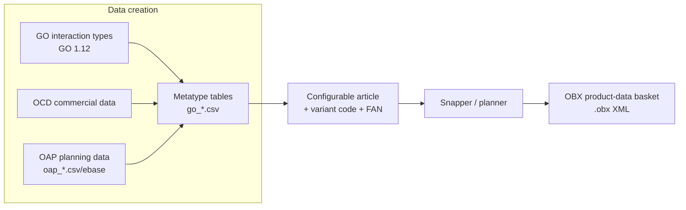

# 14 — Generation Process

**Source:** MT 1.18.0, GO 1.12.0, AppNote OAP Data Creation (2025-05-21), AN-2017-01 Price
Lists Data Creation (2025-04-24) and OBX basket examples (EasternGraphics/IBA), consolidated
for the MK Product Workbench Engineering Handbook.
**Status:** Consolidated from specification docs; unclear items marked `UNKNOWN`.

---

## 1. Overview

"Generation" in the OFML ecosystem means **producing the data artifacts** that drive a
configurable product — the metatype CSV tables, the generic-object interaction types, the
commercial (OCD/OAP) data, and the exported **product-data (OBX) baskets**. This chapter
consolidates each generation flow and states its **Purpose, Inputs, Outputs, Dependencies,
Rules and Expected Results**.



---

## 2. Metatype Generation

| Aspect | Detail |
| --- | --- |
| **Purpose** | Produce the `go_*.csv` tables that define a manufacturer's configurable products — the metatype model, its properties, article mappings, children and attachment rules. See [10_Metatype](10_Metatype.md). |
| **Inputs** | The GO type to reference (`GType`), the manufacturer's article list, property model, price-list units, child/attachment structure, and localized texts. |
| **Outputs** | The full CSV family: `go_info`, `go_types`, `go_articles`, `go_properties`/`go_propvalues`/`go_proporder`/`go_propclasses`, `go_noproperties`/`go_propindex`/`go_propmapping`, `go_children`/`go_childprops`/`go_childmoving`, `go_attpt`/`go_attptgeo`/`go_attptsorder`, `go_interactors`/`go_actions`/`go_feedback`, `go_texts`, `go_setup`, etc. |
| **Dependencies** | GO base classes ([06_OFML](06_OFML.md)); OCD/EPDF commercial data referenced via `GMode`; OFML Part III expression syntax for `NumExpr`/`BoolExpr`. |
| **Rules** | **All tables must be present** (empty if unused); file names `go_<table>.csv` (lowercase); UTF-8/ASCII; `;` separator; `#`/blank lines ignored. Every property of the referenced GO type must be described in `go_types`. |
| **Expected result** | A complete, self-consistent metatype series that resolves properties to a **variant code** and a verified **Final Article Number (FAN)**. |

---

## 3. Generic Object (GO) Generation

| Aspect | Detail |
| --- | --- |
| **Purpose** | Provide the reusable **parametric / generated interaction and geometry classes** (GO – Generic Office Library, OFML Part II) that metatypes build on. |
| **Inputs** | The desired interaction/behaviour (rotation, translation, height adjustment, drawers with locking, roller-shutter cabinets, synchronous sliding, scaling, accessory placement). |
| **Outputs** | GO types, e.g. elementary interaction classes `GOXRot`/`GOYRot`/`GOZRot`, limited variants `GOXLRot…`, translation types `GOXTrans…`, composite/complex types (e.g. height adjustment for A-leg tables, `GoYLTransYRotS`), plus `GoScaling` (scaling node) and `GoAccParameters` (accessory placement parameters). |
| **Dependencies** | OFML/VR coordinate system (note: CAD is rotated 90° about the x-axis vs. OFML — GO class names describe the motion in the **OFML** system). |
| **Rules** | GO class names encode the axis/motion; local vs. global (`L`) constrained motion is part of the naming. Geometry alignment onto a metatype uses `GAlign` / attach point `_GO_CHILD`. |
| **Expected result** | Interaction types that a metatype's `GType` can select and parametrise for the main child and its sub-objects. |

---

## 4. Snapper / OBX Generation

### 4.1 The Snapper concept

The **Snapper** produces a **product-data export (OBX)** — a serialized basket of configured
article(s). Attachment/snapping behaviour (attach points, smart attach areas) originates from
the metatype/OAP layer (`go_attpt`, `go_interactors`, `go_actions`; OAP replaces OLAYER-based
`D2SNAP`/`ATTACH & ORIGIN` snapping — see [09_OAP](09_OAP.md)).

### 4.2 The `.obx` product-data format (observed)

The small example (`Tool generated obx cloud.obx`) is **XML**, not binary. Observed structure:

```xml
<cutBuffer>
  <versionInfo vendorKey='EasternGraphics' appKey='EAI-Server' appVersion='4.18.3' bskXmlVersion='1.8.10'/>
  <items>
    <bskArticle itemType='BasketAggregate' updateState='Migratable'>
      <manufacturer id='HM'>…Herman Miller (localized names)…</manufacturer>
      <series id='CLOUD'>…</series>
      <artNr type='base'>NOCLE4</artNr>
      <artNr type='ofmlvarcode'>CLOUD_OPT.Type=10;CLOUD_OPT.Base_Finish=R00;…</artNr>
      <itemPriceComponents type='purchase'/>
      <itemPriceComponents type='sale'/>
      <pdInfo pdbType='undef' pkgName='' manufacturerId='HM' seriesId='CLOUD' progId=''/>
    </bskArticle>
  </items>
</cutBuffer>
```

Observable elements:

| Element | Meaning |
| --- | --- |
| `cutBuffer` / `versionInfo` | EAI-Server "cut buffer" basket export; carries vendor, app and basket-XML version. |
| `bskArticle` | One basket article aggregate. |
| `manufacturer` / `series` | Manufacturer and commercial series ids + localized names. |
| `artNr type='base'` | Basic article number (e.g. `NOCLE4`). |
| `artNr type='ofmlvarcode'` | **Variant code** — `<Property>=<Value>;…` encoding the chosen configuration (mirrors metatype mode-`4` properties; see [10_Metatype](10_Metatype.md)). |
| `itemPriceComponents` | Purchase / sale price components (commercial layer, [07_OCD](07_OCD.md)). |
| `pdInfo` | Product-database info (pdbType, package, manufacturer/series/prog ids). |

> **`UNKNOWN` / opaque:** the larger example `snapper_CLOUD (3).obx` exceeds 50 MB and could
> **not be read** in this environment — its full internal layout (whether it embeds geometry,
> binary blobs, or many baskets) is `UNKNOWN`. The exact, versioned OBX/`bskXmlVersion` schema
> and the complete `bskArticle` child set beyond the observed fields are also `UNKNOWN`.

| Aspect | Detail |
| --- | --- |
| **Purpose** | Serialize configured product(s) for exchange between OFML/EAI applications (cut/paste, transfer, tooling). |
| **Inputs** | Configured planning element(s): manufacturer, series, base article number, variant code, price components. |
| **Outputs** | An `.obx` XML `cutBuffer` document (see above). |
| **Dependencies** | EAI-Server basket XML (`bskXmlVersion`); metatype variant code; OCD price components. |
| **Rules** | Variant code encoded as `Prop=Value;…`; ids reference the OFML dataset (`manufacturer`, `series`, `progId`). |
| **Expected result** | A portable basket that reconstructs the same configured article(s) in a target application. |

---

## 5. OCD / OAP Data-Creation Workflows

### 5.1 OAP data creation

| Aspect | Detail |
| --- | --- |
| **Purpose** | Layer planning techniques (interactors, actions, smart attach areas, planning groups) on top of conventional OFML/metatype data. See [09_OAP](09_OAP.md). |
| **Inputs** | Article/metatype properties (`PropVarCode`), interaction design, planning-group definitions. |
| **Outputs** | `oap_*.csv` tables compiled to `oap.ebase`; cross-serial logic in a dedicated series (e.g. `global`) registered via `oap_program`. |
| **Dependencies** | Metatype/OFML data it references; OAP expression syntax (OFML Part III + `methodCall(...)`). |
| **Rules** | Separate series for OAP data; name conventions for identifiers; articles created via `xOiCreateArticle()` / `xOiCloneArticle()`; group elements via planning-group base classes. |
| **Expected result** | Uniform inter-product planning behaviour online and offline. |

### 5.2 OCD price-list data creation (multiple price lists)

| Aspect | Detail |
| --- | --- |
| **Purpose** | Support **multiple price lists in a single OFML dataset** based on price date. |
| **Inputs** | OCD price table entries with distinct **validity periods** per price component; old + new price list in one dataset. |
| **Outputs** | Updated OCD price/data tables; global vs. article-specific price components for extra charges. |
| **Dependencies** | OCD price calculation ([07_OCD](07_OCD.md)); article validity across dataset versions. |
| **Rules** | At run time the entry whose validity period matches the user's price date is used; if none matches the article has **no price** and is marked inconsistent ("invalid price date"). Handle article added/removed, variant becoming (non-)price-relevant, variant no longer valid, and conversion from article-specific to global extra-charge components across successive dataset versions. |
| **Expected result** | Correct, date-driven pricing with backward compatibility to the previous price list. |

See [05_Engineering_Workflows](05_Engineering_Workflows.md) for the end-to-end data-creation flow.

---

## 6. Generation Rules (naming, ordering, defaults, validation gates)

**Naming** ([13_Naming_Standards](13_Naming_Standards.md), Style Guide 1.2):
- Metatypes `MT_[SE_]Name`; `GType` = name without `MT_`.
- Properties `G[SE_]Name`; child-prop keys `CHP_[SE_]…`; attach points `Ap[SE_](CH_)Name`;
  property classes `PC_[SE_]…`; messages `msg[SE_]…`.
- Article ids: MetatypeID + `_` + ArticleNumber (+ optional extension / distinguishing number).
- OAP data lives in its own series; register cross-serial logic via `oap_program`.
- Dimensions given in the **paper price-list unit**.

**Ordering:**
- Property-value order is standard-sorted unless mode `128` → then `go_proporder` (standard
  props) or `go_childprops` order (child props).
- Attachment-point order from `go_attptsorder`.

**Defaults:**
- Applied after object creation; `@VOID` = non-selection (`ch`); `MT_UNDEF` = undefined
  (Serial mode, `ch` only); sub-item defaults `[start,min,max]` with `min ≥ 0`, `max > min`,
  `min ≤ start ≤ max`.

**Validation gates (must pass before/after generation):**
- All `go_*` tables present; every GO-type property described.
- Value validity via `go_propvalues` (mode `8192`); consistency mode from `go_info`
  (`consistent`/`inconsistent`/`serial`).
- Collision checks (property mode `4096`, `go_setup`/`GSetup` flags).
- **Final Article Number (FAN)** verified after article creation unless `skip_FAN`;
  variant-code mapping may be suppressed via `skipVC2MT`.
- OCD price date must resolve to a valid price list, else article marked inconsistent.

See [12_Validation_Rules](12_Validation_Rules.md) for the consolidated gate list.

---

## 7. Cross-References

- [06_OFML](06_OFML.md) — OFML/GO base model
- [07_OCD](07_OCD.md) — commercial data & pricing
- [09_OAP](09_OAP.md) — planning techniques / snapping
- [10_Metatype](10_Metatype.md) — metatype tables & property model
- [12_Validation_Rules](12_Validation_Rules.md) — validation gates
- [13_Naming_Standards](13_Naming_Standards.md) — naming & program IDs
- [15_File_Formats](15_File_Formats.md) — CSV / EBase / OBX formats
- [17_Best_Practices](17_Best_Practices.md) — data-creation best practices
- [19_Glossary](19_Glossary.md) — terminology
