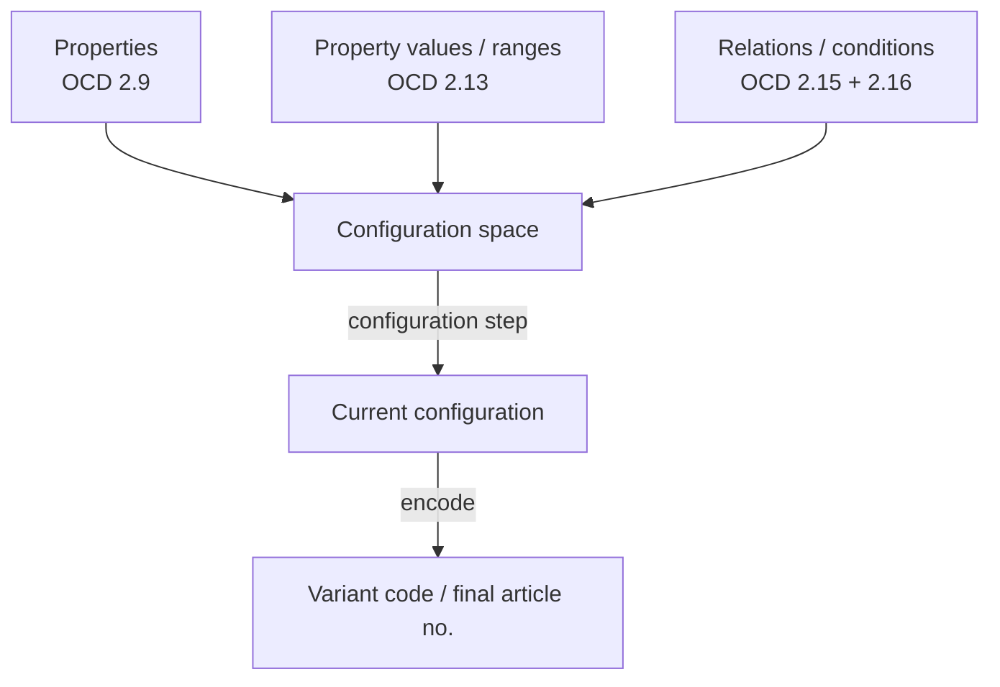
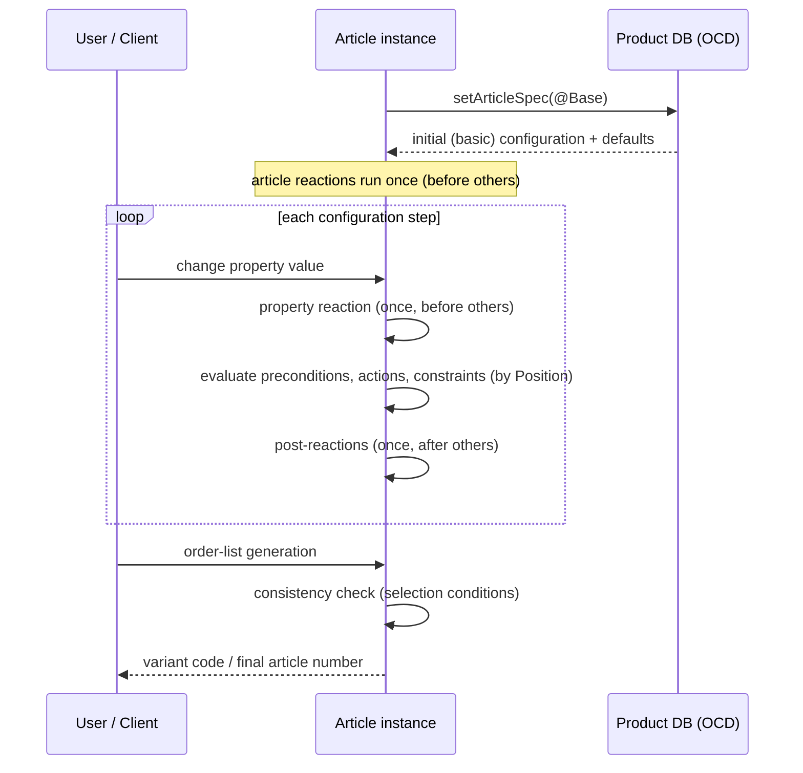

# 16 — Configuration

**Source:** OCD v4.3, OFML Interface *Property* v2.9, OFML Interfaces *Article* & *CompositeArticle* v1.4, OFML Glossary v1.1 (EasternGraphics/IBA), consolidated for the MK Product Workbench Engineering Handbook.
**Status:** Consolidated from specification docs; unclear items marked `UNKNOWN`.

Related: [07_OCD](07_OCD.md) · [10_Metatype](10_Metatype.md) · [11_Product_Model](11_Product_Model.md) · [12_Validation_Rules](12_Validation_Rules.md) · [19_Glossary](19_Glossary.md)

---

## 1. What "configuration" means in OFML

A **configurable product** is a product for which *some characteristics can be specified by the buyer* (OFML Glossary).
The **commercial data** of a configurable product therefore contains, beyond presentation and pricing, a *description
of the configurable characteristics including the relations (conditions) between them*.

At runtime the **configuration** of an article instance is the set of current values of its properties. The
configuration space — the set of *all reachable, valid configurations* — is defined by three data ingredients:

1. **Properties** — the configurable characteristics (OCD `Property` table §2.9; see [11_Product_Model](11_Product_Model.md#4-the-property-model-property-interface-v29)).
2. **Property values** — the admissible values / ranges of each property (OCD `PropertyValue` table §2.13).
3. **Relations / conditions** — the knowledge that constrains, derives and validates values (OCD `RelationObj` §2.15
   + `Relation` §2.16).

A configuration is *built* by successive **configuration steps** (each user value change), during which the relations
are re-evaluated to keep the article consistent. Committing a configuration yields a **variant code** / final article
number (see §7).

---

## 2. Properties + values define the space

### 2.1 Property scope (visibility & role)

The `Scope` field of the OCD property table classifies each property:

| Scope | Meaning |
| --- | --- |
| `C` | **configurable** (visible, user-selectable) |
| `R` | used **only in relational knowledge** (internal/auxiliary) |
| `RV` | **not configurable, but visible** to users |
| `RG` | **not configurable, but graphic-relevant** |

### 2.2 Value domains

The `PropertyValue` table (§2.13) lists all possible values per property. The value domain can be:

- **Fixed value** — operator `EQ`.
- **Open input range** — one of `GT` / `GE` / `LT` / `LE` on the *from* or *to* side.
- **Closed interval** — `GT/GE/LT/LE` on both `from` and `to`; a **raster** (increment, field 12) constrains the
  admissible steps within the range.
- **Interval + individual values** — fixed values following an interval are added to the generated OFML property's
  choice list (useful for standard/proposal values); several intervals may be specified, gated by preconditions.

Free user input is governed by the property table's `AddValues` flag: it is relevant only for *simple*
(single-valued, non-restrictable) configurable properties. Type `T` and properties without listed values accept any
value regardless; multi-valued, restrictable, and article-base-listed properties accept only listed values.

---

## 3. Relations / conditions semantics

Relations are the heart of the configuration model. They live in two OCD tables:

- **`RelationObj` (§2.15)** — binds ordered relations to a *relational object* (`RelObjID`), which properties,
  classes, values and articles reference. Fields: `RelObjID`, `Position`, `RelName`, **`Type`**, **`Domain`**.
- **`Relation` (§2.16)** — stores the actual logic (code blocks) per relation name; the language used is declared in
  the version-information table.

### 3.1 Relation types

| # | Type | Purpose / semantics |
| --- | --- | --- |
| 1 | **Precondition** | Determines *validity/visibility* of the entity it is bound to. For a property: whether it is visible (`RV`) or may be evaluated (`C`). For a property class: gates all its properties (class preconditions take **priority** — property preconditions aren't even evaluated if the class is invalid). For a property value: whether the value may be set. For a BOI component: whether it may be used. Multiple preconditions ⇒ all must hold; none ⇒ generally valid. |
| 2 | **Selection condition** | Determines whether a property *has to be evaluated*. Checked in the consistency check during order-list generation for currently-unevaluated optional properties (and empty free-string inputs). If any is met, an error is raised and order-list generation aborts. |
| 3 | **Action** | Determines/assigns property values or issues messages. Actions on articles & property classes run in **each configuration step**; actions on properties run if not hidden by a precondition; actions on values run if the value is set. |
| 4 | **Constraint** | Controls/assures configuration consistency; can also derive values or restrict value sets. Bound to **articles**, executed in each configuration step. Not every relation language supports constraints. |
| 5 | **Reaction** | Like actions, but event-driven, not every step. Bound to articles or configurable properties. Article reactions run once at initialization *before* all other relationships; property reactions run once when the user changes the value, *before* other relationships. |
| 6 | **Post-Reaction** | Same purpose as reactions but executed *after* all other relationships. ⚠ No further relations run afterwards, so post-reactions **must not** change anything that affects dependent properties, else the configuration is left inconsistent. |

### 3.2 Relation domains (scope of use)

| Domain | Where evaluated |
| --- | --- |
| `C` | **Configuration** — during initial generation and each configuration step. |
| `P` | **Price determination** (see [07_OCD](07_OCD.md)). |
| `BOI` | **Bill of items** — controls existence/visibility of a component. |
| `PCKG` | **Packaging data** determination. |
| `TAX` | **Taxation schemes** determination. |

Relations in `P`, `PCKG`, `TAX` may **only be actions** and may assign **only to internal/auxiliary properties** —
they must not affect the current configuration or later configuration relations.

Entity × domain applicability (from OCD §2.15):

| Rel. type | Article | P.class | Property | P.value | BOI part | C | P | PCKG | TAX | BOI |
| --- | --- | --- | --- | --- | --- | --- | --- | --- | --- | --- |
| Precondition |  | X | X | X | X | X |  |  |  | X |
| Selection cond. |  |  | X |  |  | X |  |  |  |  |
| Action | X | X | X | X |  | X | X | X | X |  |
| Reaction | X |  | X |  |  | X |  |  |  |  |
| Post-Reaction | X |  | X |  |  | X |  |  |  |  |
| Constraint | X |  |  |  |  | X |  |  |  |  |

### 3.3 Evaluation order

- `Position` (field 2 of `RelationObj`) fixes the evaluation order: relations of a relational object with the **same
  type and same domain** are evaluated in **ascending position order** (the sequence need not be contiguous).
- Relations with the **same position** number are evaluated in **undefined order**.
- Code blocks belonging to one relation (`Relation` table, `BlockNr`) are concatenated by number before evaluation.

### 3.4 Three-valued logic (undefined expressions)

Logical expressions can be **undefined** (e.g. a referenced property has no value):

- `OR` is undefined if both subexpressions are undefined, or one is undefined and the other is false; if either is
  **true**, the `OR` is true regardless.
- `AND` is undefined if both are undefined, or one is undefined and the other is true; if either is **not true**, the
  `AND` is not true.
- **Precondition** — violated only if *definitely false* (an undefined expression does **not** violate it).
- **Selection condition** — violated if *not definitely true* (an undefined expression **does** violate it).

**Assignments** use `=`; the left operand is a property or the special variable `$VARCOND`. Both sides must share a
type (string vs. number); numeric right operands are mathematically rounded to the property's decimal digits. An
undefined right-hand arithmetic expression makes the assignment a no-op. Assignments may carry an `IF` condition and
apply only if the condition is *definitely* fulfilled.

### 3.5 Constraints (language OCD_2)

A **constraint** is a complex construct that mainly controls configuration consistency but can also assign values or
restrict value sets. Constraints are **always linked to articles**, so statements about properties across several
property classes can be made in one constraint. A constraint has up to four keyword-introduced sections (e.g.
`Objects:`), and OCD_2 additionally supports string concatenation (`+`), `STRING()`, Boolean `TRUE`/`FALSE`,
`SPECIFIED` for restrictable properties, and value-combination tables via `TABLE()`. `UNKNOWN` — the full constraint
grammar (all four sections and `TABLE()` syntax) was not transcribed here; consult OCD §B.1–B.2.

---

## 4. Property scope, obligation and defaults

| Aspect | Field / mechanism | Semantics |
| --- | --- | --- |
| **Mandatory vs. optional** | `Obligatory` (Property table §2.9) | Whether input is mandatory. Optional (`0`) properties correspond to **options** — see [11_Product_Model](11_Product_Model.md#5-the-option-model). |
| **Default / proposal value** | `IsDefault` (PropertyValue §2.13) | Marks the proposal value used in the initial configuration. A later individual value marked default overrides an earlier one. A default value **should not** carry a precondition invalid in the initial configuration, else the property gets another/no value initially. |
| **Restrictable value set** | `Restrictable` (Property §2.9) + constraints | The set of admissible values can be narrowed by constraints, starting from the full `PropertyValue` set; interval values are not affected by restriction. State *not specified* = `@UNSPECIFIED`/`Void`. |
| **Multi-valued** | `MultiOption` (Property §2.9) | Property may hold multiple values (choice-list type `@FixedMultiV`). |
| **Additional free values** | `AddValues` (Property §2.9) | Whether the user may enter values beyond the listed set (simple configurable properties only). |
| **Visibility / dependency** | precondition relations (§3.1) | Drive whether a property/class/value is visible or selectable in a given configuration. |

### Dependencies

Dependencies between properties are expressed **exclusively through relations** (preconditions, actions, constraints,
reactions) linked via `RelObjID`. There is no separate dependency table — the relational object number in the
property/value tables is the sole binding point.

---

## 5. Configuration lifecycle & rules

**Rule summary**

- **Initialization** — `setArticleSpec()` yields the *basic* configuration with default (`IsDefault`) values; article
  reactions run first. See [11_Product_Model](11_Product_Model.md#31-program-binding-and-identity).
- **Ordering** — relations evaluate by `Position` within (type, domain); same position ⇒ undefined order; do not rely
  on it (see §3.3).
- **Defaults** — proposal values from `PropertyValue`; guard preconditions carefully.
- **Validation / consistency** — the consistency check during order-list generation runs **selection conditions**;
  any met condition (or unspecified mandatory property) aborts generation with an error. See
  [12_Validation_Rules](12_Validation_Rules.md).
- **Derivation** — actions and constraints derive/assign values; `P`/`PCKG`/`TAX`-domain relations may only touch
  internal properties.

---

## 6. Options in the configuration space

An **option** is an optional (`Obligatory = 0`) property realized as a `Y`/`YS` property whose choice list carries a
special *not-specified* value (`@VOID`/`"VOID"`, or `@UNSPECIFIED` for restrictable properties). In the configuration
space this means the property may legitimately remain *unspecified*; selection conditions (§3.1) decide whether it
must nevertheless be evaluated before an order can be generated. See [11_Product_Model](11_Product_Model.md#5-the-option-model).

---

## 7. Variant-code generation

A committed configuration is serialized into a **variant code**. The manufacturer-independent **OFML variant code**
follows the predefined OCD coding scheme **KeyValueList**:

- Every currently valid/visible configurable property is emitted **in property-table order** as
  `<class>.<property>=<value>`, with **`;`** separating properties.
- Currently non-valued optional/restrictable characteristics are coded with the value identifier **`VOID`**.
- Evaluated values are **not padded** to the property table's length field — only significant characters are emitted.

The **final article number** is normally *basic article number + variant code*, but the exact composition depends on
the product database (`UNKNOWN` in the general case).

> Updatability caveat (Article iface Appendix C): if OCD data is exported from an ERP/PPS that does not know the
> property-*class* concept and generates arbitrary classes, class-sensitive variant-code updates can fail. OFML
> applications must therefore also offer an **alternative updatability check that ignores property classes**.

---

## 8. Cross-references

- Commercial-data tables (Property, PropertyValue, RelationObj, Relation, Price) → [07_OCD](07_OCD.md)
- Product / article / property / option objects → [11_Product_Model](11_Product_Model.md)
- Metatype-driven creation of properties, values and relations → [10_Metatype](10_Metatype.md)
- Consistency & validation rules → [12_Validation_Rules](12_Validation_Rules.md)
- Term definitions → [19_Glossary](19_Glossary.md)

### Open / UNKNOWN items

- Full **constraint grammar** (all four constraint sections; `TABLE()` syntax) — see OCD §B.1–B.2.
- Exact **final article number composition** — product-database dependent.
- Complete list of **arithmetic functions in relational knowledge** (OCD Appendix F) — not transcribed.
