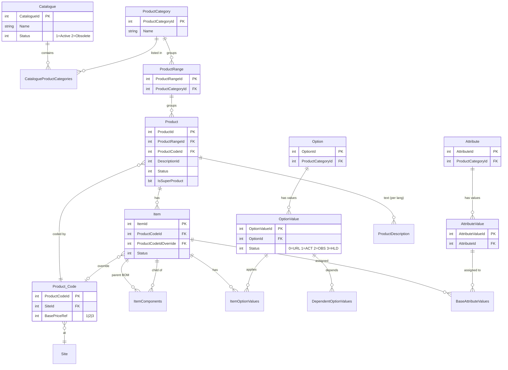

# 26 — Data Model

**Status:** Synthesis of verified module extractions; unproven items marked `UNKNOWN`.

**Module prefix:** `BR-DM` (cross-cutting; no new source read — aggregates module docs
[00](00_System_Architecture.md)–[24](24_Utilities.md)). Keys marked **(inferred)** were deduced from join
predicates / usage, not from a verified schema (no DDL was in scope).

---

## 1. Purpose

There is no ER model, schema doc, or migration in the legacy source — the database shape can only be
reconstructed from the inline SQL of ~140 forms. This document consolidates **every SQL Server table** (and
the pCon Jet/MDB tables) discovered across the module extractions into a single index, with each table's
purpose, key columns, and the module docs that read/write it. It then draws the relationships for the core
domain and consolidates the many magic status/flag encodings into one legend.

Scope notes:
- Only tables **actually cited** in a module extraction are listed. Candidate tables from the brief that
  were **not** found in any extraction (e.g. `MaterialProductIdValues`) are **omitted** and noted in §5.
- The `PDMAudit.*` tables live in a **separate `PDMAudit` database**; the pCon `tCOMd_*` / `tGEOd_*` tables
  live in per-workspace **Jet/Access MDB files** (`pcr_data_*.mdb`), not SQL Server. See
  [25_Common_SQL](25_Common_SQL.md) P-SQL-05 / P-SQL-07.
- Column lists are **not exhaustive** — they capture the columns observed in extracted SQL. Unlisted
  columns are `UNKNOWN`.

---

## 2. Master table index

### 2.1 Security / user tables

| Table | Purpose | Key columns (PK/FK) | Used by (docs) |
|-------|---------|---------------------|----------------|
| `PDMUserPrivileges` | Per-user privilege flags (~30 booleans) + identity/defaults | `UserId` PK; `UserName` (Windows account lookup key); 30 flag cols; `FullName`; `Default*` cols; `BOMManager` (special-cased) | [00](00_System_Architecture.md), [01](01_Authentication.md), [02](02_User_Permissions.md) |
| `PDMUserCatalogues` | Per-user catalogue grants (edit vs read) | `UserId` FK→PDMUserPrivileges, `CatalogueId` FK→Catalogue (composite); `ReadOnly` bit **(inverted: 1=full, 0=read)** | [02](02_User_Permissions.md), [03](03_Catalogues.md), [05](05_Products.md), [07](07_Attributes.md), [14](14_Search.md), [15](15_Filtering.md), [23](23_Generation.md) |
| `SL7UserViews` | Named user views (HM_% Syteline views) | `UserId`, `ViewName` **(inferred)** | [02](02_User_Permissions.md) |
| `sysobjects` / `sysusers` | SQL Server catalog (existence probes for HM_% views / table existence) | system | [02](02_User_Permissions.md), [07](07_Attributes.md) (Q-ATTR-010 table-exists probe) |

### 2.2 Catalogue / category tables

| Table | Purpose | Key columns (PK/FK) | Used by (docs) |
|-------|---------|---------------------|----------------|
| `Catalogue` | Top-level catalogue | `CatalogueId` PK; `Name`; `DisplayOrder`; `DescriptionId` FK→OtherDescription; `CatalogueType`; `Status` (1=Active/2=Obsolete); `CatalogueFlags` (token blob, e.g. `{NoLabel}`); `PrimarySiteId` FK→Site; `ImageFile` | [03](03_Catalogues.md), [05](05_Products.md), [07](07_Attributes.md), [11](11_Configuration.md), [15](15_Filtering.md), [18](18_Pricing.md), [23](23_Generation.md) |
| `CatalogueProductCategories` (CPC) | Category membership within a catalogue | `CatalogueId` FK + `ProductCategoryId` FK (composite); `DisplayOrder` (-1→9999); `Name`; `DescriptionId` FK; `ImageFile` | [04](04_Product_Categories.md), [05](05_Products.md), [07](07_Attributes.md), [13](13_Descriptions.md), [17](17_Images.md), [18](18_Pricing.md), [22](22_Export.md) |
| `CatalogueItems` | Released item↔catalogue membership | `CatalogueId` FK, `ItemId` FK **(inferred composite)** | [05](05_Products.md), [08](08_Property_Values.md), [14](14_Search.md), [18](18_Pricing.md), [22](22_Export.md) |
| `CatalogueItemsUnreleased` | Unreleased item↔catalogue membership | `CatalogueId` FK, `ItemId` FK **(inferred)** | [05](05_Products.md), [14](14_Search.md), [18](18_Pricing.md), [22](22_Export.md) |
| `CatalogueOptionValues` | Catalogue-scoped option-value membership | `CatalogueId` FK, `OptionValueId` FK | [10](10_Option_Values.md), [11](11_Configuration.md), [18](18_Pricing.md), [22](22_Export.md) |
| `CatalogueAttributeValues` | Catalogue-scoped attribute-value membership | `CatalogueId` FK, `AttributeValueId` FK | [05](05_Products.md), [11](11_Configuration.md), [13](13_Descriptions.md), [22](22_Export.md), [24](24_Utilities.md) |
| `CatalogueTranslations` | Existence row = catalogue translated into a language | `CatalogueId` FK, `LanguageId` FK **(existence flag)** | [12](12_Translations.md) |
| `CatalogueApplicationText` | Per-catalogue (and pricebook) application text | `CatalogueId` FK (negative = pricebook: `-1 * CatalogueId`), `ProductId` FK, `LanguageId` FK; `ApplicationText` | [12](12_Translations.md), [13](13_Descriptions.md) |
| `CatalogueUIGroups` | UI grouping of products within a catalogue | `CatalogueId` FK; `Sequence`; group name/desc; `ImageFile` **(inferred)** | [15](15_Filtering.md) |
| `CatalogueProductRanges` | Range↔catalogue membership | `CatalogueId` FK, `ProductRangeId` FK **(inferred)** | [13](13_Descriptions.md) (Q-DESC-006 join) |

### 2.3 Product / item tables

| Table | Purpose | Key columns (PK/FK) | Used by (docs) |
|-------|---------|---------------------|----------------|
| `Product` | Product master (a SuperProduct is `IsSuperProduct=1`) | `ProductId` PK; `Product` (code); `DescriptionId` FK; `ProductRangeId` FK→ProductRange; `ProductCodeId` FK→Product_Code; `Status` (<2 = active; 1 reactivate); `IsSuperProduct`; `ModelList`; `CADPlaceProgram`; `WebDPSProduct`; image cols (`ImageFile`/`WFImageFile`/`DimImageFile`) | [04](04_Product_Categories.md), [05](05_Products.md), [11](11_Configuration.md), [13](13_Descriptions.md), [14](14_Search.md), [15](15_Filtering.md), [17](17_Images.md), [18](18_Pricing.md) |
| `ProductRange` | Range grouping under a category | `ProductRangeId` PK; `ProductCategoryId` FK; `OrderCodeFormatString` | [05](05_Products.md), [07](07_Attributes.md), [08](08_Property_Values.md), [09](09_Options.md), [11](11_Configuration.md), [13](13_Descriptions.md), [14](14_Search.md), [15](15_Filtering.md), [17](17_Images.md), [18](18_Pricing.md) |
| `ProductCategory` | Category master | `ProductCategoryId` PK; `Name`; `CADPlanning` | [04](04_Product_Categories.md), [05](05_Products.md), [08](08_Property_Values.md), [11](11_Configuration.md), [15](15_Filtering.md), [18](18_Pricing.md), [24](24_Utilities.md) |
| `Item` | Item / SKU (physical + pricing + CAD attrs) | `ItemId` PK; `Item` (code); `ProductCodeId`/`ProductCodeIdOverride` FK→Product_Code; physical (`WeightKilos`, `VolumeLitres`, `FreightCategory`, `CommodityCode`, `FSCCompliant`, `Height`/`Width`/`Depth`); pricing (`BasePrice`/`BasePrice2`/`BasePrice3`, `ListPrice`); CAD (`CADImage3D`, `CADImage2D`='master', `Notes`); `Status` (1=released); `FeaturePositionString` | [05](05_Products.md), [06](06_Articles.md), [07](07_Attributes.md), [11](11_Configuration.md), [14](14_Search.md), [18](18_Pricing.md), [20](20_ODB.md), [21](21_OCD.md) |
| `ItemComponents` | SuperProduct BOM (parent→child items) | `ItemId` FK (parent), `SubItemId` FK (child); `Quantity`; `ComponentSequence`; `FeaturePositionString` | [05](05_Products.md), [06](06_Articles.md) |
| `ItemOptionValues` | Item-level option-value applicability + increments | `ItemId` FK, `OptionValueId` FK; `IncrementalPrice`/`2`/`3`; `IncrementalVolume` | [05](05_Products.md), [07](07_Attributes.md), [08](08_Property_Values.md), [10](10_Option_Values.md), [18](18_Pricing.md) |
| `Product_Code` | Order/product code per site + base-price routing | `ProductCodeId` PK (**caller-supplied**, not identity); `SiteId` FK→Site; `Product_Code`; `Description`; `PriceCode`; `UnitCode`; `BasePriceRef` (1/2/3); `Truncation` (def 0); `OCDExport` (def 0); `Status` (def 1) | [05](05_Products.md), [06](06_Articles.md), [08](08_Property_Values.md), [14](14_Search.md), [18](18_Pricing.md), [24](24_Utilities.md) |

### 2.4 Option / attribute (metadata) tables

| Table | Purpose | Key columns (PK/FK) | Used by (docs) |
|-------|---------|---------------------|----------------|
| `[Option]` | Option (feature) definition (reserved word → bracketed) | `OptionId` PK; `Name`; `DescriptionId` FK; `DisplayOrder`; `SLFeatureLength`; `ProductCategoryId` FK; `OrderCodeFormatKey`; CAD (`LayerNameList`, `HideByDefault`, `ProductMaskKey`, `EOSLiteDisplayOrder`) | [05](05_Products.md), [08](08_Property_Values.md), [09](09_Options.md), [10](10_Option_Values.md), [11](11_Configuration.md), [18](18_Pricing.md) |
| `OptionValue` | Value within an option | `OptionValueId` PK; `OptionId` FK→[Option]; `Name`; `OrderCodeValue`; `DescriptionId` FK; `DisplayOrdinal`; `Status` (0/1/2/3); `ExcludeFromValidation`; `ExcludeFromFabricIndex`; CAD (`CADMaterial`, `CADSuffix`, `ModelSpecific`, `ProductMaskValue`, `ChromaticSequence`); `ImageFile` | [05](05_Products.md), [08](08_Property_Values.md), [09](09_Options.md), [10](10_Option_Values.md), [11](11_Configuration.md), [17](17_Images.md), [18](18_Pricing.md) |
| `DependentOptionValues` | Option-value dependency edges | `OptionValueId` FK, `AdditionalOptionValueId` FK | [10](10_Option_Values.md), [14](14_Search.md), [18](18_Pricing.md) |
| `ProductOptionValues` | Product↔option-value link | `ProductId` FK, `OptionValueId` FK **(inferred)** | [14](14_Search.md) (Q-SRCH-018 UNION) |
| `Attribute` | Attribute (non-selectable property) definition | `AttributeId` PK; `Name`; `DescriptionId` FK; `DisplayOrder`; `ProductCategoryId` FK; CAD (`LayerNameList`, `HideByDefault`, `ProductMaskKey`, `EOSLiteDisplayOrder`) | [06](06_Articles.md), [07](07_Attributes.md), [08](08_Property_Values.md), [09](09_Options.md), [11](11_Configuration.md), [13](13_Descriptions.md), [24](24_Utilities.md) |
| `AttributeValue` | Value within an attribute | `AttributeValueId` PK; `AttributeId` FK; `Name`; `DescriptionId` FK; `DisplayOrdinal`; CAD (`CADMaterial`, `CADSuffix`, `ModelSpecific`, `ProductMaskValue`, `ChromaticSequence`); `ImageFile` | [06](06_Articles.md), [07](07_Attributes.md), [08](08_Property_Values.md), [11](11_Configuration.md), [13](13_Descriptions.md), [17](17_Images.md) |
| `BaseAttributeValues` | Item's base attribute-value assignment | `ItemId` FK, `AttributeValueId` FK | [05](05_Products.md), [06](06_Articles.md), [07](07_Attributes.md), [08](08_Property_Values.md) |
| `ProductAttributeValues` | Product↔attribute-value link | `ProductId` FK, `AttributeValueId` FK **(inferred)** | [12](12_Translations.md), [14](14_Search.md) (Q-SRCH-016/018) |
| `DependentAttributeValues` | Attribute-value → option-value dependency edges | `AttributeValueId` FK, `AdditionalOptionValueId` FK **(inferred)** | [14](14_Search.md) (Q-SRCH-018 UNION) |
| `AttributeGroupCodes` / `OptionGroupCodes` | CAD group-code grouping/container/context per attribute/option | `AttributeId`/`OptionId` FK; `GroupCode`; `Container`; `Context`; `DescriptionId` FK; `DependentAttrValueId`/`DependentOptValueId` | [11](11_Configuration.md) |
| `CADSchemes` | CAD layer scheme per catalogue + pCon package version | `SchemeId` PK; `CatalogueId` FK; `Version`; `SchemeName` **(inferred)** | [11](11_Configuration.md) |

### 2.5 Description / translation tables

| Table | Purpose | Key columns (PK/FK) | Used by (docs) |
|-------|---------|---------------------|----------------|
| `ProductDescription` | Per-language product text | `DescriptionId` FK (shared with Product), `LanguageId` FK (composite); `ShortDescription`; `LongDescription`; `ApplicationText`; `MarketingDescription` (=Lifestyle) | [12](12_Translations.md), [13](13_Descriptions.md), [14](14_Search.md), [17](17_Images.md) |
| `OtherDescription` | Per-language text for **non-product** entities | `DescriptionId` FK, `LanguageId` FK (composite); `ShortDescription`; `RelatedTable` (entity tag) | [03](03_Catalogues.md), [04](04_Product_Categories.md), [08](08_Property_Values.md), [09](09_Options.md), [10](10_Option_Values.md), [11](11_Configuration.md), [12](12_Translations.md), [15](15_Filtering.md) |
| `Language` | Language master | `Language_ID` PK; `Language` | [12](12_Translations.md), [13](13_Descriptions.md), [24](24_Utilities.md) |

### 2.6 Pricing / financial tables

| Table | Purpose | Key columns (PK/FK) | Used by (docs) |
|-------|---------|---------------------|----------------|
| `PriceFormula` | Uplift formula per site/currency | `PriceFormulaId` PK; `SiteId` FK; `DomCurrCode`; `PriceFormula`; `FirstPrice` (uplift %); `EffectiveDate`; `FirstBase` (e.g. 'P1') | [18](18_Pricing.md), [24](24_Utilities.md) |
| `PriceMatrix` | Item-price-code → customer-price-code mapping | `ItemPriceCode`, `CustPriceCode`; `PriceFormula`; `Rounding` **(inferred keys)** | [05](05_Products.md), [08](08_Property_Values.md), [18](18_Pricing.md), [24](24_Utilities.md) |
| `Currency` | Currency master | `Currency_ID` PK; `Currency` (code; 'OGC' excluded); `PriceCode`; `Symbol`; `DecimalPlaces`; `Description` | [05](05_Products.md), [08](08_Property_Values.md), [18](18_Pricing.md), [24](24_Utilities.md) |
| `ExchangeRate` | FX rates | `CurrCode` FK, `DomCurrCode` (composite); `BuyRate`; `EffectiveDate` **(inferred keys)** | [18](18_Pricing.md), [22](22_Export.md), [24](24_Utilities.md) |
| `PriceMatrix` — see above | | | |
| `FabricBands` | Fabric price banding | `PriceBand`; `Application`; `OptionValueId` FK **(inferred)** | [18](18_Pricing.md) |

### 2.7 Static / reference tables

| Table | Purpose | Key columns (PK/FK) | Used by (docs) |
|-------|---------|---------------------|----------------|
| `Site` | Site/plant master | `SiteId` PK; `Site`; `Description`; `DomCurrCode`; `PrimarySiteId` reference **(inferred)** (`SiteId 20` excluded in many queries) | [05](05_Products.md), [06](06_Articles.md), [07](07_Attributes.md), [18](18_Pricing.md), [24](24_Utilities.md) |
| `FreightCategory` | Freight category reference | `FreightCategory` PK; `Description` | [07](07_Attributes.md) |
| `CommodityCode` | Commodity/HS code reference | `CommodityCode` PK; `Description` | [07](07_Attributes.md) |
| `Country` | Country reference | `CountryId` PK; `CountryName` | [07](07_Attributes.md) |
| `WebEOSItemRestrictions` | Per item/site/catalogue web-order caps (table optional) | `ItemId` FK, `SiteId` FK, `CatalogueId` FK; `WebEOSQuantity` | [07](07_Attributes.md) |
| `CPCDeliveryOffsets` | Per catalogue/category delivery lead-time offsets | `CatalogueId` FK, `ProductCategoryId` FK; `SourceCountry`; `DeliveryCountry`; `ShipVia`; `DeliveryOffset` | [07](07_Attributes.md) |
| `CPCSourceCountries` | Per catalogue/category source countries | `CatalogueId` FK, `ProductCategoryId` FK, `SourceCountryId` FK→Country | [07](07_Attributes.md) |
| `ExportSchedule` | Queued products for later Syteline export | product/schedule rows **(inferred)** | [22](22_Export.md) |

### 2.8 Handbook / publication tables

| Table | Purpose | Key columns (PK/FK) | Used by (docs) |
|-------|---------|---------------------|----------------|
| `Handbook` | Handbook/pricebook definition header | `HandbookId` PK **(inferred)** | [23](23_Generation.md) |
| `HandbookProducts` | Product/group membership + publish flags | `HandbookId` FK; `ProductGroupId`; `GroupName`; `PublishCategory` (flag); `SeparateIncrements`; `AlternateImageFile` | [04](04_Product_Categories.md), [17](17_Images.md), [23](23_Generation.md) |
| `HandbookGroups` | Handbook grouping | `HandbookId` FK; group cols **(inferred)** | [23](23_Generation.md) |
| `HandbookAttributes` | Attributes shown per handbook group | `HandbookId` FK, `AttributeId` FK **(inferred)** | [23](23_Generation.md) |
| `HandbookOptions` | Options shown per handbook group | `HandbookId` FK, `OptionId` FK; `OptNum` (negated = hidden) | [23](23_Generation.md) |
| `HandbookAttributeExclusions` | Excluded attribute values per handbook | `HandbookId` FK + value ids **(inferred)** | [23](23_Generation.md) |
| `HandbookOptionExclusions` | Excluded option values per handbook | `HandbookId` FK + value ids **(inferred)** | [23](23_Generation.md) |
| `HandbookIncrementDesc` | Increment description overrides | `HandbookId` FK **(inferred)** | [23](23_Generation.md) |
| `DealerCatalogues` | Dealer→catalogue mapping (PDMPublished DB) | **(inferred)** | [23](23_Generation.md) |

### 2.9 Audit tables (separate `PDMAudit` database)

| Table | Purpose | Key columns (PK/FK) | Used by (docs) |
|-------|---------|---------------------|----------------|
| `PDMAudit.dbo.Transactions` | Audit header (one per change action) | `TransactionId` PK; `UserName`; `TransactionDate` (GetUTCDate); `DatabaseEffected` | [09](09_Options.md), [14](14_Search.md), [18](18_Pricing.md), [24](24_Utilities.md) |
| `PDMAudit.dbo.ItemPriceUpdates` | Item base-price before/after | `TransactionId` FK; `ItemId`; `PrevBasePrice*`/`NewBasePrice*` | [18](18_Pricing.md) |
| `PDMAudit.dbo.IncrementalPriceUpdates` | Incremental-price before/after | `TransactionId` FK; item/option ids; prev/new increments | [18](18_Pricing.md) |
| `PDMAudit.dbo.PFUpdates` | Price-formula before/after | `TransactionId` FK; formula prev/new | [18](18_Pricing.md), [24](24_Utilities.md) |
| `PDMAudit.dbo.ProdCodeUpdates` | Product-code reassignment before/after | `TransactionId` FK; `ProductId`; `PrevProdCodeId`; `NewProdCodeId`; `SiteId` | [14](14_Search.md) |

> Audit writes are **skipped on `eoscloud` servers** ([18_Pricing](18_Pricing.md)). See
> [25_Common_SQL](25_Common_SQL.md) P-SQL-05.

### 2.10 pCon Jet/Access MDB tables (`pcr_data_*.mdb` — NOT SQL Server)

| Table (prefix) | Domain / MDB | Observed members | Used by (docs) |
|----------------|--------------|------------------|----------------|
| `tCOMd_*` | Commercial — `pcr_data_com_ocd.mdb` | `Article`, `ArticleClass`, `Class`, `Property`, `PropValue`, `Package`, `Text`, `Relation`, `RelObj`, `RelObjRel` | [05](05_Products.md), [11](11_Configuration.md), [12](12_Translations.md), [18](18_Pricing.md), [21](21_OCD.md) |
| `tGEOd_*` | Geometry — `pcr_data_geo_odb.mdb` | `Object`, `Node2D`, `Node3D`, `Package`, `Layer` | [11](11_Configuration.md), [20](20_ODB.md) |
| `sel_oas` internal tables | Selection — `pcr_data_sel_oas.mdb` | **UNKNOWN** (not enumerated in source) | [19](19_OAP.md) |
| `typ_cls` internal tables | Type/class — `pcr_data_typ_cls.mdb` | **UNKNOWN** | [11](11_Configuration.md) |

> `tCOMd_Text` carries per-language columns (`en`/`fr`/`de`/`nl`, langs 1/2/5/9) —
> [12_Translations](12_Translations.md).

---

## 3. Relationships & ER diagram (core domain)

Cardinalities below marked **(inferred)** are deduced from join predicates in extracted SQL, not from
declared foreign keys (no DDL in scope).

- `Catalogue` 1—* `CatalogueProductCategories` *—1 `ProductCategory` (CPC is the M:N bridge; composite
  `CatalogueId`+`ProductCategoryId`). **(inferred)**
- `ProductCategory` 1—* `ProductRange` (`ProductRange.ProductCategoryId`). **(inferred)**
- `ProductRange` 1—* `Product` (`Product.ProductRangeId`). **(inferred)**
- `Product` 1—* `Item` **(inferred)**; `Item` *—1 `Product_Code` via `ProductCodeId` /
  `ProductCodeIdOverride` **(inferred)**; `Product_Code` *—1 `Site`.
- `Item` (SuperProduct) 1—* `ItemComponents` *—1 `Item` (self-referential BOM: parent `ItemId` → child
  `SubItemId`). **(inferred)**
- `Item` *—* `OptionValue` via `ItemOptionValues`.
- `[Option]` 1—* `OptionValue`; `OptionValue` *—* `OptionValue` via `DependentOptionValues`.
- `Attribute` 1—* `AttributeValue`; `Item` *—* `AttributeValue` via `BaseAttributeValues`.
- Description: `Product` 1—* `ProductDescription` (per `LanguageId`); every other entity → `OtherDescription`
  via `DescriptionId` (tagged by `RelatedTable`).

> Not shown (to keep the diagram legible): the M:N catalogue-scoping bridges
> (`CatalogueItems`/`CatalogueItemsUnreleased`, `CatalogueOptionValues`, `CatalogueAttributeValues`), the
> translation tables, and the `PDMAudit.*` / pCon MDB tables. See §2 for their keys.

---

## 4. Status / flag value legend

Consolidated encoding of every magic status/flag observed. Each entry backlinks to its source module.

| Field | Encoding | Source |
|-------|----------|--------|
| `OptionValue.Status` | `0`=URL (unreleased), `1`=ACT (active), `2`=OBS (obsolete), `3`=HLD (hold) | [10_Option_Values](10_Option_Values.md) |
| `Catalogue.Status` | `1`=Active, `2`=Obsolete (Obsolete shown only when "Show OBS" checked) | [03_Catalogues](03_Catalogues.md) |
| `Product.Status` | `< 2` treated as active; `1` used to reactivate | [05_Products](05_Products.md), [14_Search](14_Search.md) |
| `Item.Status` / `Product_Code.Status` | `1` = released/active (only `Status=1` processed on export; new codes default `Status=1`) | [06_Articles](06_Articles.md), [08_Property_Values](08_Property_Values.md), [14_Search](14_Search.md) |
| `PDMUserCatalogues.ReadOnly` | **Inverted:** `1`=full edit, `0`=read-only | [02_User_Permissions](02_User_Permissions.md) |
| `DisplayOrder` / `CPC.DisplayOrder` sentinel | `-1` → coalesced to `9999` (sort last) | [04_Product_Categories](04_Product_Categories.md), [13_Descriptions](13_Descriptions.md) |
| `Product_Code.BasePriceRef` | `1`→`BasePrice`, `2`→`BasePrice2`, `3`→`BasePrice3` (which item price slot to use) | [06_Articles](06_Articles.md), [18_Pricing](18_Pricing.md) |
| `Product_Code.Truncation` / `.OCDExport` | new codes default `0` | [06_Articles](06_Articles.md) |
| `Product.IsSuperProduct` | `1` = SuperProduct (has `ItemComponents` BOM), else standard | [05_Products](05_Products.md) |
| `Catalogue.CatalogueFlags` | token blob; e.g. `{NoLabel}` token toggles label suppression (free-text, unescaped) | [03_Catalogues](03_Catalogues.md) |
| `CatalogueApplicationText.CatalogueId` | negative id (`-1 * CatalogueId`) = **pricebook** application text | [12_Translations](12_Translations.md), [13_Descriptions](13_Descriptions.md) |
| `HandbookOptions.OptNum` | value negated (`* -1`) = option hidden in handbook | [23_Generation](23_Generation.md) |
| `HandbookProducts.PublishCategory` | `1` = include group in server-side publication | [23_Generation](23_Generation.md) |
| `Item.CADImage2D` | literal `'master'` sentinel (default 2D image reference) | [11_Configuration](11_Configuration.md), [20_ODB](20_ODB.md) |
| `LanguageId` map | `1`=English (UK), `2`=French, `3`=Italian, `4`=Japanese, `5`=German, `6`=Spanish, `7`=Chinese, `8`=Portuguese, `9`=Dutch, `10`=English (generic); OCD uses EN=1, DE=5, NL=9; pCon `tCOMd_Text` uses 1/2/5/9 | [08_Property_Values](08_Property_Values.md), [12_Translations](12_Translations.md) |
| Synthetic category id | `999` = "< SP Components >" pseudo-category | [04_Product_Categories](04_Product_Categories.md), [05_Products](05_Products.md) |
| Excluded category ids | `NOT IN (1,128,129,999)` on product loads | [05_Products](05_Products.md) |
| Excluded site id | `SiteId 20` excluded from many product/price loads | [05_Products](05_Products.md), [07_Attributes](07_Attributes.md) |
| Excluded currency | `Currency 'OGC'` excluded | [18_Pricing](18_Pricing.md) |
| Hardcoded option ids | `8` = Fabric Type, `28` = Fabric Colour | [09_Options](09_Options.md) |
| pCon `context` token | `com_ocd`/`geo_odb`/`sel_oas`/`typ_cls` → MDB file + `MDBQuery` selector `OCD`/`ODB`/`OAS`/`CLS` | [19_OAP](19_OAP.md), [20_ODB](20_ODB.md), [21_OCD](21_OCD.md), [24_Utilities](24_Utilities.md) |
| `PriceFormula.FirstBase` | e.g. `'P1'` (first-price base slot marker) | [18_Pricing](18_Pricing.md) |

> Where a fuller enumeration could not be verified from the extractions (e.g. every value of
> `[Option].HideByDefault`, or the full `sel_oas`/`typ_cls` MDB schemas), it is marked `UNKNOWN` at the
> point of use in the module docs rather than guessed here.

---

## 5. Notes, gaps & omissions

- **Omitted candidate tables (no citation found):** `MaterialProductIdValues` — appears in the brief's
  candidate list but was **not** found in any module extraction, so it is intentionally excluded. A
  `MaterialLibrary` / base-material store is referenced only descriptively in
  [11_Configuration](11_Configuration.md) (group-code/base-material editor) without a verified table name,
  so it is not indexed as a table.
- **Keys are largely inferred.** No DDL was in scope; PK/FK annotations come from join predicates,
  `WHERE`/`INSERT` column usage, and naming convention. Treat all **(inferred)** markers as hypotheses to
  confirm against the live schema.
- **Column lists are partial.** Only columns seen in extracted SQL are listed; the true tables have more
  columns (`UNKNOWN`).
- **Business logic lives outside these tables.** Core pricing/option semantics are in
  `UNKNOWN`-body procs/functions — see [25_Common_SQL](25_Common_SQL.md) §3.
- **Three data stores, one app:** the working `PDMLive` SQL Server DB, the separate `PDMAudit` SQL Server
  DB, and per-workspace pCon **Jet MDB** files. A migration must model all three.
