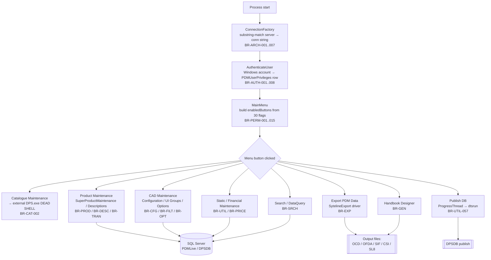
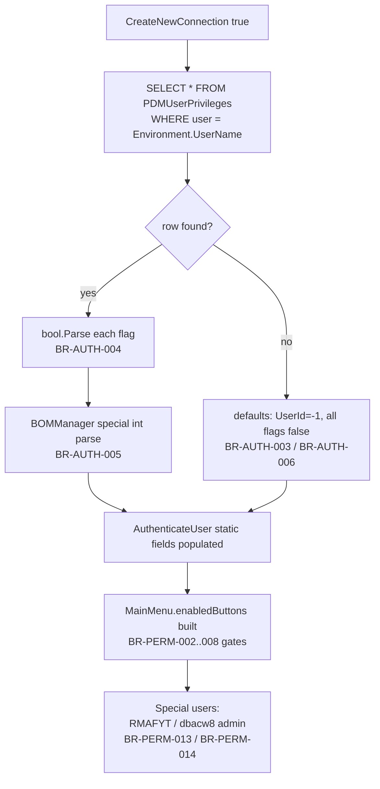
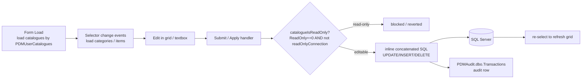
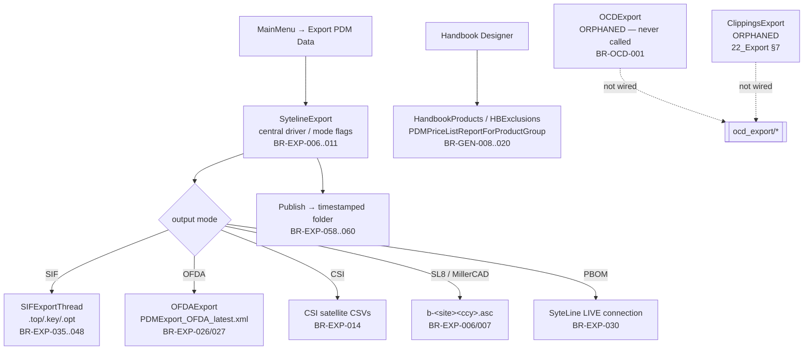

# 28 — Call Hierarchy

*End-to-end map of how the legacy PDM Maintenance application actually executes: from process start, through Windows-identity authentication and the permission-gated Main Menu, into each maintenance form, and out through the export/generation pipelines. Every stage links back to the module document that proves it, and dead/orphaned code paths are called out explicitly.*

**Status:** Aggregated from verified module extractions; unproven items marked UNKNOWN.

> All rule ids referenced below (e.g. `BR-PERM-002`) are defined and cited in [27_Business_Rules_Index](27_Business_Rules_Index.md) and their source module docs.

---

## 1. Top-level application flow

**Startup → session.** Everything hangs off global mutable static state (`BR-ARCH-009`): connected server/DB, site, catalogue, category, product, currency, language. The connection string is chosen by substring-matching the server name (`BR-ARCH-002`), with retry/backoff (`BR-ARCH-003`) and forced read-only on certain servers (`BR-ARCH-004`/`005`). See [00_System_Architecture](00_System_Architecture.md).

**Authentication.** There is no login screen; identity is the Windows account (`BR-AUTH-001`). A single `PDMUserPrivileges` row is read (`BR-AUTH-002`); a missing row yields defaults (`BR-AUTH-003`/`006`); errors are non-fatal (`BR-AUTH-007`). See [01_Authentication](01_Authentication.md).

**Menu construction.** `MainMenu` translates the 30 capability flags (`BR-PERM-001`) into a visible button set, with several server/DB context conditions (`BR-PERM-002..008`) and special-user overrides (`BR-PERM-013`/`014`). See [02_User_Permissions](02_User_Permissions.md).

## 2. Privilege load sub-flow

## 3. Maintenance-form data round-trip (generic pattern)

Almost every maintenance form follows the same **Form → Event → Worker/Service → SQL/MDB → Output** shape:

- **Read-only gate** is the recurring guard: `ReadOnly == 0` **and** not a read-only connection = editable (`BR-PROD-005`, `BR-ATTR-011`/`036`, `BR-DESC-032`, `BR-CFG-004`). Note the **inverted** per-user convention `1 = full access` in `PDMUserCatalogues` (`BR-PERM-009`).
- **Audit** rows are written to `PDMAudit.dbo.Transactions` for catalogue-affecting writes (`BR-OPT-028`, `BR-OVAL-027`, `BR-PRICE-060`/`061`, `BR-SRCH-020`) — but **disabled on `eoscloud`** (`BR-PRICE-062`).
- **SQL construction** is overwhelmingly inline string concatenation (injection surface: `BR-SRCH-002`, `BR-PRICE-100`, `BR-FILT-035`); `StaticDataMaintenance` is the notable exception using parameterised commands (`BR-UTIL-002`/`030`).

### Per-stage chains (with backlinks)

| Stage | Form → Event → Worker → Store → Output | Backlink |
|---|---|---|
| Catalogues | `MainMenu.CatMaintButton_Click` → `Process.Start("DPS.exe … maintenanceCAT")` → *external* | [03_Catalogues](03_Catalogues.md) |
| Categories | `CADMaintenance`/`ProductDescriptions` selector → `Q-CATEG-001` → grid | [04_Product_Categories](04_Product_Categories.md) |
| Products / BOM | `SuperProductMaintenance` → `SubmitButton_Click` → `ItemComponents` upsert + `updateSPFlag()` → grid | [05_Products](05_Products.md) |
| Articles | `ProductCodeEntry.AddButton_Click` → validate → `INSERT Product_Code` → confirm | [06_Articles](06_Articles.md) |
| Attributes | `PhysicalMaintenance` → save → optimistic-concurrency `UPDATE Item` → re-select | [07_Attributes](07_Attributes.md) |
| Property/Option values | `ProductDescriptions`/`AddNewData` → `OtherDescription`+`OptionValue` inserts | [08_Property_Values](08_Property_Values.md), [10_Option_Values](10_Option_Values.md) |
| Options | `ProductDescriptions`/`SIFImport` → format-key validation → `[Option]` write + audit | [09_Options](09_Options.md) |
| Configuration (CAD) | `CADMaintenance` → model/material edits → pipe-delimited `Product.*` writes | [11_Configuration](11_Configuration.md) |
| Descriptions/Translations | `ProductDescriptions` → `submitData`/`modifyOtherDescription` → per-language UPSERT | [12_Translations](12_Translations.md), [13_Descriptions](13_Descriptions.md) |
| Search | `DataQuery` (title-switched) → `{text}` replace → inline SQL → results/apply/reactivate | [14_Search](14_Search.md) |
| Filtering (UI Groups) | `UIGroupMaintenance` → matcher `getUIGroupIdForProduct` → `CatalogueUIGroups` or `groupdata.txt` | [15_Filtering](15_Filtering.md) |
| Ordering | `OrderCategories` (catalogue path) → ordinal textboxes → per-row `UPDATE DisplayOrder` | [16_Ordering](16_Ordering.md) |
| Images | `GetImage`/`ValidateImageThread`/`CADMaintenance` → UNC share existence → move/rewrite | [17_Images](17_Images.md) |
| Pricing | `PriceMaintenance`/`UpdatePricesThread` → uplift maths → `Item`/`ItemOptionValues` + audit | [18_Pricing](18_Pricing.md) |
| pCon MDB (OAP/ODB) | `CADMaintenance`/`MDBQuery` → Jet OLE DB `pcr_data_*.mdb` | [19_OAP](19_OAP.md), [20_ODB](20_ODB.md) |

## 4. Export / generation pipeline

- `SytelineExport` is the central export driver; mode flags select SIF/OFDA/CSI/SL8/PBOM outputs (`BR-EXP-006..014`). Site 20 remaps to site 1 for SL8 (`BR-EXP-007`). See [22_Export](22_Export.md).
- The shared stored proc `PDMOptionDataReport` (body UNKNOWN) is the option/value backbone consumed across OCD/OFDA/Search (`BR-PVAL-035`, `BR-OPT-001`, `BR-SRCH-016`).
- Handbook generation runs synchronously on the UI thread with a memory guard (`BR-GEN-008`, `BR-GEN-020`). See [23_Generation](23_Generation.md).
- **Publish DB** is driven by `ProgressThread` → `xp_cmdshell 'dtsrun … -Sdbchip02 -N"Export_PDM2004_to_DPSDB"'` (hard-coded server/package) (`BR-UTIL-057`). See [24_Utilities](24_Utilities.md).

## 5. Menu button → feature → permission gate → module

| Menu button | Feature | Permission / condition gate | Module doc |
|---|---|---|---|
| Publish DB | DPS DB publish (dtsrun) | `DatabasePublication` **AND** DB == target (`BR-PERM-002`) | [02_User_Permissions](02_User_Permissions.md), [24_Utilities](24_Utilities.md) |
| Product Maintenance | SuperProduct / Descriptions / Options | `ProductMaintenance` **OR** `BOMManager` (`BR-PERM-003`) | [05_Products](05_Products.md), [13_Descriptions](13_Descriptions.md) |
| PDM Import | SIF import | `PDMImport` **AND** non-`eoscloud` (`BR-PERM-004`) | [22_Export](22_Export.md) |
| Handbook | Handbook Designer | `HandbookPublication` **AND** non-`eoscloud` (`BR-PERM-005`) | [23_Generation](23_Generation.md) |
| Audit | Audit viewer | `PDMAuditer` **AND** DB ≠ `(local)` ≠ `POSH` (`BR-PERM-006`) | [02_User_Permissions](02_User_Permissions.md) |
| Web Configurator | Web Configurator | `CoreMaintenance` **AND** non-`eoscloud` (`BR-PERM-007`) | [11_Configuration](11_Configuration.md) |
| Static Maintenance (left-click) | `StaticDataMaintenance` | any financial flag (`BR-PERM-008`) | [24_Utilities](24_Utilities.md) |
| Static Maintenance (right-click) | `FinancialMaintenance` | right-click gate (`BR-PRICE-052`) | [18_Pricing](18_Pricing.md) |
| Catalogue Maintenance | external `DPS.exe` (dead shell) | `CatalogueMaintenance` (`BR-CAT-001`/`002`) | [03_Catalogues](03_Catalogues.md) |
| CAD Maintenance | Configuration / UI Groups / ODB / OAP | `CADMaintenance` (`BR-CFG-001`, `BR-FILT-002`, `BR-ODB-009`, `BR-OAP-004`) | [11_Configuration](11_Configuration.md) |
| Physical Data | `PhysicalMaintenance` | `CommodityMaintenance` (`BR-ATTR-001`) | [07_Attributes](07_Attributes.md) |
| Product Descriptions | descriptions/translations | `DescriptionMaintenance`; `DescriptionEdit` overrides read-only (`BR-TRAN-028`/`029`) | [12_Translations](12_Translations.md) |
| Price Maintenance | `PriceMaintenance` surfaces | `PriceMaintenance`/`FormulaMaintenance`/… (`BR-PRICE-053`/`054`) | [18_Pricing](18_Pricing.md) |
| Delete Items | delete products/items | `PDMAdministrator` only (`BR-PERM-015`) | [02_User_Permissions](02_User_Permissions.md) |
| Admin button | admin surfaces | `PDMAdministrator` **OR** `RMAFYT`; `dbacw8` unconditional (`BR-PERM-013`/`014`) | [02_User_Permissions](02_User_Permissions.md) |

## 6. Dead & orphaned paths

These paths exist in the binary but are unreachable, non-functional, or defeated. Each is proven in its source module.

| Path | Nature | Rule(s) | Module |
|---|---|---|---|
| `CatalogueMaintenance.cs` form | Dead shell — the menu launches external `DPS.exe`; the in-app form is never opened | `BR-CAT-002`, `BR-CAT-019` | [03_Catalogues](03_Catalogues.md) |
| DPS single-instance guard `if (0 == 0)` | Always-true dead check; the guard is never enforced | `BR-CAT-004` | [03_Catalogues](03_Catalogues.md) |
| Catalogue `AlphaButton` (sort alphabetically) | Dead stub — confirms then does nothing | `BR-CAT-014` | [03_Catalogues](03_Catalogues.md) |
| Category re-ordering path (`catalogueId > 0`) | Dead — the only caller passes `-1` | `BR-CATEG-010`, `BR-ORD-011` | [04_Product_Categories](04_Product_Categories.md), [16_Ordering](16_Ordering.md) |
| Category-ordering query missing-space defect | Dead + broken — would raise a SQL error if ever executed | `BR-CATEG-011`, `BR-ORD-013` | [04_Product_Categories](04_Product_Categories.md), [16_Ordering](16_Ordering.md) |
| Ordering `AlphaButton` | Dead stub — confirms then does nothing | `BR-ORD-012` | [16_Ordering](16_Ordering.md) |
| Product Descriptions `Alpha` sort button | Dead stub | `BR-DESC-030` | [13_Descriptions](13_Descriptions.md) |
| Find & Replace `type == "Other"` branch | Dead/unimplemented stub (tool is Product-only) | `BR-TRAN-020` | [12_Translations](12_Translations.md) |
| Commodity-code `HSCode` edit | Latent/dead — the `HSCode` assignment is commented out in the UPDATE | `BR-ATTR-032` | [07_Attributes](07_Attributes.md) |
| `GetImage` `filePaths[0]` / `[2]` (`C:\` bases) | Dead in production — `C:\` candidates skipped unless `testMode` (always false) | `BR-IMG-006` | [17_Images](17_Images.md) |
| `Global.imageUnavailable` fallback | Effectively dead — never assigned, so the fallback is always `null` | `BR-IMG-010` | [17_Images](17_Images.md) |
| `OCDExport` (`ocdThread`) | Orphaned — instantiated but never `initParams`/`execThread`'d | `BR-OCD-001`, `BR-OCD-062` | [21_OCD](21_OCD.md) |
| `ClippingsExport` | Orphaned exporter (not wired to any live path) | 22_Export §7 | [22_Export](22_Export.md) |
| `CustomPricePerm` | Orphaned — never instantiated; permutation maths unreachable | `BR-PRICE-036`, `BR-PRICE-074` | [18_Pricing](18_Pricing.md) |
| `showPConButtons` date/currency gate | Defeated — builds a gate then unconditionally sets `result = true` | `BR-PRICE-072` | [18_Pricing](18_Pricing.md) |
| MainMenu *Layout XML* button | Dead entry point — permanently `Visible = false` | `BR-FILT-002` | [15_Filtering](15_Filtering.md) |
| `ImportLayoutFromCatalogue` menu item | Empty stub — does nothing | `BR-FILT-032` | [15_Filtering](15_Filtering.md) |
| `_readOnlyCatalogues` in UI Groups | Captured but **never enforced** — read-only catalogues remain editable (authorization gap) | `BR-FILT-036` | [15_Filtering](15_Filtering.md) |
| `[Custom Function / Query]` menu item | Disabled developer stub (`MsgBox("no function currently assigned")`) | `BR-SRCH-032` | [14_Search](14_Search.md) |

---

*End of call hierarchy. For the full enumerated rule set, see [27_Business_Rules_Index](27_Business_Rules_Index.md).*
