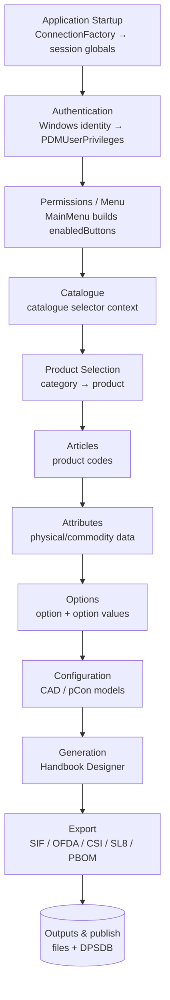

# Call Hierarchy (Navigation)

*Quick-navigation view of how the legacy PDM Maintenance application executes end-to-end — from process start, through Windows-identity authentication and the permission-gated Main Menu, into each maintenance form, and out through the export/generation pipelines. Every stage links to the module document that proves it.*

> **This is the quick-navigation index.** The detailed, fully-cited source is [28_Call_Hierarchy](../28_Call_Hierarchy.md) (whole-app flow, per-stage chains with rule ids, and the complete dead/orphaned-path catalogue). Use this page to jump; use 28 for proof.

---

## 1. Application execution flow (high level)

## 2. Generic UI round-trip

The recurring shape of almost every maintenance form: a UI event calls a form method, which invokes a helper/worker, which builds SQL against SQL Server (or a pCon MDB), then the grid is refreshed.

> The recurring guard before any write is the **read-only gate** (`ReadOnly == 0` **and** not a read-only connection). Catalogue-affecting writes also emit an audit row to `PDMAudit.dbo.Transactions` (disabled on `eoscloud`). See [28_Call_Hierarchy §3](../28_Call_Hierarchy.md).

## 3. Per-stage map

| Stage | Entry form / menu | Key method(s) | Helper / worker | SQL / MDB | Output / UI | Module doc |
|---|---|---|---|---|---|---|
| Application Startup | `MainMenu` (process start) | `ConnectionFactory.CreateNewConnection(true)` | `ConnectionFactory`, `Global` | connection string by server-name substring match | session globals populated; menu shell | [00_System_Architecture](../00_System_Architecture.md) |
| Authentication | `MainMenu` init (~3016) | `AuthenticateUser.setUserPrivileges(user)` | `AuthenticateUser`, `ConnectionFactory` | `SELECT … FROM PDMUserPrivileges WHERE UserName=` (Q-AUTH-001) | static permission flags set | [01_Authentication](../01_Authentication.md) |
| Permissions / Menu | `MainMenu` (~3004–3090) | flag evaluation → `enabledButtons.Add(...)` | `AuthenticateUser` | none (in-memory flags) | visible/enabled menu buttons | [02_User_Permissions](../02_User_Permissions.md) |
| Catalogue | MainMenu **Catalogue Maintenance** button; `ProductDescriptions` catalogue selector | `CatMaintButton_Click` → `Process.Start("DPS.exe …")`; `initialiseCatalogues` | external `DPS.exe` (dead shell); `ProductDescriptions` | `PDMUserCatalogues`, catalogue selects | catalogue context; external app | [03_Catalogues](../03_Catalogues.md) |
| Product Selection | `CADMaintenance` / `ProductDescriptions` selectors | category/product selector `*_Changed` (Q-CATEG-001) | `ProductDescriptions`, `DataQuery` | category/product `SELECT` | populated category → product grids | [04_Product_Categories](../04_Product_Categories.md), [05_Products](../05_Products.md) |
| Articles | `SuperProductMaintenance`; `ProductCodeEntry` | `SubmitButton_Click` → `ItemComponents` upsert + `updateSPFlag()`; `AddButton_Click` → `INSERT Product_Code` | inline ADO | `ItemComponents`, `Product_Code` | grid refresh / confirm | [05_Products](../05_Products.md), [06_Articles](../06_Articles.md) |
| Attributes | `PhysicalMaintenance` | save → optimistic-concurrency `UPDATE Item` → re-select | inline ADO | `Item` | re-selected grid | [07_Attributes](../07_Attributes.md) |
| Options | `ProductDescriptions` / `SIFImport` | format-key validation → `[Option]` write + audit; `AddNewData` inserts | `AddNewData` | `[Option]`, `OptionValue`, `ItemOptionValues` | grid + audit row | [09_Options](../09_Options.md), [08_Property_Values](../08_Property_Values.md), [10_Option_Values](../10_Option_Values.md) |
| Configuration (CAD) | `CADMaintenance` | model/material edits → pipe-delimited `Product.*` writes | `MDBQuery`, `DelayThread` | `Product.*`; pCon `tCOMd_*` / `tGEOd_*` via Jet OLE DB | grid / MDB update | [11_Configuration](../11_Configuration.md), [19_OAP](../19_OAP.md), [20_ODB](../20_ODB.md), [21_OCD](../21_OCD.md) |
| Descriptions / Translations | `ProductDescriptions` | `submitData` / `modifyOtherDescription` per-language UPSERT | inline ADO | `OtherDescription`, per-language tables | grid refresh | [12_Translations](../12_Translations.md), [13_Descriptions](../13_Descriptions.md) |
| Search / Filtering | `DataQuery` (title-switched); `UIGroupMaintenance` | `{text}` replace → inline SQL; `getUIGroupIdForProduct` | `DataQuery` | title-driven inline SQL; `CatalogueUIGroups` | results / apply / reactivate | [14_Search](../14_Search.md), [15_Filtering](../15_Filtering.md) |
| Ordering | `OrderCategories` (catalogue path) | ordinal textboxes → per-row `UPDATE DisplayOrder` | inline ADO | `DisplayOrder` columns | reordered grid | [16_Ordering](../16_Ordering.md) |
| Images | `GetImage`; `ValidateImageThread`; `CADMaintenance` | `GetImage.GetImage(...)`; `ValidateImageThread.ExecThread()` | `GetImage`, `ValidateImageThread` | UNC share existence probe; image-ref selects | bitmap load / null broken refs | [17_Images](../17_Images.md) |
| Pricing | `PriceMaintenance`; `UpdatePricesThread`; `FinancialMaintenance` | uplift maths → `Item` / `ItemOptionValues` + audit | `UpdatePricesThread`, `IncPriceThread`, `UpdatePriceThread` | `Item`, `ItemOptionValues`, `fnGetListPrice*` | prices updated + audit | [18_Pricing](../18_Pricing.md) |
| Generation | Handbook Designer | `HandbookProducts` / `HBExclusions`; `PDMPriceListReportForProductGroup` (synchronous, UI thread) | inline ADO (no worker) | handbook tables + stored proc | generated handbook (in-memory) | [23_Generation](../23_Generation.md) |
| Export | MainMenu **Export PDM Data** → `SytelineExport` | `ExportButton_Click` tab dispatch → `ExportSL8Data` / `ExportCSIData` / `ExportOFDA` / PBOM | `ExportThread`, `SytelineCSIExport`, `OFDAExport`, `SIFExportThread`, `BOMExport` | dozens of per-item inline selects; `PDMOptionDataReport` | `.xls`/`.asc`/`.csv`/`.xml`/`.top`/`.key`/`.opt` | [22_Export](../22_Export.md) |
| Publish DB | MainMenu **Publish DB** → `PublishDatabase` | `ExportDPSDB` → `ExportDPSDBThread.execThread` | `ExportDPSDBThread`, `ProgressThread` | `xp_cmdshell 'dtsrun … -Sdbchip02 …'` (hard-coded) | DPSDB publish | [24_Utilities](../24_Utilities.md), [22_Export](../22_Export.md) |

> **UNKNOWN** — the exact ordering of user navigation between Catalogue → Product → Article stages is convention, not enforced flow; the app allows jumping between maintenance forms directly from the menu. `PDMOptionDataReport` stored-proc body is UNKNOWN (see [22_Export](../22_Export.md)).

## 4. Background workers (`*Thread.cs`)

Long-running work runs on dedicated worker classes so the UI thread stays responsive; progress is reported back via `UpdateStatusLabel` / `UpdateStatusText` / `UpdateExportTimer` events.

| Worker class | Pipeline served | Module doc |
|---|---|---|
| `ExportThread` | SL8 / MillerCAD export (`ExportSL8Data`) → `.xls` / `b-<site><ccy>.asc`; BOM branch → `SytelineBOMExport` | [22_Export](../22_Export.md) |
| `SytelineCSIExport` (`csiThread`) | CSI export → `PDMExport_CSI.csv` + satellite CSVs | [22_Export](../22_Export.md) |
| `OFDAExport` (`ofdaThread`) | OFDA export → `PDMExport_OFDA_latest.xml` (uses `PDMOptionDataReport` + `fnGetListPrice`) | [22_Export](../22_Export.md) |
| `SIFExportThread` | SIF export (user `dbacw8`) → `.top` / `.key` / `.opt` | [22_Export](../22_Export.md) |
| `ExportDPSDBThread` | Publish DB → DTS package + `sp_detach_db`/`sp_attach_db` + `File.Copy` | [22_Export](../22_Export.md), [24_Utilities](../24_Utilities.md) |
| `ProgressThread` | Drives `xp_cmdshell dtsrun` (DPS DB export) for `ExportDPSDBThread` | [24_Utilities](../24_Utilities.md) |
| `DelayThread` | 500 ms debounce for the `CADMaintenance` category filter | [24_Utilities](../24_Utilities.md) |
| `TimerThread` | Elapsed `HH:MM:SS` label for long operations | [24_Utilities](../24_Utilities.md) |
| `ValidateImageThread` | Interactive broken-image validation launched from the `DataQuery` dialog (title starts `"Unresolved"`) | [17_Images](../17_Images.md), [07_Attributes](../07_Attributes.md) |
| `ExportLayoutStyleThread` | Layout-style / value-image export path | [07_Attributes](../07_Attributes.md) |
| `UpdatePricesThread` | Background price import / uplift into `Item` / `ItemOptionValues` | [18_Pricing](../18_Pricing.md), [10_Option_Values](../10_Option_Values.md) |
| `UpdatePriceThread` | pCon price push (`PConPriceUpdate`) into external `tCOMd_*` MDB via Jet OLE DB | [18_Pricing](../18_Pricing.md) |
| `IncPriceThread` | Incremental price maintenance | [18_Pricing](../18_Pricing.md) |
| `ValidateSIFThread` | SIF validation pass | [10_Option_Values](../10_Option_Values.md) |

> **UNKNOWN** — `TimerThread` and `DelayThread` are generic utility timers; some forms may reuse them beyond the pipelines listed above (not exhaustively proven).

---

*For per-stage chains with rule ids and the full dead/orphaned-path catalogue, see [28_Call_Hierarchy](../28_Call_Hierarchy.md). For the enumerated rule set, see [27_Business_Rules_Index](../27_Business_Rules_Index.md).*
