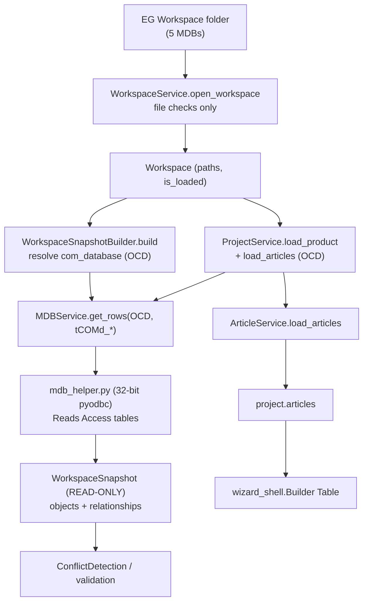

# 01 — MDB Engineering Workflow

**Status:** Analysis of the existing implementation; unverified items marked `UNKNOWN`.

## Purpose

This document describes exactly how an **EG Workspace** (a folder of Access MDB
databases) becomes an in-memory *engineering workspace* that feeds the Builder
Table. It traces the real call flow from opening a workspace folder, through the
read-only snapshot, to the project/article data the UI consumes. It is grounded
in the source files cited throughout.

The workflow has two independent concerns that must not be confused:

- **Reading** the authoritative engineering model (OCD / `tCOMd_*`) into a
  read-only snapshot — done by [`WorkspaceSnapshotBuilder`](../../services/workspace_snapshot_builder.py).
- **Writing** a fresh handbook base (creating `tCOMd_*` rows) — done by
  [`MDBService.create_handbook_base`](../../services/mdb_service.py) which shells
  to [`mdb_helper.create_handbook_base`](../../helpers/mdb_helper.py).

## The 5-MDB EG Workspace

An EG Workspace is a folder containing exactly the five files listed in
[`WorkspaceService.REQUIRED_FILES`](../../services/workspace_service.py). Opening
and validating a workspace performs **file-system checks only** — no database is
opened at this stage (see class docstring and
[validate_workspace](../../services/workspace_service.py#L57)).

| Workspace field | Filename | Role |
|---|---|---|
| `workspace_mdb` | `pcr_workspace.mdb` | Workspace registry / manifest. `UNKNOWN` — not read by any service found. |
| `com_database` | `pcr_data_com_ocd.mdb` | **OCD commercial = authoritative engineering model.** Holds all `tCOMd_*` tables. The only DB read by the snapshot builder and project loader. |
| `geo_database` | `pcr_data_geo_odb.mdb` | **ODB geometry.** Geometry model. `UNKNOWN` — no loading/reading code found (see "ODB loading sequence"). |
| `cls_database` | `pcr_data_typ_cls.mdb` | Type/class database. `UNKNOWN` — resolved as a path but not read by services found. |
| `oas_database` | `pcr_data_sel_oas.mdb` | Selection/OAS database. `UNKNOWN` — resolved as a path but not read by services found. |

`WorkspaceService` resolves each path in
[discover_mdb_files](../../services/workspace_service.py#L74) and marks the
[Workspace](../../core/workspace.py) as `is_loaded` only when all five files
exist. The `Workspace` model itself is a plain data holder with no I/O.

## Builder Workspace creation — step-by-step call flow

1. **Open workspace (file checks).**
   [`WorkspaceService.open_workspace`](../../services/workspace_service.py#L31)
   builds a `Workspace`, resolves the five MDB paths, validates, and sets
   `is_loaded`. The controller stores it via
   [`AppController.open_workspace`](../../ui/controllers/app_controller.py#L146)
   as `current_workspace`. No DB is opened.

2. **Build the read-only snapshot (OCD read).**
   [`WorkspaceSnapshotBuilder.build`](../../services/workspace_snapshot_builder.py#L61)
   resolves `com_database` (the OCD MDB), then for each entry in its `_TABLES`
   map calls [`MDBService.get_rows(com_database, table)`](../../services/mdb_service.py#L113)
   and converts rows into `SnapshotObject`s. Missing/unreadable tables are simply
   skipped. It finishes by linking best-effort parent/child relationships.

3. **Read rows via the 32-bit helper.**
   `MDBService.get_rows` shells out through
   [`_run_helper`](../../services/mdb_service.py#L19) to
   [`helpers/mdb_helper.py`](../../helpers/mdb_helper.py) using `py -3.14-32`
   (32-bit pyodbc is required for the Access driver). Returns
   `{"columns": [...], "rows": [...], "table": ...}`.

4. **Produce the snapshot.**
   [`WorkspaceSnapshot`](../../core/workspace_snapshot.py) is an in-memory,
   read-only container (`add` + lookup helpers, plus convenience collections such
   as `.articles`, `.properties`, `.options`). It is the single source of truth
   for conflict detection / validation (used by
   [`AppController.build_import_preview`](../../ui/controllers/app_controller.py#L188)).

5. **Load the project / articles for the Builder Table.**
   Product selection uses a separate, product-oriented path:
   [`ProjectService.load_product`](../../services/project_service.py#L25) builds a
   `Project` (resolves `workspace_path` via `repository_service.find_workspace`),
   then [`ProjectService.load_articles`](../../services/project_service.py#L60)
   reads `pcr_data_com_ocd.mdb` tables `tCOMd_Article` and `tCOMd_Text` via
   `MDBService.get_rows` and delegates to
   [`ArticleService.load_articles`](../../services/article_service.py#L6) to build
   `project.articles`.

6. **Populate the Builder Table.**
   The wizard reads `controller.project.articles` in
   [`_populate_builder_table`](../../ui/widgets/wizard_shell.py#L458) and renders
   the rows (see [07_Builder_Workspace.md](07_Builder_Workspace.md)).

> `UNKNOWN`: There is no single wired end-to-end entrypoint that chains
> *open_workspace → build snapshot → project → Builder Table*. In the controller,
> [`open_project`](../../ui/controllers/app_controller.py#L138),
> [`select_product`](../../ui/controllers/app_controller.py#L477) and
> [`load_articles`](../../ui/controllers/app_controller.py#L482) are `TODO`/`pass`.
> The snapshot path (`build_import_preview`) and the project/article path
> (`ProjectService`) currently exist as two separate consumers of the same OCD
> reads.

## OCD loading sequence (authoritative engineering model)

OCD (`pcr_data_com_ocd.mdb`) is the **authoritative engineering model**. Its
`tCOMd_*` tables are read into the snapshot in the order declared by
[`WorkspaceSnapshotBuilder._TABLES`](../../services/workspace_snapshot_builder.py#L22):

| # | Snapshot object type | OCD table | Key column candidates | Captured state |
|---|---|---|---|---|
| 1 | ComGroup | `tCOMd_ComGroup` | `ComGroupCode` | `label` |
| 2 | Package | `tCOMd_Package` | `ProgramCode` | `label` |
| 3 | Article | `tCOMd_Article` | `com_ArticleCode` | — |
| 4 | Property Class | `tCOMd_Class` | `com_ClassName` | `kind` |
| 5 | Property | `tCOMd_Property` | `com_PropName` | `class` |
| 6 | Property Value | `tCOMd_PropValue` | `com_PropValue` | `code` |
| 7 | Option | `tCOMd_Option` | `com_OptionName` | `type`, `code`, `article` |
| 8 | Option Value | `tCOMd_OptionValue` | `com_OptionValueName` | `parent`, `code` |
| 9 | Text Block | `tCOMd_Text` | `com_TextName` | — |

Relationship linking (best-effort) in
[`_link_relationships`](../../services/workspace_snapshot_builder.py#L127):
Property → parent Property Class (via `state["class"]`); Option → parent Article
(via `state["article"]`); Option Value → parent Option (via `state["parent"]`).

The **write** side mirrors these tables. `MDBService.create_handbook_base` →
[`mdb_helper.create_handbook_base`](../../helpers/mdb_helper.py#L1387) creates the
ComGroup/Package context then writes article rows. From the OCD analysis and the
task brief it targets `tCOMd_Article`, `tCOMd_Class`, `tCOMd_Property`,
`tCOMd_PropValue`, `tCOMd_ArtBase`, `tCOMd_ArticleClass` (plus `tCOMd_Text`,
`tCOMd_OfmlType`, `tCOMd_DistributionRegion`). Payload shape:
`ComGroup`, `Package`, `Articles`, `AttributeValues`, `ClassesWanted`,
`AllowedArticleCodes`. The write path is invoked through
[`_run_helper_with_json_arg`](../../services/mdb_service.py#L58), which serialises
the payload to a temp JSON file passed as `@<path>`.

## ODB loading sequence (geometry)

`UNKNOWN` — **minimal / none found.** `pcr_data_geo_odb.mdb` is resolved as
`workspace.geo_database` in
[discover_mdb_files](../../services/workspace_service.py#L74) and existence-checked
in validation, but no service found reads it: the snapshot builder reads *only*
`com_database` (OCD), and `ProjectService` reads *only* OCD tables. There is no
geometry loader, no ODB table map, and no ODB-derived snapshot objects in the
code inspected. Geometry loading appears to be out of scope in the current
implementation.

## Dependencies

- `WorkspaceSnapshotBuilder` depends on `MDBService` (row reads) and optionally
  `WorkspaceService` (path resolution when given a root string).
- `MDBService` depends on the external 32-bit interpreter `py -3.14-32` and
  `helpers/mdb_helper.py` (pyodbc + Access driver). `UNKNOWN` — the driver/ODBC
  availability is an environment requirement, not verifiable from source.
- `ProjectService` depends on `repository_service`, `mdb_service`,
  `article_service` (see [constructor](../../services/project_service.py#L5)).
- Schema introspection helper
  [`mdb_schema_helper.py`](../../helpers/mdb_schema_helper.py) provides
  `list_tables`/`get_columns`/`get_primary_keys`/`get_foreign_keys`/`build_schema`
  (used for schema discovery, not part of the snapshot build path found).

## Services summary

| Service | File | Responsibility | I/O |
|---|---|---|---|
| `WorkspaceService` | [workspace_service.py](../../services/workspace_service.py) | Locate/validate/discover the 5 MDBs | File-system only |
| `WorkspaceSnapshotBuilder` | [workspace_snapshot_builder.py](../../services/workspace_snapshot_builder.py) | OCD → read-only `WorkspaceSnapshot` | Read (via MDBService) |
| `MDBService` | [mdb_service.py](../../services/mdb_service.py) | Read rows/tables; write handbook base | Read + Write (32-bit helper) |
| `ProjectService` | [project_service.py](../../services/project_service.py) | Build `Project`, load `articles` from OCD | Read (via MDBService) |
| `ArticleService` | [article_service.py](../../services/article_service.py) | Rows → article domain objects | None (pure transform) |

## UI flow

- [`ui/app_window.py`](../../ui/app_window.py) hosts the left-panel explorers
  ([`MODULES = ["MDB Explorer", "PDM Explorer", "OCD Explorer"]`](../../ui/app_window.py#L755))
  and a [`BuilderTablePlaceholder`](../../ui/app_window.py#L305) scaffold with the
  same seven columns as the wizard.
- [`ui/widgets/wizard_shell.py`](../../ui/widgets/wizard_shell.py) is the live
  Builder Workspace, populated from `controller.project.articles`. See
  [07_Builder_Workspace.md](07_Builder_Workspace.md).
- The controller exposes `current_workspace`, `current_project`,
  `last_workspace_snapshot`; several product-selection handlers are still `TODO`.
