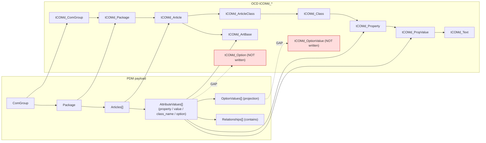

# 03 — Engineering Object Mapping

**Status:** Analysis of the existing implementation; unverified items marked `UNKNOWN`.

## Purpose

A master mapping between every **engineering object** the OCD commercial model
uses (`tCOMd_*` tables / [`SnapshotObjectType`](../../core/workspace_snapshot.py))
and its **equivalent PDM object** (payload field, explorer field, or the service
that produces it). It documents the *existing* compatibility bridge only —
[`PDMToMDBService`](../../services/pdm_to_mdb_service.py) →
[`MDBService.create_handbook_base`](../../services/mdb_service.py) →
[`mdb_helper.create_handbook_base`](../../helpers/mdb_helper.py#L1387) — and does
**not** propose a new mapping.

- OCD hierarchy: `ComGroup → Package → Article → PropertyClass → Property →
  PropertyValue`; `Option → OptionValue`; `TextBlock`. See
  [06_OCD_Integration.md](06_OCD_Integration.md).
- PDM payload shape: `{ Articles, AttributeValues, Relationships, OptionValues }`
  (+ `ComGroup`, `Package`). See [02_PDM_Data_Model.md](02_PDM_Data_Model.md).
- ODB geometry (`tGEOd_*`): no reader/writer exists. See
  [05_ODB_Integration.md](05_ODB_Integration.md).

The write coverage was read from
[`create_handbook_base`](../../helpers/mdb_helper.py#L1387): it writes ComGroup,
Package, Text, Article, ArtBase, ArticleClass, Class, Property and PropValue —
but **not** `tCOMd_Option` / `tCOMd_OptionValue` (a confirmed write-coverage gap,
even though the snapshot builder *reads* both — see
[`_TABLES`](../../services/workspace_snapshot_builder.py#L22)).

---

## Master mapping table

| MDB Engineering Object (`tCOMd_` + `SnapshotObjectType`) | Equivalent PDM Object (payload / explorer / service) | Required Conversion | Missing Fields | Default Values | Compatibility Notes |
|---|---|---|---|---|---|
| **ComGroup** — `tCOMd_ComGroup` / `ComGroup` | Category name → [`build_com_group`](../../services/pdm_to_mdb_service.py) → `{ ComGroupCode, ComGroupLabel }` | `ComGroupCode = category_name.upper()`; label = raw name | — | ID assigned on write by `get_or_create_com_group` | 1 ComGroup per category. `ComGroupID` back-filled into payload by `generate_initial_tables`. |
| **Package** — `tCOMd_Package` / `Package` | Category name → [`build_package`](../../services/pdm_to_mdb_service.py) → `{ ProgramCode, ProgramLabel, ComGroupID, DistributionRegionID, MaterialMF, MaterialPK }` | `ProgramCode = category_name.lower()`; series normalized via [`_normalize_series_name`](../../services/pdm_to_mdb_service.py) | Real program/series identity beyond the category name — `UNKNOWN` | `DistributionRegionID=5`, `MaterialMF="hmx"`, `MaterialPK="basics"` | Series name drives derived class names (`<series>_attr`, `<series>_options`). |
| **Article** — `tCOMd_Article` / `Article` | `payload.Articles[]` `{ article_code, article_name }` from `selected_products` (`.Product`, `.Name`) | `ArticleCode = product.Product`; name = `product.Name` or code | Geometry, status, lifecycle, OFML type from PDM — `UNKNOWN` | `article_name` defaults to code; `OfmlTypeID` resolved on write | Selected-product set is authoritative; falls back to codes parsed from `article_numbers`. |
| **ArtBase** — `tCOMd_ArtBase` / (no snapshot type) | Derived from `AttributeValues` rows (`class_name` + `property` + normalized `value`) per `article_numbers` | `PropValue = normalize_prop_value_code(value)`; article code mapped via longest-prefix `map_article_code_to_allowed` | — | Value falls back to `name` when `value` empty | Written per (article, class, property, value). No PDM source object; purely a projection. |
| **ArticleClass** — `tCOMd_ArticleClass` / (no snapshot type) | Derived: classes referenced by an article's `AttributeValues` rows | Ordering `100 + index*10`; localized propclass text built | — | Order starts at 100, step 10 | Join row linking Article→Class with a `propclass` Text. No direct PDM object. |
| **Class / PropertyClass** — `tCOMd_Class` / `Property Class` | `AttributeValues.class_name` (derived by [`_class_name_for_row`](../../services/pdm_to_mdb_service.py)); rarely populated upstream | Fallback to `property` name; `ClassesWanted = [<series>_options, PLC, Code]` | Real PDM property class — `UNKNOWN` / often unpopulated | `<series>_attr` (default), `<series>_options`, `PLC`, `Code` | `class_name` on PDM rows is generally empty; class names are *inferred* from the property text, not sourced. |
| **Property** — `tCOMd_Property` / `Property` | `AttributeValues.property` | `(class_name, property)` pair deduped; created under its class | Data type / units — `UNKNOWN` | ClassName falls back to property name | Explorer `data_type` = `"List"` if >1 value else `"Single"` (derived, not sourced). |
| **PropValue** — `tCOMd_PropValue` / `Property Value` | `AttributeValues.value` (+ `name`, `order_code`) | `PropValue = normalize_prop_value_code(value)`; optional `propvalue`/`price` Text | Pricing/dependency links — `UNKNOWN` | `value_code` falls back to `normalize_prop_value_code(name)` | Deduped per `(property_id, value_code, value_name)`. Text row created when a text value is present. |
| **Option** — `tCOMd_Option` / `Option` | `payload.OptionValues[].parent_option` (option-source `AttributeValues`) | Would map option name → `tCOMd_Option` | **Not written** — no `tCOMd_Option` insert in `create_handbook_base` | — | **GAP.** Snapshot *reads* `tCOMd_Option` but nothing writes it. Options currently collapse into class `<series>_options`. |
| **OptionValue** — `tCOMd_OptionValue` / `Option Value` | `payload.OptionValues[]` `{ option_name, value_name, value_code, display_order, parent_option, relationships }` (via [`add_option_values`](../../services/generate_payload_service.py#L140)) | Would map value → `tCOMd_OptionValue` under its Option | **Not written** — no `tCOMd_OptionValue` insert | `display_order` assigned sequentially per option | **GAP.** Produced in the payload/explorer but never persisted to OCD. |
| **Text** — `tCOMd_Text` / `Text Block` | PropValue text + propclass text (built in `create_handbook_base`) | `get_or_create_text` with type code (`propvalue`/`price`/`propclass`) | Localized strings from PDM — `UNKNOWN` | Multilingual defaults for propclass (`de/en/fr/nl`) | Localized text is synthesized on write, not carried from PDM. |
| **Relationships** — snapshot `children`/`parent` links | `payload.Relationships[]` (via [`add_relationships`](../../services/generate_payload_service.py#L75)) | Edges `ComGroup→Package→Article→Property/Option→Value` | Constraint/price/dependency edges — `UNKNOWN` | `relationship_type = "contains"` only | **GAP.** Single relationship type; `metadata` empty. See [`relationship_index`](../../core/workspace_snapshot.py). |

---

## Object hierarchy (mapping view)

## Flagged gaps

- **Option / OptionValue** — mapped in the payload/explorer but **not written**
  to `tCOMd_Option` / `tCOMd_OptionValue` (write-coverage gap; snapshot reads
  them). See [04_Compatibility_Layer.md](04_Compatibility_Layer.md#known-gaps-to-close-for-full-parity).
- **Property class** — `class_name` is largely unpopulated on PDM rows and is
  *inferred* from property text; real PDM classes are `UNKNOWN`.
- **ODB geometry** — no `tGEOd_*` reader/writer exists. See
  [05_ODB_Integration.md](05_ODB_Integration.md).
- **Relationships** — single `"contains"` type only; richer OCD relations are
  `UNKNOWN`.
