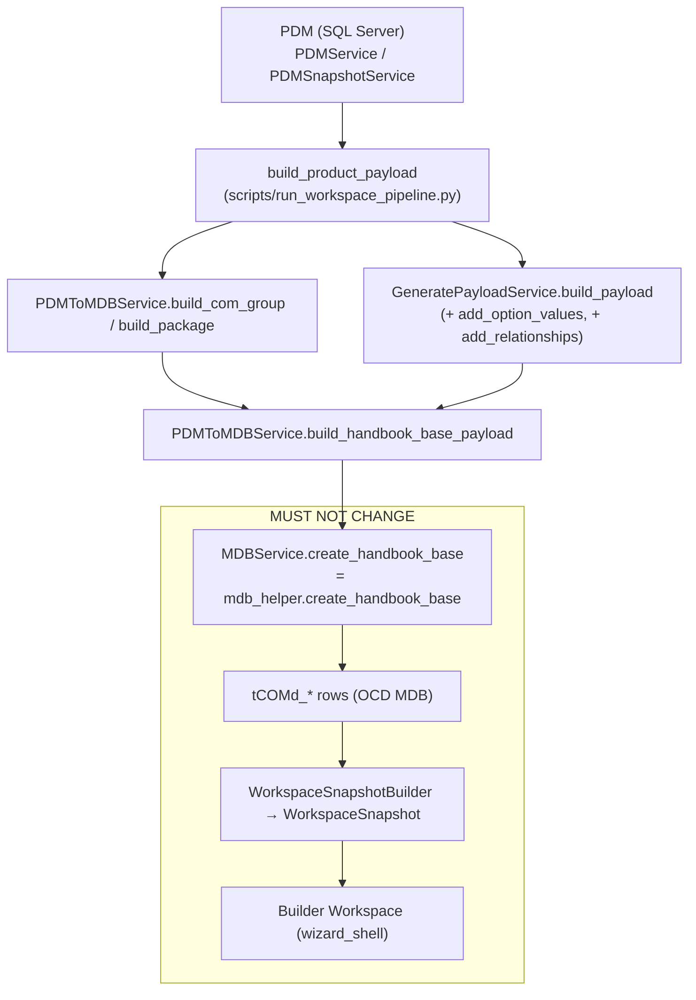

# 04 — Compatibility Layer

**Status:** Analysis of the existing implementation; unverified items marked `UNKNOWN`.

## Purpose

This document describes the **existing compatibility layer** that lets the MK
Product Workbench source its engineering data from **PDM** (SQL Server) instead
of an **MDB** workspace, while keeping the downstream Builder / ODB / OCD
workflow unchanged. The layer *swaps the source of engineering data only*; it
does not redesign the OCD model or the Builder.

The layer is made of these existing components:

- [`PDMToMDBService`](../../services/pdm_to_mdb_service.py) — builds the
  `ComGroup` / `Package` skeleton and the `create_handbook_base` payload.
- [`build_product_payload`](../../scripts/run_workspace_pipeline.py) — the single
  shared assembly that turns PDM data into the engineering payload.
- [`GeneratePayloadService`](../../services/generate_payload_service.py) — extends
  the payload with `OptionValues` and `Relationships` projections.
- [`WorkspaceImportService`](../../services/workspace_import_service.py) /
  [`workspace_pipeline_service.py`](../../services/workspace_pipeline_service.py)
  — orchestrate the write into the OCD MDB.
- [`MDBService.create_handbook_base`](../../services/mdb_service.py) →
  [`mdb_helper.create_handbook_base`](../../helpers/mdb_helper.py#L1387) — the
  **unchanged** OCD writer that both MDB-sourced and PDM-sourced products flow
  through.

The result is `tCOMd_*` rows, read back into a
[`WorkspaceSnapshot`](../../core/workspace_snapshot.py) and surfaced in the
Builder Workspace exactly as before. See [07_Builder_Workspace.md](07_Builder_Workspace.md).

---

## End-to-end flow

Only the **left** of the diagram (PDM → payload) is the compatibility layer.
Everything inside *MUST NOT CHANGE* is the pre-existing Builder / OCD / ODB
workflow, reused verbatim.

---

## Responsibilities

| Layer component | Input | Output | File / function |
|---|---|---|---|
| Product selection | `category_id`, `catalogue_id` | PDM product rows | [`PDMService.get_products_for_category`](../../services/pdm_service.py) |
| Attribute assembly | products | `AttributeValues` rows | `build_attribute_rows` → [`PDMSnapshotService`](../../services/pdm_snapshot_service.py) / `PDMFilterBuilderService` |
| ComGroup / Package skeleton | category name | `ComGroup`, `Package` dicts | [`PDMToMDBService.build_com_group` / `build_package`](../../services/pdm_to_mdb_service.py) |
| Payload aggregation | com_group, package, attribute_rows, products | `{ Articles, AttributeValues, OptionValues, Relationships }` | [`GeneratePayloadService.build_payload`](../../services/generate_payload_service.py#L18) |
| Shared assembly | `category_id`, `plan`, `limit` | `(payload, products, name, services)` | [`build_product_payload`](../../scripts/run_workspace_pipeline.py) |
| Handbook-base payload | com_group, package, attribute_values, selected_products | `create_handbook_base` payload (`AttributeValues`, `Articles`, `AllowedArticleCodes`, `ClassesWanted`) | [`build_handbook_base_payload`](../../services/pdm_to_mdb_service.py) |
| Write orchestration | payload, workspace | `PipelineResult` / `ImportResult` | [`workspace_import_service.py`](../../services/workspace_import_service.py), [`workspace_pipeline_service.py`](../../services/workspace_pipeline_service.py) |
| OCD writer (**unchanged**) | handbook-base payload | `tCOMd_*` rows | [`create_handbook_base`](../../helpers/mdb_helper.py#L1387) |
| Snapshot read-back (**unchanged**) | OCD MDB | `WorkspaceSnapshot` | [`WorkspaceSnapshotBuilder.build`](../../services/workspace_snapshot_builder.py) |
| Explorer view-model | payload, products | explorer dict | [`AppController._build_explorer_model`](../../ui/controllers/app_controller.py#L314) |

---

## What must NOT change

The compatibility layer replaces **only the source of engineering data**
(PDM instead of an MDB import). The following are consumed as-is and must remain
untouched:

- **OCD writer** — [`create_handbook_base`](../../helpers/mdb_helper.py#L1387)
  and the `tCOMd_*` schema. PDM data is shaped to fit the *existing* payload
  contract; the writer is source-agnostic.
- **WorkspaceSnapshot** — the read-only model and
  [`WorkspaceSnapshotBuilder`](../../services/workspace_snapshot_builder.py) read
  the same OCD tables regardless of origin. See [06_OCD_Integration.md](06_OCD_Integration.md).
- **ODB geometry** — no reader/writer exists and none is added here; geometry is
  out of scope. See [05_ODB_Integration.md](05_ODB_Integration.md).
- **Builder Workspace** — [`wizard_shell.py`](../../ui/widgets/wizard_shell.py)
  renders `controller.project.articles` identically for MDB- and PDM-sourced
  products. See [07_Builder_Workspace.md](07_Builder_Workspace.md).

The layer's contract is the **payload shape** (`Articles`, `AttributeValues`,
`OptionValues`, `Relationships`, `ComGroup`, `Package`) — matching it is what
keeps the rest of the workflow unchanged. Real payload→MDB usage is exercised by
[`tests/test_mdb_write_integration.py`](../../tests/test_mdb_write_integration.py),
[`tests/test_ocd_payload_service.py`](../../tests/test_ocd_payload_service.py) and
[`tests/test_com_group.py`](../../tests/test_com_group.py).

---

## Known gaps to close for full parity

These are **gaps in the existing layer**, not a redesign. Cross-referenced with
[03_Engineering_Object_Mapping.md](03_Engineering_Object_Mapping.md#flagged-gaps)
and [06_OCD_Integration.md](06_OCD_Integration.md).

| Gap | Evidence | Impact |
|---|---|---|
| **Options / OptionValues not written** | `create_handbook_base` writes ComGroup/Package/Text/Article/ArtBase/ArticleClass/Class/Property/PropValue but no `tCOMd_Option` / `tCOMd_OptionValue`; snapshot builder *reads* both ([`_TABLES`](../../services/workspace_snapshot_builder.py#L22)). | Options exist in the payload/explorer but never persist to OCD; round-trip is lossy. |
| **Property class unpopulated** | `AttributeValues.class_name` generally empty; classes inferred by [`_class_name_for_row`](../../services/pdm_to_mdb_service.py) (`<series>_attr`/`<series>_options`/`PLC`/`Code`). | OCD property classes are synthetic, not sourced from PDM. `UNKNOWN` real class. |
| **ODB geometry absent** | No `tGEOd_*` reader/writer anywhere. | Geometry cannot be produced from PDM. See [05_ODB_Integration.md](05_ODB_Integration.md). |
| **Single relationship type** | [`add_relationships`](../../services/generate_payload_service.py#L75) emits only `relationship_type = "contains"`, empty `metadata`. | Constraints, pricing and dependency edges are `UNKNOWN` / not modelled. |
