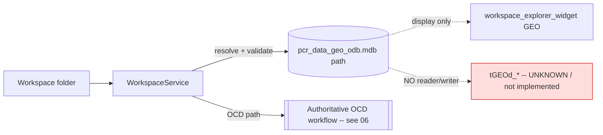

# 05 — ODB Integration (Geometry)

**Status:** Analysis of the existing implementation; unverified items marked `UNKNOWN`.

## Purpose

**ODB** ("Object/Geometry Data Base") is the *geometry* domain of the EG
Workspace, stored in `pcr_data_geo_odb.mdb` and (in the pCon/OFML data model)
backed by the `tGEOd_*` table family. This document records the **actual state**
of ODB support in *this* Python/PySide6 codebase — which is intentionally
minimal.

---

## 1. Actual State — Path Resolved/Validated Only

In this codebase ODB is **only a resolved and validated file path**. There is
**no reader and no writer** for geometry data.

Confirmed references:
- [services/workspace_service.py](../../services/workspace_service.py) — `REQUIRED_FILES["geo_database"] = "pcr_data_geo_odb.mdb"`. `open_workspace` / `discover_mdb_files` resolve the path and `validate_workspace` checks the file exists. That is the full extent of interaction.
- [core/workspace.py](../../core/workspace.py) — `self.geo_database = ""` stored on the `Workspace` model.
- [ui/widgets/workspace_explorer_widget.py](../../ui/widgets/workspace_explorer_widget.py) — displays the `("GEO", "geo_database")` entry (path display only).
- [ui/main_window.py](../../ui/main_window.py) (~line 1196) — a comment mentioning `"ODB"`; no geometry logic.

**No `tGEOd_*` reads or writes exist anywhere in `services/` or `helpers/`.** A
grep for `tGEOd` matches only legacy C# documentation under
`docs/Legacy_PDM_Business_Logic/`, not runtime code.

> Note: the one `"ODB"` token in [helpers/mdb_helper.py](../../helpers/mdb_helper.py)
> (`preferred_code="ODB"` in `resolve_ofml_type_id`) is an **OfmlType code**, not
> geometry — it belongs to the OCD workflow, not ODB.

| Concern | Status |
|---|---|
| ODB path resolution | Implemented (`WorkspaceService`) |
| ODB path validation (file exists) | Implemented (`WorkspaceService`) |
| ODB path display in UI | Implemented (`workspace_explorer_widget`) |
| `tGEOd_*` reader | **None found** |
| `tGEOd_*` writer | **None found** |
| Geometry model objects | **None** (`WorkspaceSnapshot` covers OCD only) |
| PDM geometry source | **None** — PDM provides no geometry |
| Geometry internals / schema | `UNKNOWN` |

---

## 2. What WOULD Be Required to Integrate ODB (Compatibility Notes Only)

*Not a design or redesign — gaps only, all out of current scope.*

- **A geometry source.** PDM currently supplies no geometry. Where 2D/3D model
  references would originate is `UNKNOWN`.
- **A `tGEOd_*` reader/writer.** Equivalent to the OCD `WorkspaceSnapshotBuilder`
  / `mdb_helper` layer but for `pcr_data_geo_odb.mdb`. Table set, key columns,
  and relationships are `UNKNOWN` in this codebase.
- **Snapshot/model objects for geometry.** `WorkspaceSnapshot` has no geometry
  object types; new types would be required. `UNKNOWN`.
- **PDM → ODB mapping.** No mapping exists (`WorkspaceMappingService` targets
  only Handbook/OCD tables). `UNKNOWN`.

All of the above are **gaps / `UNKNOWN` / out-of-current-scope**.

---

## 3. ODB Does Not Block OCD Engineering

ODB is **not** on the critical path for engineering Articles, Properties, or
Options. The authoritative commercial workflow is **OCD** (`tCOMd_*`), fully
documented in [06_OCD_Integration.md](06_OCD_Integration.md). The workbench
resolves and validates the ODB path so a workspace is structurally complete, but
performs no geometry read/write.

