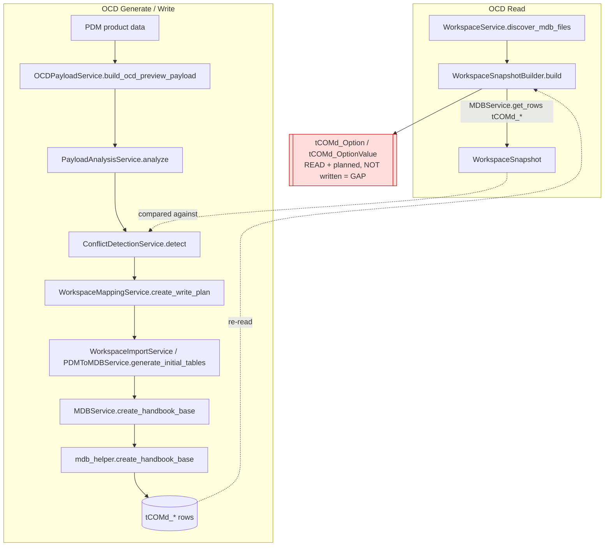

# 06 — OCD Integration (Commercial Engineering Model)

**Status:** Analysis of the existing implementation; unverified items marked `UNKNOWN`.

## Purpose

**OCD** ("Order Commercial Data") is the *commercial engineering model* in this
codebase. It lives in the EG Workspace database `pcr_data_com_ocd.mdb` and is
represented entirely by the `tCOMd_*` table family (ComGroup, Package, Article,
ArtBase, ArticleClass, Class, Property, PropValue, Option, OptionValue, Text,
OfmlType). OCD is the **authoritative** Articles/Properties/Options workflow —
everything the workbench engineers ends up as `tCOMd_*` rows and, in memory, as
`WorkspaceSnapshot` objects.

OCD is *source-agnostic*: a product coming from an MDB import and a product built
from PDM both converge on the same `tCOMd_*` rows / snapshot object types, so the
downstream engineering logic never has to know the origin.

---

## 1. OCD Loading (READ) Sequence

```
Workspace folder
  -> WorkspaceService.discover_mdb_files()      resolves com_database path
  -> WorkspaceSnapshotBuilder.build()           reads tCOMd_* via MDBService.get_rows()
  -> WorkspaceSnapshot                           read-only in-memory object graph
```

Files/functions:
- [services/workspace_service.py](../../services/workspace_service.py) — `discover_mdb_files` / `open_workspace` resolve `com_database = pcr_data_com_ocd.mdb` (file-system only; never opens a DB).
- [services/workspace_snapshot_builder.py](../../services/workspace_snapshot_builder.py) — `WorkspaceSnapshotBuilder.build` iterates `_TABLES`, calls `MDBService.get_rows(com_database, table)`, and converts rows into `SnapshotObject`s. It **only reads OCD**; missing/unreadable tables are silently skipped.
- [core/workspace_snapshot.py](../../core/workspace_snapshot.py) — `WorkspaceSnapshot`, the read-only container + lookup helpers.

### `_TABLES` mapping (builder → snapshot)

| Snapshot type | OCD table | Key column candidates | State fields |
|---|---|---|---|
| `COM_GROUP` | `tCOMd_ComGroup` | `ComGroupCode` / `com_ComGroupCode` | `label` |
| `PACKAGE` | `tCOMd_Package` | `ProgramCode` / `com_ProgramCode` | `label` |
| `ARTICLE` | `tCOMd_Article` | `com_ArticleCode` / `ArticleCode` | — |
| `PROPERTY_CLASS` | `tCOMd_Class` | `com_ClassName` / `ClassName` / `Name` | `kind` |
| `PROPERTY` | `tCOMd_Property` | `com_PropName` / `PropName` / `Name` | `class` |
| `PROPERTY_VALUE` | `tCOMd_PropValue` | `com_PropValue` / `PropValue` / `Value` | `code` |
| `OPTION` | `tCOMd_Option` | `com_OptionName` / `OptionName` / `Name` | `type`, `code`, `article` |
| `OPTION_VALUE` | `tCOMd_OptionValue` | `com_OptionValueName` / … | `parent`, `code` |
| `TEXT_BLOCK` | `tCOMd_Text` | `com_TextName` / `TextName` / `Name` | — |

`_link_relationships` then wires best-effort hierarchy: Property→Class,
Option→Article, OptionValue→Option.

---

## 2. OCD Generate / Write Sequence

```
PDM product data
  -> OCDPayloadService.build_ocd_preview_payload / build_generate_review_payload
  -> PayloadAnalysisService.analyze            (read-only pre-write checks)
  -> ConflictDetectionService.detect           (compare payload vs WorkspaceSnapshot)
  -> WorkspaceMappingService.create_write_plan (expected Workspace write plan)
  -> PDMToMDBService.generate_initial_tables
        -> MDBService.create_handbook_base
             -> helpers/mdb_helper.create_handbook_base  => writes tCOMd_*
```

Services and their roles:
- [services/ocd_payload_service.py](../../services/ocd_payload_service.py) — assembles/scopes the OCD payload (`build_ocd_preview_payload`, `build_generate_review_payload`, `scope_payload_to_selected_articles`).
- [services/generate_payload_service.py](../../services/generate_payload_service.py) — UI-free `build_payload`; delegates to `OCDPayloadService` + `PDMToMDBService`.
- [services/generate_workflow_service.py](../../services/generate_workflow_service.py) — `GenerateWorkflowService` chains payload build → validation → MDB write.
- [services/payload_analysis_service.py](../../services/payload_analysis_service.py) + [core/payload_analysis.py](../../core/payload_analysis.py) — read-only structural analysis (duplicates, references, statistics). Never mutates payload or DB.
- [services/ocd_payload_validation_service.py](../../services/ocd_payload_validation_service.py) — `validate_pre_write_payload` gate before writing.
- [services/conflict_detection_service.py](../../services/conflict_detection_service.py) + [core/conflict_detection.py](../../core/conflict_detection.py) — pure comparison of payload vs `WorkspaceSnapshot`, classifying NEW / IDENTICAL / MODIFIED / CONFLICT (Replace is never a default).
- [services/workspace_mapping_service.py](../../services/workspace_mapping_service.py) + [core/workspace_mapping.py](../../core/workspace_mapping.py) — `create_write_plan` produces the *expected* Workspace write plan (affected tables, row counts, order). Plans only; writes nothing.
- [services/ocd_payload_impact_service.py](../../services/ocd_payload_impact_service.py) — diffs payload against existing tables (impact preview).
- [services/workspace_import_service.py](../../services/workspace_import_service.py) — writes the *minimal* ComGroup/Package/Articles into the workspace OCD db by reusing `PDMToMDBService` + `MDBService.create_handbook_base`.
- [services/workspace_pipeline_service.py](../../services/workspace_pipeline_service.py) — pure orchestration: snapshot → payload → analysis → mapping → import → analysis.
- [services/pdm_to_mdb_service.py](../../services/pdm_to_mdb_service.py) — `generate_initial_tables` builds the ComGroup/Package payload and calls `create_handbook_base`.
- [services/mdb_service.py](../../services/mdb_service.py) — `create_handbook_base` shells the helper with the JSON payload.
- [helpers/mdb_helper.py](../../helpers/mdb_helper.py) — `create_handbook_base` performs the actual `tCOMd_*` INSERT/UPDATE.

---

## 3. OCD Object → Table → Producer/Consumer

| OCD object | `tCOMd_` table | Key columns (helper) | Producer (write) | Consumer (read) |
|---|---|---|---|---|
| ComGroup | `tCOMd_ComGroup` | `com_ComGroupCode`, `com_ComGroupLabel` | `create_handbook_base` → `get_or_create_com_group` | snapshot builder |
| Package | `tCOMd_Package` | `reg_ProgramCode`, `com_ComGroupID`, `com_DistributionRegionID` | `get_or_create_package` | snapshot builder |
| Article | `tCOMd_Article` | `com_ArticleCode`, `com_PackageID` | `get_or_create_article` | snapshot builder |
| ArtBase | `tCOMd_ArtBase` | article/base link | `create_handbook_base` (ArtBase writer) | `UNKNOWN` (not read by snapshot) |
| ArticleClass | `tCOMd_ArticleClass` | article↔class link | `create_handbook_base` (ArticleClass writer) | `UNKNOWN` (not read by snapshot) |
| Class | `tCOMd_Class` | `com_ClassName` | `get_or_create_class` | snapshot builder |
| Property | `tCOMd_Property` | `com_PropName`, `ClassName` | `get_or_create_property` | snapshot builder |
| PropValue | `tCOMd_PropValue` | `com_PropValue`, `Code` | property-value writer | snapshot builder |
| Text | `tCOMd_Text` | `com_TextName`, `com_Text_1_*` | `get_or_create_text` / `insert_text` | snapshot builder |
| OfmlType | `tCOMd_OfmlType` | resolved id (`preferred_code="ODB"` is an **OfmlType code**, not geometry) | `resolve_ofml_type_id` (read/resolve) | — |
| Option | `tCOMd_Option` | `com_OptionName`, … | **NOT WRITTEN** — see gap | snapshot builder (read only) |
| OptionValue | `tCOMd_OptionValue` | `com_OptionValueName`, … | **NOT WRITTEN** — see gap | snapshot builder (read only) |

---

## 4. How OCD Stays Identical for MDB vs PDM Products

Both paths are *source-agnostic* because they converge on the same
representation:

- **Read side:** any OCD db (imported MDB, or one just written from PDM) is read
  the same way by `WorkspaceSnapshotBuilder` into the same `SnapshotObject`
  types. The snapshot has no notion of "PDM" vs "MDB".
- **Write side:** whether the payload originates from a raw MDB import or from
  PDM selection, it is assembled into the *same* `create_handbook_base` payload
  shape (`ComGroup`, `Package`, `Articles`, `AttributeValues`, `ClassesWanted`)
  and produces the *same* `tCOMd_*` rows.

So "OCD" is the neutral commercial contract; PDM and MDB are just two producers
of it.

---

## 5. Options / OptionValues Write Coverage — Compatibility Gap

**Confirmed gap.** The snapshot builder **reads** `tCOMd_Option` and
`tCOMd_OptionValue` (see `_TABLES`), and the mapping/conflict layers model
Options (`WorkspaceMappingService.TABLE_OPTIONS` / `TABLE_OPTION_VALUES`;
`_CONFLICT_KEYS` has `Option`/`Option Value`). **However,
`helpers/mdb_helper.create_handbook_base` does NOT write `tCOMd_Option` or
`tCOMd_OptionValue`.** Its writers cover only:

`tCOMd_ComGroup`, `tCOMd_Package`, `tCOMd_Text`, `tCOMd_Article`,
`tCOMd_ArtBase`, `tCOMd_ArticleClass`, `tCOMd_Class`, `tCOMd_Property`,
`tCOMd_PropValue` (plus read/validate of `tCOMd_OfmlType` /
`tCOMd_DistributionRegion`).

**Implication:** OCD generation is round-trip complete for
Articles/Classes/Properties/Values/Texts, but **Options and OptionValues are
read/compared/planned but never generated** into the OCD db by this workflow.
This is a write-coverage gap, not a reader gap. Root-cause of Option persistence
is `UNKNOWN` (possibly out of current scope).

---

## 6. Flow Diagram



---

## 7. Orchestration Note

`WorkspacePipelineService.execute`
([services/workspace_pipeline_service.py](../../services/workspace_pipeline_service.py))
chains the reused services end-to-end (snapshot → payload → analysis → mapping →
import → analysis) with no business logic of its own, stopping early on analysis
issues or import failure.
