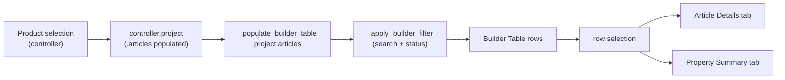

# 07 — Builder Workspace

**Status:** Analysis of the existing implementation; unverified items marked `UNKNOWN`.

## Purpose

The **Builder Workspace** is the single, central engineering workspace of the MK
Product Workbench. This document describes what it is, how it is populated, its
Builder Table and detail tabs, how product selection feeds it, and — critically —
why it must remain **source-agnostic** (identical whether articles originate from
an MDB workspace or from PDM). It is grounded in
[`ui/widgets/wizard_shell.py`](../../ui/widgets/wizard_shell.py).

## What the Builder Workspace is

The Builder Workspace is implemented by
[`MetatypeWizardShell`](../../ui/widgets/wizard_shell.py#L237), a single central
`QWidget` that reproduces the product mockup:

- top bar (brand + project actions),
- left workflow rail (steps, modules, project info),
- header card strip,
- **Builder Table** with **Article Details / Property Summary** tabs,
- right PDM Explorer tree + Selected Product Details,
- bottom status bar.

Per its module docstring it "owns presentation and is wired to the existing
backend through the `controller` … It reuses the existing project/PDM services …
rather than duplicating logic." It contains **no** database or SQL code.

## How it is populated

The Builder Table is filled from `project.articles`, never directly from a
database:

- [`_project()`](../../ui/widgets/wizard_shell.py#L395) returns
  `controller.project` (falling back to `None`).
- [`_populate_builder_table`](../../ui/widgets/wizard_shell.py#L458) copies
  `project.articles` into `self._builder_articles`, then
  [`_apply_builder_filter`](../../ui/widgets/wizard_shell.py#L463) renders the
  visible rows.

Upstream, `project.articles` is produced by
[`ProjectService.load_articles`](../../services/project_service.py#L60) →
[`ArticleService.load_articles`](../../services/article_service.py#L6) reading OCD
tables `tCOMd_Article` + `tCOMd_Text` (see
[01_MDB_Engineering_Workflow.md](01_MDB_Engineering_Workflow.md)). The read-only
[`WorkspaceSnapshot`](../../core/workspace_snapshot.py) also exposes a
`.articles` collection; the Builder consumes whichever object graph the
controller places on `controller.project`.

> `UNKNOWN`: The controller handlers that would perform product selection and
> assign `controller.project`
> ([`open_project`](../../ui/controllers/app_controller.py#L138),
> [`select_product`](../../ui/controllers/app_controller.py#L477),
> [`load_articles`](../../ui/controllers/app_controller.py#L482)) are currently
> `TODO`/`pass`. The wizard's read contract is complete; the wiring that assigns
> the project is not yet implemented in the code inspected.

## Builder Table columns

Defined in [`_builder_columns`](../../ui/widgets/wizard_shell.py#L804) (identical
to the [`BuilderTablePlaceholder.COLUMNS`](../../ui/app_window.py#L308) scaffold):

| Column | Source (per-article attribute) |
|---|---|
| `#` | Row index |
| `Article Code` | `article.article_code` |
| `Description` | `article.short_text` |
| `Properties (Selected)` | count of `article.requested_properties` (or `property_count`) |
| `Property Values (Selected)` | sum over `article.requested_property_values` |
| `Metatype ID` | `article.metatype_id` |
| `Status` | `article.status` |

Counts are computed by
[`_article_counts`](../../ui/widgets/wizard_shell.py#L491); the footer totals are
updated by [`_update_builder_footer`](../../ui/widgets/wizard_shell.py#L502).
Search + status filtering live in
[`_apply_builder_filter`](../../ui/widgets/wizard_shell.py#L463) /
[`_on_builder_status_filter`](../../ui/widgets/wizard_shell.py#L562).

## Article Details / Property Summary tabs

Built by [`_build_article_tabs`](../../ui/widgets/wizard_shell.py#L836). Selecting
a Builder Table row triggers
[`_on_builder_selection_changed`](../../ui/widgets/wizard_shell.py#L513), which
populates both tabs for the chosen article.

**ARTICLE DETAILS** — key/value labels populated by
[`_populate_article_details`](../../ui/widgets/wizard_shell.py#L523):

| Field | Attribute |
|---|---|
| Article Code | `article.article_code` |
| Description | `article.short_text` |
| Article No. | `article.article_nr` |
| PRM Key | `article.prm_key` |
| CHPRM Key | `article.chprm_key` |
| Metatype ID | `article.metatype_id` |
| Status | `article.status` |

**PROPERTY SUMMARY** — table with columns
[`Property Name`, `Values Count`, `Selected Values (Preview)`](../../ui/widgets/wizard_shell.py#L870),
filled by [`_populate_property_summary`](../../ui/widgets/wizard_shell.py#L538)
from `article.requested_property_values` (falling back to
`article.requested_properties`). The same rows are shown inline on the Article
Details tab and full-width on the dedicated Property Summary tab.

## How product selection feeds it

The Builder reads only `controller.project.articles`. Any selection mechanism
(MDB product load via `ProjectService`, or a PDM-sourced project) simply has to
set `controller.project` with an articles collection of the expected shape and
call the wizard's refresh path.

## Why it must stay the SINGLE, source-agnostic engineering workspace

The Builder Workspace is deliberately decoupled from data origin:

- It touches **no** database, SQL, or file paths — it reads plain Python
  attributes off `article` objects via `getattr(..., default)`.
- Both the OCD/MDB path (`ProjectService`/`ArticleService`) and the read-only
  `WorkspaceSnapshot` expose an `.articles` collection, so either can feed the
  same widget.
- Keeping one Builder Workspace means MDB-sourced and PDM-sourced products are
  reviewed, filtered, and edited in exactly one place with one UX — avoiding
  divergent, source-specific editors.

Therefore the contract is: **the origin loads data; the Builder consumes a
uniform article shape.** New sources must adapt to this shape rather than the
Builder branching on source.

## Source-agnostic contract (what the Builder consumes)

Regardless of origin (MDB / OCD snapshot / PDM), each item in
`controller.project.articles` must satisfy this shape (all accessed via
`getattr` with safe defaults, so missing fields degrade to `-`/`0`):

| Attribute | Type | Used by |
|---|---|---|
| `article_code` | str | Builder table, details |
| `short_text` | str | Builder table (Description), details |
| `article_nr` | str | Article Details |
| `prm_key` | str | Article Details |
| `chprm_key` | str | Article Details |
| `metatype_id` | str | Builder table, details |
| `status` | str | Builder table, status filter |
| `requested_properties` | list | property count |
| `requested_property_values` | dict `{prop: [values]}` | value count, Property Summary |
| `property_count` | int | fallback property count |

And the container contract: `controller.project` exposes an iterable
`.articles`. Anything meeting this contract renders identically in the Builder
Workspace.

> `UNKNOWN`: The exact class backing these attributes (and whether snapshot
> `Article` objects expose `requested_property_values`) is not fully verified
> here; the MDB path uses
> [`ArticleService.load_articles`](../../services/article_service.py#L6) output.
