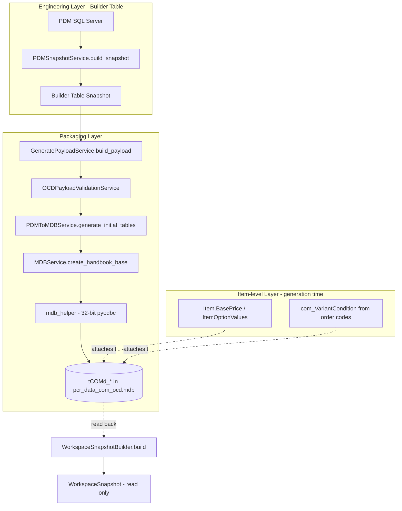
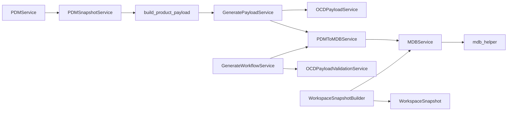

# Architecture

**Cross-refs:** [README](./README.md) · [PackagingPipeline](./PackagingPipeline.md) · [OCDTables](./OCDTables.md) · [GeneratorArchitecture](./GeneratorArchitecture.md)

## Overall Architecture Diagram

## Complete Execution Flow

1. **Product selection** — PDM SQL: `get_products_for_category` (catalogue/category scoped).
2. **Snapshot build** — `PDMSnapshotService.build_snapshot` collects the product-centric engineering
   model (see snapshot keys below). Parallel bulk fetch via `ThreadPoolExecutor`.
3. **Payload assembly** — `scripts/run_workspace_pipeline.py::build_product_payload` →
   `GeneratePayloadService.build_payload`:
   - `PDMToMDBService.build_com_group` / `build_package` → skeleton.
   - `OCDPayloadService` scopes/previews/generates `Articles` + `AttributeValues`.
   - `add_option_values` + `add_relationships` extend the payload.
4. **Validation** — `OCDPayloadValidationService` blocks invalid rows before any write.
5. **Base creation** — `PDMToMDBService.generate_initial_tables` → `MDBService.create_handbook_base`
   → `mdb_helper.create_handbook_base` writes `tCOMd_*` rows.
6. **Read-back** — `WorkspaceSnapshotBuilder.build` reads the OCD MDB into a read-only
   `WorkspaceSnapshot` used for conflict detection / validation.

## Service Dependency Diagram

## Layer Responsibilities

| Layer | Services | Responsibility |
|---|---|---|
| Engineering | `PDMService`, `PDMSnapshotService`, `PDMFilterBuilderService`, `PDMArticleCodeService` | Produce the product-centric Builder Table snapshot (truth). |
| Payload | `GeneratePayloadService`, `OCDPayloadService`, `PDMToMDBService` | Reshape engineering data into an OCD-shaped payload. |
| Validation | `OCDPayloadValidationService` | Gate the write; reject invalid rows. |
| Write | `MDBService`, `helpers/mdb_helper.py` | Create `tCOMd_*` rows (32-bit Access driver). |
| Read-back | `WorkspaceSnapshotBuilder`, `WorkspaceSnapshot` | Read authoritative OCD model back for conflict checks. |

## Engineering Layer vs Packaging Layer

- **Engineering (reusable, product-centric):** article identity, properties/values, options/values,
  dependencies, configuration/child models, exclusion rules, order-code/model metadata. Exposed as
  Builder Table snapshot keys — the generator consumes these directly, never re-querying PDM.
- **Packaging (generator-only):** `ComGroup`/`Package` skeleton constants, `tCOMd_*` object/ID
  creation, `contains` relationship edges, localized text packaging, MDB write mechanics.

## Builder Table Integration (snapshot keys)

`product_attributes`, `product_options`, `product_configuration_features`,
`product_child_configurations`, `product_configuration_graph`, `product_dependencies`,
`product_option_exclusion_rules`, `product_engineering_metadata` (plus hierarchy: catalogues,
categories, products). See [BuilderTableMapping.md](./BuilderTableMapping.md).
