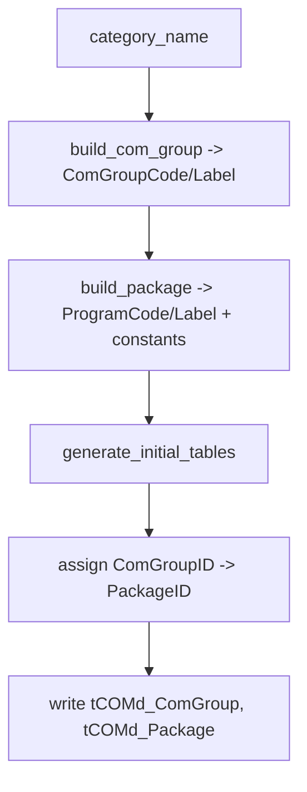

# ComGroup & Package

**Cross-refs:** [PackagingPipeline](./PackagingPipeline.md) · [OCDTables](./OCDTables.md) · [Relationships](./Relationships.md)

The **ComGroup** and **Package** are the top two levels of the OCD package skeleton. They are pure
**packaging** constructs (no PDM engineering truth) built by `PDMToMDBService`.

## ComGroup

- **Builder:** `PDMToMDBService.build_com_group(category_name)`.
- **Shape:** `{ "ComGroupCode": category_name.upper(), "ComGroupLabel": category_name }`.
- **Meaning:** the top-level commercial group (brand/program container) that owns packages.
- **Destination:** `tCOMd_ComGroup` (`com_ComGroupID` assigned by `generate_initial_tables`).

## Package

- **Builder:** `PDMToMDBService.build_package(category_name, com_group_id)`.
- **Shape:**
  ```
  {
    "ProgramCode": category_name.lower(),
    "ProgramLabel": category_name,
    "ComGroupID": com_group_id,
    "DistributionRegionID": 5,
    "MaterialMF": "hmx",
    "MaterialPK": "basics"
  }
  ```
- **Meaning:** a program/series package under a ComGroup.
- **Destination:** `tCOMd_Package` (`com_PackageID` assigned by `generate_initial_tables`).

## Constants (packaging-only, business-fixed)

| Constant | Value | Meaning |
|---|---|---|
| `DistributionRegionID` | `5` | Distribution region for the package (fixed for HMX). |
| `MaterialMF` | `"hmx"` | Manufacturer material key (Herman Miller X). |
| `MaterialPK` | `"basics"` | Program/package material key. |

These are **not** engineering data — they are packaging configuration. They may need to become
configurable per brand/region in the future generator, but are currently fixed.

## Generation Flow



1. `build_com_group` derives the ComGroup from the category name (upper/label).
2. `build_package` derives the Package (lower code + label) and injects the fixed constants and the
   parent `ComGroupID`.
3. `generate_initial_tables` writes both and back-fills `ComGroupID` / `PackageID` into the payload.
4. All downstream `Package→Article` relationships hang off the created `PackageID`
   (see [Relationships.md](./Relationships.md)).
