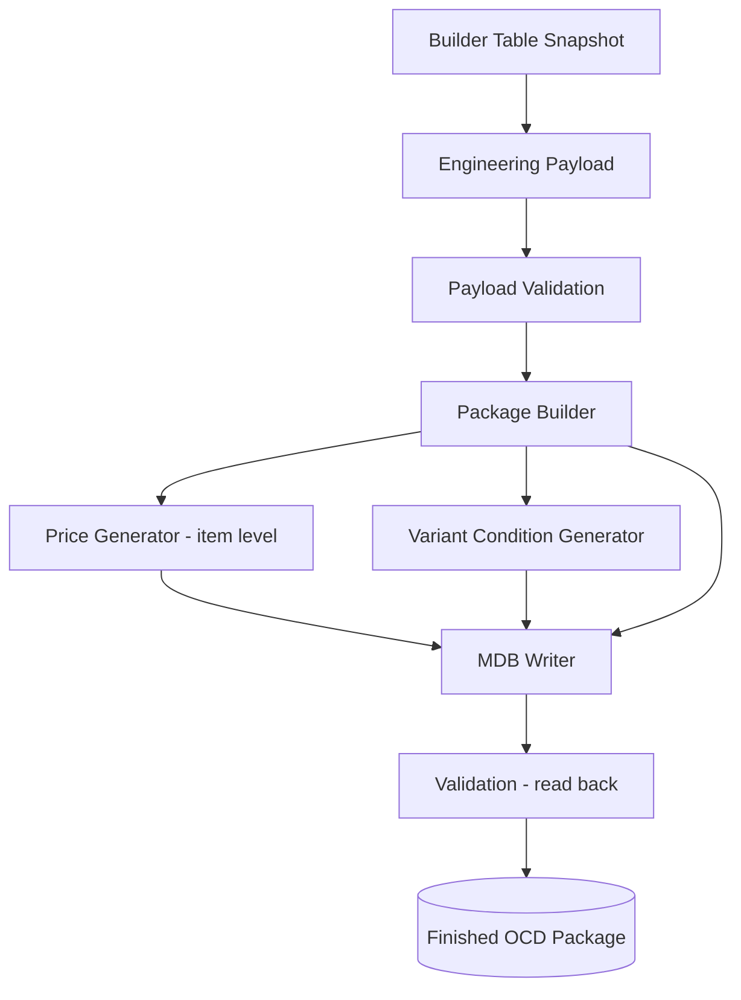

# Generator Architecture (Future PCon Generator)

**Cross-refs:** [Architecture](./Architecture.md) · [PackagingPipeline](./PackagingPipeline.md) · [PriceGeneration](./PriceGeneration.md) · [VariantConditions](./VariantConditions.md) · [BuilderTableMapping](./BuilderTableMapping.md)

Design for the future PCon Generator. It consumes the **Builder Table snapshot** and produces a
finished OCD package, reusing the existing write layer. **Not yet implemented.**

## Pipeline



## Stage Design

| Stage | Input | Output | Reuses | New logic |
|---|---|---|---|---|
| **Engineering Payload** | snapshot keys | `ComGroup/Package/Articles/AttributeValues/OptionValues/Relationships` | `GeneratePayloadService`, `PDMToMDBService` | none |
| **Payload Validation** | payload | gated payload | `OCDPayloadValidationService` | extend rules for pricing/variant refs |
| **Package Builder** | gated payload | `tCOMd_ComGroup/Package/Article/Class/Property/PropValue/ArtBase` objects | `PDMToMDBService.generate_initial_tables`, `MDBService` | none |
| **Price Generator** | released Items per article | `tCOMd_Price` rows | reads `Item`/`ItemOptionValues`/`PriceFormula`/`PriceMatrix` | **item enumeration + rounding** |
| **Variant Condition Generator** | `product_options.Code` + `product_engineering_metadata` formats | `com_VariantCondition` strings | reads snapshot | **order-code composition + OFML grammar** |
| **MDB Writer** | all built objects | `tCOMd_*` rows in MDB | `MDBService.create_handbook_base` → `mdb_helper` (32-bit) | none |
| **Validation (read-back)** | OCD MDB | conflict report | `WorkspaceSnapshotBuilder`, `WorkspaceSnapshot` | none |

## Consumption Contract (no PDM re-query)

The generator must consume only the Builder Table snapshot for engineering truth:

- `product_engineering_metadata` → Article/ArtBase + order-code formats.
- `product_attributes` → Property/PropValue (attribute source).
- `product_options` → Property/PropValue (option source) + `Code` for variant conditions.
- `product_configuration_features` / `product_child_configurations` / `product_configuration_graph`
  → configuration structure and child articles.
- `product_dependencies` → valid combinations for the Variant Condition Generator.
- `product_option_exclusion_rules` → excluded combinations.

The generator additionally reads **item-level** data (`Item`, `ItemOptionValues`, price tables)
**only** inside the Price Generator stage.

## Design Principles

1. **Engineering vs Packaging separation** — never push packaging artifacts (IDs, ComGroup constants,
   variant strings) back into the Builder Table.
2. **Item enumeration is localized** — only the Price Generator (and any per-item variant pricing)
   enumerates Items; everything else is product-centric.
3. **Reuse the write layer** — do not reimplement MDB writing; call `MDBService`/`mdb_helper`.
4. **Validate before and after** — pre-write payload validation + post-write read-back conflict check.
5. **Constants become configuration** — `DistributionRegionID`/`MaterialMF`/`MaterialPK` should move to
   config when multi-brand/region is required.

## Suggested Module Layout (future)

```
services/pcon/
  pcon_package_builder.py      # engineering payload -> tCOMd objects (reuses PDMToMDBService/MDBService)
  pcon_price_generator.py      # item-level pricing -> tCOMd_Price
  pcon_variant_generator.py    # order codes -> com_VariantCondition
  pcon_generator.py            # orchestrates the stages + validation
```
