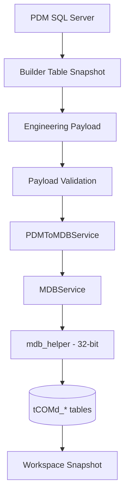

# Packaging Pipeline

**Cross-refs:** [Architecture](./Architecture.md) · [OCDTables](./OCDTables.md) · [Relationships](./Relationships.md) · [ComGroup](./ComGroup.md)

The end-to-end packaging workflow, stage by stage:

## Stage 1 — PDM → Builder Table Snapshot
- **Entry:** `PDMSnapshotService.build_snapshot(products, pdm_service, product_category_id)`.
- **Inputs:** selected products (from `get_products_for_category`), catalogue/category scope.
- **Outputs:** snapshot dict with product-centric engineering keys (`product_attributes`,
  `product_options`, `product_configuration_*`, `product_dependencies`,
  `product_option_exclusion_rules`, `product_engineering_metadata`, …).
- **Dependencies:** `PDMService` bulk queries; parallel fetch.
- **Notes:** This is the single engineering source of truth; downstream never re-queries PDM.

## Stage 2 — Builder Table → Engineering Payload
- **Entry:** `scripts/run_workspace_pipeline.py::build_product_payload` → `GeneratePayloadService.build_payload`.
- **Inputs:** snapshot engineering rows; category name; selected products; grouped article codes/rows.
- **Outputs:** payload dict:
  - `ComGroup` `{ComGroupCode, ComGroupLabel}`
  - `Package` `{ProgramCode, ProgramLabel, ComGroupID, DistributionRegionID=5, MaterialMF="hmx", MaterialPK="basics"}`
  - `Articles` `[{article_code, article_name}]`
  - `AttributeValues` `[{source: attribute|option, property, value, name, order_code, description, article_numbers, class_name}]`
  - `OptionValues` (projected from option-source AttributeValues)
  - `Relationships` (`contains` edges)
- **Dependencies:** `OCDPayloadService`, `PDMToMDBService`.

## Stage 3 — Payload Validation
- **Entry:** `OCDPayloadValidationService`.
- **Inputs:** assembled payload.
- **Outputs:** pass/fail + validation messages; blocks write on invalid rows (e.g. empty class/property,
  invalid article numbers — see `docs/uat_checklist.md` UAT-02).
- **Dependencies:** payload only (pure).

## Stage 4 — PDMToMDBService (initial tables)
- **Entry:** `PDMToMDBService.generate_initial_tables(mdb_service, mdb_file, com_group, package, ...)`.
- **Inputs:** validated payload (or `build_handbook_base_payload`).
- **Outputs:** returns created `ComGroup/Package/Articles/ArticleClasses/Classes/Properties/PropValues/ArtBases`
  with assigned IDs (`ComGroupID`, `PackageID`, …).
- **Dependencies:** `MDBService`.

## Stage 5 — MDBService
- **Entry:** `MDBService.create_handbook_base(mdb_file, payload)`.
- **Inputs:** base payload.
- **Outputs:** delegates to helper; returns created-object IDs.
- **Dependencies:** `mdb_helper`.

## Stage 6 — mdb_helper (32-bit write)
- **Entry:** `helpers/mdb_helper.py::create_handbook_base`.
- **Inputs:** JSON payload argument.
- **Outputs:** `tCOMd_*` rows written into the Access MDB.
- **Dependencies:** 32-bit pyodbc + Access driver (`py -3.14-32`). Required because the Access
  ODBC driver is 32-bit only.

## Stage 7 — tCOMd_* Tables (the package)
- **Location:** `pcr_data_com_ocd.mdb` (the OCD commercial database — authoritative engineering model).
- **Tables:** see [OCDTables.md](./OCDTables.md).

## Stage 8 — Workspace Snapshot (read-back)
- **Entry:** `WorkspaceSnapshotBuilder.build`.
- **Inputs:** the OCD MDB.
- **Outputs:** read-only `WorkspaceSnapshot` (articles/properties/options + parent/child links).
- **Use:** conflict detection / validation (`AppController.build_import_preview`).

## Stage Dependency Summary

| Stage | Depends on | Produces |
|---|---|---|
| 1 Snapshot | PDM SQL | engineering snapshot |
| 2 Payload | snapshot | OCD-shaped payload |
| 3 Validation | payload | gated payload |
| 4 InitialTables | gated payload | created objects + IDs |
| 5 MDBService | payload | helper invocation |
| 6 mdb_helper | JSON payload | `tCOMd_*` rows |
| 7 tCOMd_* | rows | OCD package |
| 8 Read-back | OCD MDB | read-only snapshot |
