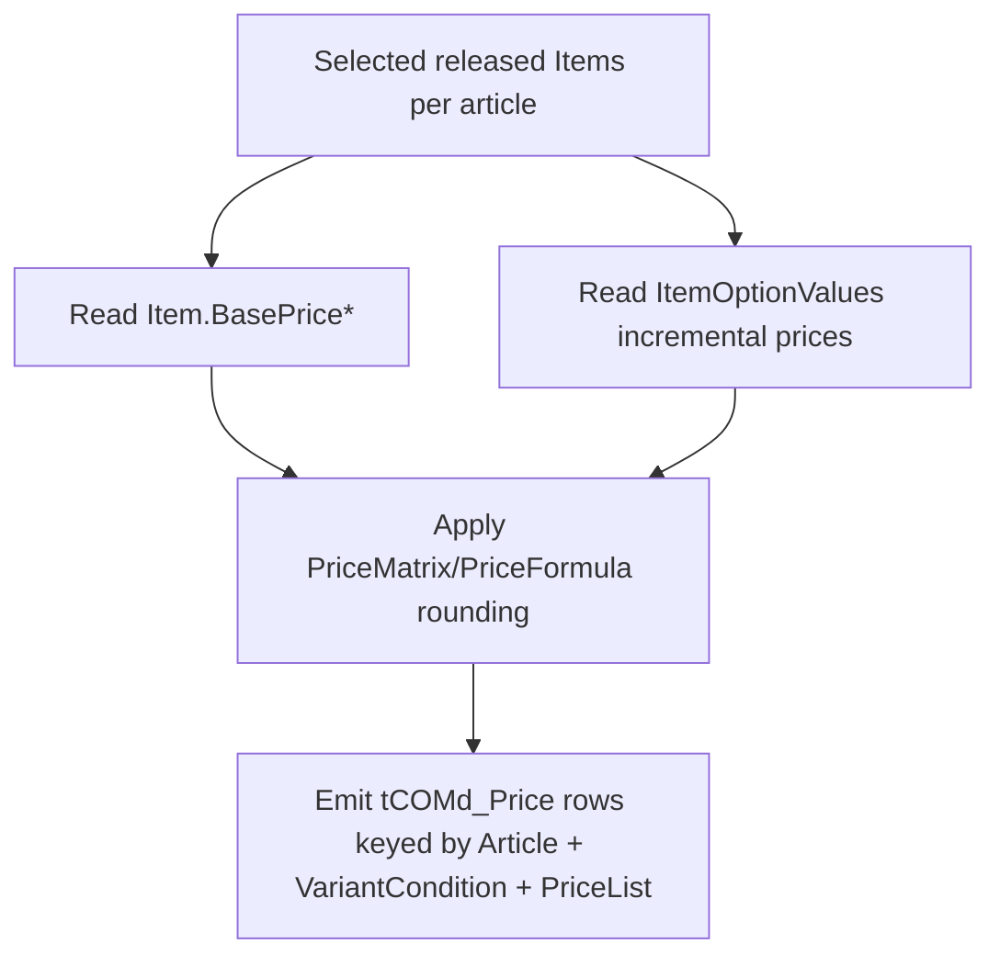

# Price Generation

**Cross-refs:** [OCDTables](./OCDTables.md) · [GeneratorArchitecture](./GeneratorArchitecture.md) · [Summary](./Summary.md)

## PDM Pricing Data Model

| Source | Grain | Fields | Meaning |
|---|---|---|---|
| `Item.BasePrice` / `BasePrice2` / `BasePrice3` | **per Item** | base prices (multi-currency/site) | The base price of a released item (SKU). |
| `ItemOptionValues` | **per (Item, OptionValue)** | `IncrementalPrice`, `IncrementalPrice2`, `IncrementalPrice3`, `IncrementalVolume`, `FeatRank` | Incremental up-charge for selecting an option value on an item. |
| `PriceFormula` | site/currency | `SiteId`, `DomCurrCode`, `EffectiveDate`, `FirstBase`, `FirstPrice`, `PriceFormula` | Price computation formula (rounding/derivation). |
| `PriceMatrix` | price code | `CustPriceCode`, `ItemPriceCode`, `PriceFormula`, `Rounding`, `MidpointRounding` | Maps customer/item price codes → formula + rounding. |
| Price lists | list | `com_PriceListID`, `com_PriceListLabel` (OCD `tCOMd_PriceList2`) | Named price lists (e.g. `EUR...2019`). |

Destination in OCD: `tCOMd_Price` (`com_ArticleID`, `com_VariantCondition`, `com_PriceValue`,
`com_PriceListID`) → `tCOMd_PriceList2`.

## Why Pricing Is Item-Level

Measured against the live PDM database:

- **Base price varies per item** for ~**18%** of multi-item products (4,347 / 24,680) — e.g. size/height
  variants of the same product have different base prices.
- **Incremental price varies per item** for ~**24%** of sampled (product, option) groups (48 / 200) —
  the same option value can carry different up-charges on different items.

Therefore a price cannot be attributed to a *product* without loss; it is intrinsically tied to a
released **Item** (and often to the specific option combination).

## Why Pricing Is NOT Stored in the Builder Table

- The Builder Table is **product-centric** and deliberately does **not enumerate Items** (same
  decision as for Articles — see [BuilderTableMapping](./BuilderTableMapping.md) and the parity notes).
- Collapsing item prices to product level would be lossy/incorrect for ~1 in 5 products.
- Pricing is a **generation-time** concern, not engineering truth needed to *describe* a configurable
  product.

## How the Future Generator Should Consume Pricing

Algorithm (summarized):
1. For each article, resolve its released **Items** (item enumeration happens **here**, in the generator).
2. Read `Item.BasePrice*` and `ItemOptionValues.IncrementalPrice*`.
3. Apply `PriceMatrix`/`PriceFormula` rounding/derivation for the target site/currency.
4. Build `com_VariantCondition` (see [VariantConditions.md](./VariantConditions.md)) to key each price
   to the option combination.
5. Write `tCOMd_Price` rows linked to `tCOMd_Article` and `tCOMd_PriceList2`.

**Key rule:** item enumeration and pricing live in the **Price Generator stage**, never in the Builder Table.
