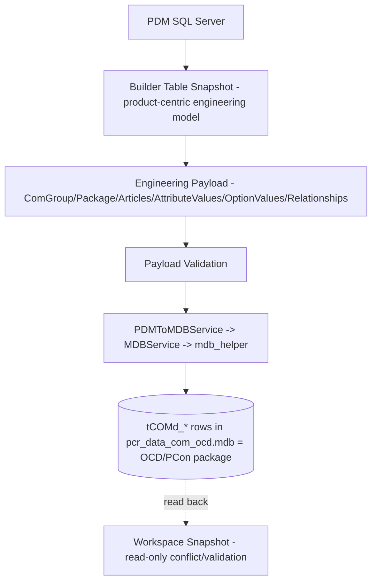

# PCon Reference Knowledge Base

**Status:** Permanent reference documentation. Analysis only — no generation logic lives here.
**Purpose:** Enable future implementation of the **PCon Generator** without re-inspecting the
original DPS/PDM C# source. Everything needed to understand how a PCon-consumable OCD package
is assembled from PDM engineering data is captured in this folder.

---

## Overall Architecture (one paragraph)

The Metatype Wizard reads authoritative product engineering data from the **PDM SQL Server**
database into a product-centric **Builder Table snapshot**. A packaging layer converts that
snapshot into an **engineering payload** (`ComGroup`, `Package`, `Articles`, `AttributeValues`,
`OptionValues`, `Relationships`), validates it, and writes it as **OCD `tCOMd_*` rows** into an
Access MDB (`pcr_data_com_ocd.mdb`) via a 32-bit helper. That MDB is the PCon package; it can be
read back into a read-only **Workspace Snapshot** for conflict detection. Pricing and variant
conditions are **item-level generation-time concerns**, deliberately kept out of the Builder Table.

## High-Level Workflow

## Layer Model

| Layer | Responsibility | Lives in Builder Table? |
|---|---|---|
| **Engineering layer** | Product-centric truth: articles, properties, options, dependencies, configurations, exclusions, order-code metadata | **Yes** (snapshot keys) |
| **Packaging layer** | `tCOMd_*` object creation, IDs, relationships, ComGroup/Package skeleton, MDB write | No (generator-only) |
| **Item-level layer** | Pricing and variant conditions (per released Item) | No (generation-time) |

## Folder Contents

| Document | Covers |
|---|---|
| [Architecture.md](./Architecture.md) | Architecture + execution flow + service dependencies + layer responsibilities |
| [PackagingPipeline.md](./PackagingPipeline.md) | Stage-by-stage packaging workflow (inputs/outputs/dependencies) |
| [OCDTables.md](./OCDTables.md) | Every important `tCOMd_*` table (purpose, keys, relationships, layer) |
| [Relationships.md](./Relationships.md) | Generated `contains` relationship graph |
| [PriceGeneration.md](./PriceGeneration.md) | Pricing model; why it is item-level and excluded from the Builder Table |
| [VariantConditions.md](./VariantConditions.md) | `com_VariantCondition` generation from order codes |
| [ComGroup.md](./ComGroup.md) | ComGroup/Package skeleton constants and creation flow |
| [GeneratorArchitecture.md](./GeneratorArchitecture.md) | Design for the future PCon Generator |
| [BuilderTableMapping.md](./BuilderTableMapping.md) | Builder Table model → PDM tables → OCD tables → generator stage matrix |
| [Summary.md](./Summary.md) | Executive summary + implementation roadmap |

## Source Anchors (for verification)

- Python packaging: `services/generate_payload_service.py`, `services/ocd_payload_service.py`,
  `services/ocd_payload_validation_service.py`, `services/pdm_to_mdb_service.py`,
  `services/mdb_service.py`, `helpers/mdb_helper.py`, `scripts/run_workspace_pipeline.py`.
- Builder Table snapshot: `services/pdm_snapshot_service.py`, `services/pdm_service.py`.
- PDM/DPS reference: `PDMMaintenance/OCDExport.cs`, `PDMMaintenance/PConPriceUpdate.cs`,
  `PDMMaintenance/PriceMaintenance.cs`, `PDMMaintenance/CADMaintenance.cs`, `DPS/ocdPrice.cs`.
- Existing analysis: `docs/PDM_MDB_Engineering/`, `docs/go_knowledge_base.md`.
