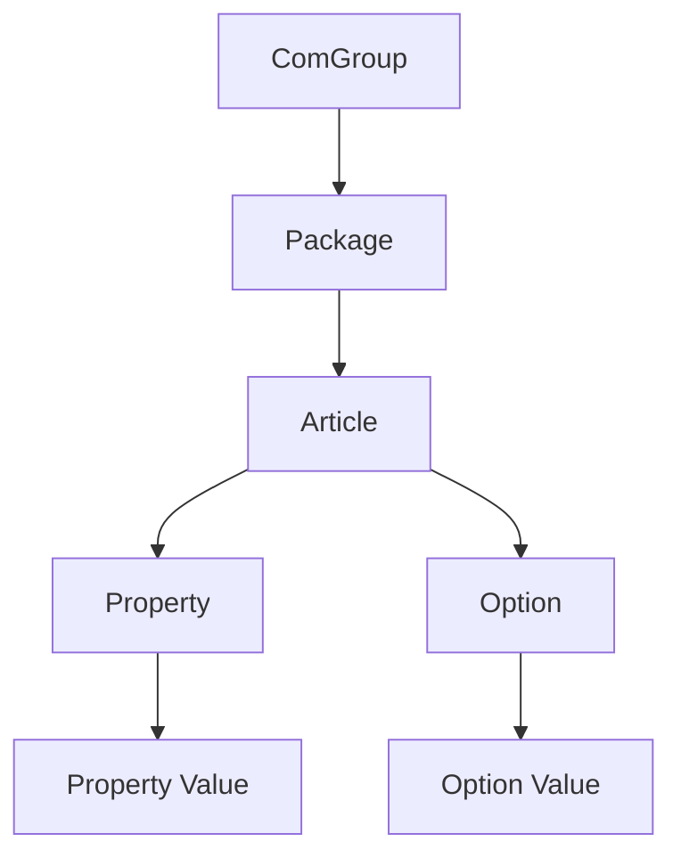

# Relationships

**Cross-refs:** [OCDTables](./OCDTables.md) · [PackagingPipeline](./PackagingPipeline.md) · [Architecture](./Architecture.md)

The payload's `Relationships` section (added by `GeneratePayloadService.add_relationships`) links
objects that **already exist** in the payload using `contains` edges. It never creates new objects —
it only records structure. Source: `services/generate_payload_service.py`,
`docs/PDM_MDB_Engineering/02_PDM_Data_Model.md`.

## Generated Relationship Graph



## Edge Definition

Each relationship row has the shape:

```
{ source_type, source_name, target_type, target_name, relationship_type: "contains", metadata }
```

| Edge | Source | Destination | Purpose | Generation logic |
|---|---|---|---|---|
| ComGroup → Package | `ComGroup` | `Package` | Program belongs to a commercial group | 1 edge per package under its com group |
| Package → Article | `Package` | `Article` | Article belongs to a program | 1 edge per article code in the payload |
| Article → Property | `Article` | `Property` | Article exposes a property | for each attribute-source property used by the article (`article_numbers`) |
| Article → Option | `Article` | `Option` | Article exposes an option | for each option-source property used by the article |
| Property → Property Value | `Property` | `Value` | Value belongs to a property | for each value under a property |
| Option → Option Value | `Option` | `Value` | Value belongs to an option | for each value under an option (`add_option_values`) |

## Business Meaning

- The `contains` graph is the **structural skeleton** the OCD/PCon consumer walks to render a
  configurable article: pick a Package → an Article → its Properties/Options → their Values.
- **Source of the structure:** the Builder Table engineering models — `product_attributes`
  (Article→Property→Value) and `product_options` (Article→Option→Value). The ComGroup/Package levels
  come from the packaging skeleton ([ComGroup.md](./ComGroup.md)).
- **Dependencies / exclusions / configurations** are *not* `contains` edges; they are separate
  engineering models (`product_dependencies`, `product_option_exclusion_rules`,
  `product_configuration_graph`) consumed by the Variant Condition and Configuration logic.

## Generation Logic Summary (algorithm, not code)

1. Emit `ComGroup→Package` for the single skeleton pair.
2. For every article code, emit `Package→Article`.
3. For every `AttributeValues` row, resolve `article_numbers` → for each article emit
   `Article→Property` (attribute source) or `Article→Option` (option source), then
   `Property→Value` / `Option→Value`.
4. Deduplicate edges by `(source_type, source_name, target_type, target_name)`.
