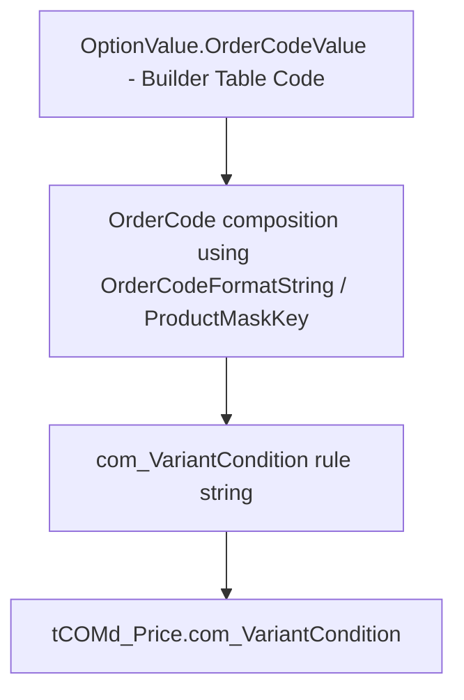

# Variant Conditions

**Cross-refs:** [PriceGeneration](./PriceGeneration.md) · [OCDTables](./OCDTables.md) · [BuilderTableMapping](./BuilderTableMapping.md)

## What a Variant Condition Is

A **variant condition** (`com_VariantCondition`) is an OFML/OCD **rule string** that keys a price (or
other OCD attribute) to a specific **option combination** — i.e. "this price applies when these option
order codes are selected." It lives in the MDB (`tCOMd_Price.com_VariantCondition`) and is emitted by
OCD export (`PDMMaintenance/OCDExport.cs`, `DPS/ocdPrice.cs::variantCondition`), and can be generated
in bulk via CAD Maintenance ("Generate VARCOND for PA_PRICING").

## Source Data: Order Codes

Variant conditions are built from **order codes**, which the Builder Table already carries:

- `OptionValue.OrderCodeValue` → exposed as `product_options[*].Code`.
- `AttributeValue.OrderCodeValue` / `ModelSuffix` → exposed via `product_attributes`.
- Product/range order-code **format strings** → exposed as `product_engineering_metadata`
  (`product_order_code_format`, `range_order_code_format`, `product_mask_key`, `model_list`).

The order code / order-code-format is the raw material; the variant condition is the **composed rule**.

## Why Variant Conditions Are Generated (Not Stored)

- PDM has **zero** columns named `*VariantCondition*` — there is no raw variant-condition table in PDM.
- It is a **derived OFML/OCD construct**, computed at export time from option order codes + the
  product/range order-code format rules.
- Producing it is **generation logic** — explicitly out of scope for the Builder Table.

## Why They Are NOT Builder Table Engineering Data

- The Builder Table stores **inputs** (order codes, format strings, dependencies), which are the
  engineering truth.
- The variant condition is an **output** of the generator. Storing outputs in the Builder Table would
  duplicate generation logic and violate the engineering/packaging separation.

## How the Future Generator Should Build Them (summarized)

1. For a target article + option combination, gather the selected option values' `Code`
   (`OrderCodeValue`) from `product_options`.
2. Apply the product/range **order-code format** (`product_engineering_metadata`) — `OrderCodeFormatString`,
   `ProductMaskKey`, `ModelList` — to compose the canonical order code / mask.
3. Encode the option combination as the `com_VariantCondition` rule string per the OFML/OCD grammar
   used by `OCDExport.cs` / `ocdPrice.cs`.
4. Attach it to the corresponding `tCOMd_Price` row.

**Dependencies:** consume `product_options` (`Code`), `product_engineering_metadata` (format rules),
and `product_dependencies` (to know which combinations are valid). No PDM re-query needed.
