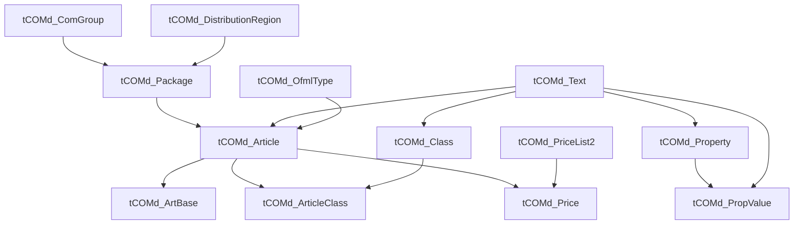

# Dependency Graph (Insertion Order)

**Cross-refs:** [ERDiagram](./ERDiagram.md) · [WriteOrder](./WriteOrder.md) · [RelationshipMatrix](./RelationshipMatrix.md)

Derived from the call order in `helpers/mdb_helper.py::create_handbook_base`. An arrow means "must
exist before" (the child holds a foreign key to the parent).



## Linear Insertion Order (safe sequence)

```
tCOMd_DistributionRegion   (ensure exists; fixed id 5)
        │
        ▼
tCOMd_ComGroup             (get_or_create by com_ComGroupCode)
        │
        ▼
tCOMd_OfmlType             (resolve/ensure; article default type)
        │
        ▼
tCOMd_Package              (needs ComGroupID + DistributionRegionID)
        │
        ▼
tCOMd_Text                 (created on demand for any labeled entity)
        │
        ▼
tCOMd_Class                (needs Text for class label)
        │
        ▼
tCOMd_Property             (needs Text for property label)
        │
        ▼
tCOMd_PropValue            (needs Property + Text)
        │
        ▼
tCOMd_Article              (needs Package + OfmlType + Text)
        │
        ▼
tCOMd_ArticleClass         (needs Article + Class)
        │
        ▼
tCOMd_ArtBase              (needs Article)
        │
        ▼
tCOMd_PriceList2           (price stage; needs list metadata)
        │
        ▼
tCOMd_Price                (price stage; needs Article + PriceList)
```

## Why Each Dependency Exists

| Dependency | Reason |
|---|---|
| DistributionRegion → Package | Package row stores `com_DistributionRegionID` (FK). Region must pre-exist. |
| ComGroup → Package | Package stores `com_ComGroupID`. ComGroup is the parent container. |
| OfmlType → Article | Article stores `com_OfmlTypeID` (article render/type). Resolved before articles. |
| Text → Class/Property/PropValue/Article | Each references a `com_TextID`/`com_ShortTextID`; text rows are created on demand first (`get_or_create_text`). |
| Package → Article | Article stores `com_PackageID`; article belongs to the package. |
| Property → PropValue | PropValue stores `com_PropertyID`; a value belongs to a property. |
| Article + Class → ArticleClass | Join row needs both parent IDs to exist. |
| Article → ArtBase | ArtBase stores `com_ArticleID`. |
| PriceList → Price, Article → Price | Price stores both `com_PriceListID` and `com_ArticleID`. |

## Idempotency

All structural inserts use **get-or-create** semantics (look up by natural key first —
`com_ComGroupCode`, `com_PackageCode`, article code, text name, property/value codes — then insert).
This makes re-runs idempotent and lets an existing OCD DB be extended without duplicates.
