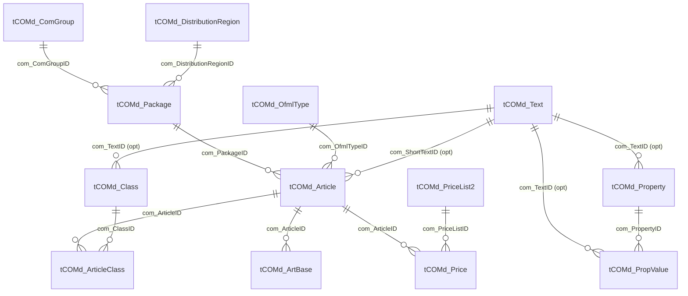

# ER Diagram — OCD `tCOMd_*`

**Cross-refs:** [DependencyGraph](./DependencyGraph.md) · [RelationshipMatrix](./RelationshipMatrix.md) · [WriteOrder](./WriteOrder.md)

Reverse-engineered from `helpers/mdb_helper.py` (`get_or_create_*` functions) and
`services/mdb_service.py::get_article_property_summary`. Field names use the `com_` prefix.

## Entity Relationship Diagram

## Keys & Cardinality Summary

| Table | Primary Key | Foreign Keys | Parent(s) | Child(ren) | Cardinality | Optional? |
|---|---|---|---|---|---|---|
| `tCOMd_ComGroup` | `com_ComGroupID` | `com_ManufacturerID` | (Manufacturer) | Package | 1→N Package | required |
| `tCOMd_DistributionRegion` | `com_DistributionRegionID` | — | — | Package | 1→N | required (fixed id 5) |
| `tCOMd_OfmlType` | `com_OfmlTypeID` | — | — | Article | 1→N | required |
| `tCOMd_Package` | `com_PackageID` | `com_ComGroupID`, `com_DistributionRegionID` | ComGroup, DistributionRegion | Article | 1→N Article | required |
| `tCOMd_Text` | `com_TextID` | `com_TextTypeID` | (TextType) | Article/Property/PropValue/Class | 1→N (shared) | referenced optionally |
| `tCOMd_Article` | `com_ArticleID` | `com_PackageID`, `com_OfmlTypeID`, `com_ShortTextID` | Package, OfmlType, Text | ArticleClass, ArtBase, Price | 1→N | required |
| `tCOMd_Class` | `com_ClassID` | `com_TextID` | Text | ArticleClass | 1→N | required |
| `tCOMd_ArticleClass` | (`com_ArticleID`,`com_ClassID`) | `com_ArticleID`, `com_ClassID` | Article, Class | — | N↔N join | required |
| `tCOMd_ArtBase` | `com_ArtBaseID` | `com_ArticleID` | Article | — | 1→N | required |
| `tCOMd_Property` | `com_PropertyID` | `com_TextID` | Text | PropValue | 1→N | required |
| `tCOMd_PropValue` | `com_PropValueID` | `com_PropertyID`, `com_TextID` | Property, Text | — | 1→N | required |
| `tCOMd_PriceList2` | `com_PriceListID` | — | — | Price | 1→N | required (price stage) |
| `tCOMd_Price` | `com_PriceID` | `com_ArticleID`, `com_PriceListID` | Article, PriceList | — | 1→N | optional (price stage) |

## Notes

- `tCOMd_Text` is a **shared** lookup: Article/Property/PropValue/Class all reference text IDs via
  `get_or_create_text`. Text rows are created on demand before the referencing entity.
- `tCOMd_ArticleClass` is a pure **N↔N** join between Article and Class.
- `tCOMd_Price`/`tCOMd_PriceList2` belong to the **item-level price stage** (see
  [../PriceGeneration.md](../PriceGeneration.md)); they are optional for a structural-only package.
