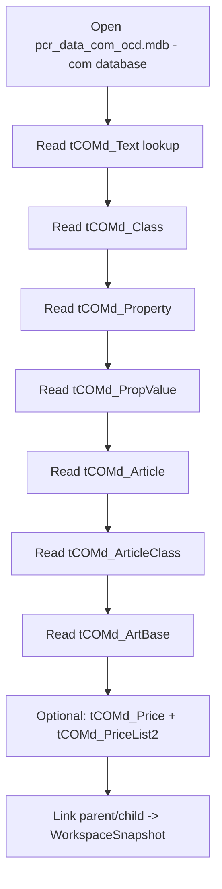

# Read Order (Importing an OCD Workspace)

**Cross-refs:** [WriteOrder](./WriteOrder.md) · [ERDiagram](./ERDiagram.md) · [../PackagingPipeline.md](../PackagingPipeline.md)

Authoritative sources: `services/workspace_snapshot_builder.py` (read-back into a read-only snapshot)
and `services/mdb_service.py::get_article_property_summary` (joined read).

## Optimal Read Sequence

`get_article_property_summary` reads, in this order: `tCOMd_Article`, `tCOMd_Text`, `tCOMd_Property`,
`tCOMd_PropValue`, `tCOMd_Class`, `tCOMd_ArticleClass`, `tCOMd_ArtBase` — then joins by ID in memory.

## Why This Order Is Required

- **Text first (or alongside):** labels are resolved by `com_TextID`/`com_ShortTextID`; loading text
  into a lookup lets every other entity resolve its display name in one pass.
- **Definitions before instances:** Class/Property/PropValue are the *definitions*; Article and its
  links are the *instances* that reference them. Loading definitions first makes link resolution O(1).
- **Join tables last:** `tCOMd_ArticleClass` and `tCOMd_ArtBase` require both endpoints already loaded.
- **Price optional/last:** item-level pricing is not needed to reconstruct the configurable structure.

## Which Objects Are Reconstructed First

1. **Lookups:** Text (id→label), Class (id→name), Property (id→name), PropValue (id→property, label).
2. **Articles:** `com_ArticleID`, `com_ArticleCode`, `com_ShortTextID` → article identity + display.
3. **Links:** ArticleClass (article↔class), ArtBase (article→base).

## How Relationships Are Rebuilt

- `WorkspaceSnapshotBuilder.build` reads each table in its `_TABLES` map via `MDBService.get_rows`,
  converts rows to `SnapshotObject`s, then performs a **best-effort parent/child linking** pass by
  matching FK columns to loaded PKs. Missing/unreadable tables are skipped (defensive import).
- The resulting `WorkspaceSnapshot` exposes `.articles`, `.properties`, `.options` and lookup helpers,
  and is the single source for conflict detection / import preview.

## Notes

- Reads shell to the 32-bit `helpers/mdb_helper.py` (`get_rows`) because the Access ODBC driver is
  32-bit only. Batch reads per table (one call each) rather than per-row.
