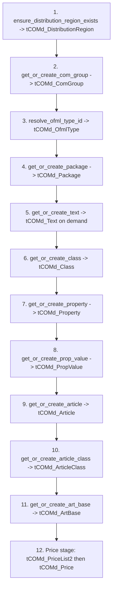

# Write Order (Creating a Brand-New OCD Database)

**Cross-refs:** [DependencyGraph](./DependencyGraph.md) · [ReadOrder](./ReadOrder.md) · [ValidationRules](./ValidationRules.md)

Authoritative source: `helpers/mdb_helper.py::create_handbook_base` (and the `get_or_create_*` /
`ensure_*` / `resolve_*` helpers). All structural writes are **get-or-create** (idempotent).

## Safe Write Sequence

## Must-Exist-First (roots)

1. `tCOMd_DistributionRegion` — fixed region (id 5); ensured before Package.
2. `tCOMd_ComGroup` — resolved/created by `com_ComGroupCode`; parent of Package.
3. `tCOMd_OfmlType` — resolved for article default type; parent of Article.

## Dependent Tables (in order)

4. `tCOMd_Package` — needs `com_ComGroupID` + `com_DistributionRegionID`.
5. `tCOMd_Text` — created on demand whenever a labeled entity needs a `com_TextID`.
6. `tCOMd_Class` → 7. `tCOMd_Property` → 8. `tCOMd_PropValue` (Property before its values).
9. `tCOMd_Article` — needs Package + OfmlType + Text.
10. `tCOMd_ArticleClass` — needs Article + Class.
11. `tCOMd_ArtBase` — needs Article.
12. Price stage: `tCOMd_PriceList2` then `tCOMd_Price` (needs Article + PriceList).

## When IDs Are Generated

- Each `get_or_create_*` returns the natural-key lookup result or the **autonumber PK** produced by
  `insert_row` (`INSERT INTO [table] ...`). The returned ID is threaded into children:
  `ComGroupID → Package`, `PackageID → Article`, `PropertyID → PropValue`,
  `ArticleID + ClassID → ArticleClass`, `ArticleID → ArtBase`.
- `create_handbook_base` locks `package["PackageID"]` to the resolved package to prevent stale IDs
  from payload edits.

## How Relationships Are Established

- Parent PK is fetched/created first, then written into the child's FK column at insert time. There is
  no post-hoc linking pass for structural tables (the `Relationships` payload section is a logical
  `contains` graph, not physical FKs — see [../Relationships.md](../Relationships.md)).

## Potential Validation Failures

- Missing `ComGroupCode`/`ProgramCode` → cannot create ComGroup/Package.
- Article row with empty `article_code` → skipped/blocked (see [ValidationRules](./ValidationRules.md)).
- PropValue without a resolvable Property → orphan; blocked.
- Text type unresolved (`resolve_text_type_code`) → label cannot be attached.
- `ReplaceArticleSet` with a non-empty `article_codes` prunes the existing package article set first
  (`prune_package_article_set`) — destructive; validate the set before pruning.

## Rollback Considerations

- Access/pyodbc writes are executed via the 32-bit helper. Wrap a generation run in a **transaction**
  (single connection, commit at end) so a mid-run failure rolls back cleanly.
- Because inserts are get-or-create, a failed run can also be safely **re-run** to converge, but
  partial `prune_package_article_set` deletions are not automatically restored — snapshot/backup the
  MDB before destructive replace operations.
